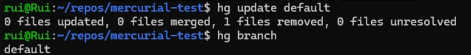

# Table of Contents

1. [Class Assignment 1 - Version Control](#class-assignment-1---version-control)
2. [Initializing a New Repository](#initializing-a-new-repository)
    - [Git](#git)
3. [Git Workflow - Part 1 - No Branches](#git-workflow---part-1---no-branches)
    - [1. Checking Status and Untracked Files](#1-checking-status-and-untracked-files)
    - [2. Staging Files](#2-staging-files)
    - [3. Committing Files](#3-committing-files)
    - [4. Checking Status After Commit](#4-checking-status-after-commit)
    - [5. Pushing Changes to Remote](#5-pushing-changes-to-remote)
    - [6. Creating a Tag](#6-creating-a-tag)
    - [7. Pushing the Tag](#7-pushing-the-tag)
    - [8. Viewing the Git Log](#8-viewing-the-git-log)
    - [9. Git Log with Graph](#9-git-log-with-graph)
    - [10. Reverting a Commit](#10-reverting-a-commit)
4. [Git Workflow - Part 2 - Branches](#git-workflow---part-2---branches)
    - [1. Creating a Branch](#1-creating-a-branch)
    - [2. Checking Out to a Branch](#2-checking-out-to-a-branch)
    - [3. Setting the Branch Upstream](#3-setting-the-branch-upstream)
    - [4. Merging Feature Branches](#4-merging-feature-branches)
    - [5. Rebasing a Branch onto Main](#5-rebasing-a-branch-onto-main)
    - [6. Force Pushing Changes with git push --force](#6-force-pushing-changes-with-git-push--force)
    - [7. Viewing the Git Log after the rebase](#7-viewing-the-git-log-after-the-rebase)
5. [Mercurial Workflow - Part 1 - No Branches](#mercurial-workflow---part-1---no-branches)
    - [1. Initializing a New Repository and checking if the .hg Directory Exists](#1-initializing-a-new-repository-and-checking-if-the-hg-directory-exists)
    - [2. Configuring Mercurial: Defining the User](#2-configuring-mercurial-defining-the-user)
    - [3. Committing Changes and Viewing Commit History in Mercurial](#3-committing-changes-and-viewing-commit-history-in-mercurial)
    - [4. Creating a Tag](#4-creating-a-tag)
6. [Mercurial Workflow - Part 2 - Branches](#mercurial-workflow---part-2---branches)
    - [1. Checking the Current Branch](#1-checking-the-current-branch)
    - [2. Creating a New Branch](#2-creating-a-new-branch)
    - [3. Creating and Tracking a New File](#3-creating-and-tracking-a-new-file)
    - [4. Staging the New File](#4-staging-the-new-file)
    - [5. Committing the New File](#5-committing-the-new-file)
    - [6. Viewing the History with a Graph](#6-viewing-the-history-with-a-graph)
    - [7. Updating to the Default Branch](#7-updating-to-the-default-branch)
    - [8. Merging the new-file Branch](#8-merging-the-new-file-branch)
    - [9. Committing the Merge and Viewing the Merge in the Log with Graph](#9-committing-the-merge-and-viewing-the-merge-in-the-log-with-graph)
    - [10. Rolling Back the Last Commit and deleting the history](#10-rolling-back-the-last-commit-and-deleting-the-history)
    - [11. Reverting a Specific Commit without deleting the history](#11-reverting-a-specific-commit-without-deleting-the-history)
    - [12. Reverting uncommitted changes](#12-reverting-uncommitted-changes)
7. [Conclusion](#conclusion)

# Class Assignment 1 - Version Control

Starting a new project involves creating a new repository. This section will guide you through the process of
initializing a local repository and verifying its setup.

## Initializing a New Repository

### Git

To create a new local Git repository, navigate to your desired project directory in the terminal and run the following command:

`git init`


This command initializes a new Git repository in the current directory. After running this command, Git creates a hidden directory called .git, which contains all the version control information for your project.


# Git Workflow - Part 1 - No Branches

This guide walks through essential Git commands, focusing on basic operations without branches. It includes tracking changes, staging files, creating commits, and tagging versions.

## 1. Checking Status and Untracked Files

Use `git status` to check the current state of the repository. It displays **staged**, **unstaged**, and **untracked** files:


## 2. Staging Files

To stage all changes, run the command `git add --all`. This moves **unstaged** files to the **staged** state:


## 3. Committing Files

Once files are staged, commit them using:

```bash
git commit -m "<commit_message>"
```

This creates a commit with your changes:


## 4. Checking Status After Commit

After committing, `git status` shows that the local branch is ahead of the remote branch by one commit:


## 5. Pushing Changes to Remote

To synchronize your local changes with the remote repository, push the commit using:

```bash
git push
```


## 6. Creating a Tag

After completing the work, create a tag to mark the current version of the project. 
The git tag command is useful for identifying specific versions of the code  (e.g., `1.1.0`), 
making it easy to track software releases, using:

```bash
git tag 1.1.0
```


## 7. Pushing the Tag

Push the created tag to the remote repository to ensure that the tag is available on the remote repository,
so other collaborators can see the marked version, with:

```bash
git push --tags
```


## 8. Viewing the Git Log

To view the commit history, use the git log command. The log displays all the commits made in the project, 
with details like the author, date, and commit message. The 1.1.0 tag will be associated with the latest commit.


## 9. Git Log with Graph

The git log command lets you view the history of your commits. However, the standard git log can sometimes be
overwhelming with too much detail, especially in larger projects. To view a simplified and visual representation
of your Git history, you can use the following options:

```bash
git log --graph --oneline --decorate
```

This command provides a compact, visual overview of your commit history, showing:

* Graph: A visual representation of the branching structure.
* One Line per Commit: Displays each commit on a single line for easier readability.
* Decorations: Shows branch names, tags, and other metadata directly with the commits.

This displays the log with a commit graph and additional information:


## 10. Reverting a Commit

Before reverting a commit, check its hash using the `git log --graph --oneline --decorate` command:


To revert a specific commit (e.g., `0124b1f`), use:

```bash
git revert 0124b1f
```

This creates a new commit that reverses the changes from the selected commit:


# Git Workflow - Part 2 - Branches

This section covers Git operations related to branch creation, tracking, and merging.

## 1. Creating a Branch

You can create a new branch to develop a feature or fix a bug without affecting the main code. 
This allows isolated, controlled development. To create a branch, use the command:
```bash
git branch <branch_name>
```

Example of creating a branch:


## 2. Checking Out to a Branch

After creating a branch, you can switch to it using the git checkout command. 
This lets you work on a new line of development without modifying the code in the main branch.

```bash
git checkout <branch_name>
```

Example of checking out to a new branch:


## 3. Setting the Branch Upstream

Once a local branch is created, you need to push it to the remote repository and set it to track the 
corresponding remote branch. This makes syncing between local and remote branches easier.

```bash
git push --set-upstream origin <branch_name>
```

This ensures that your local branch is connected to the remote branch for easier syncing.


## 4. Merging Feature Branches

After finishing the development on your feature branch, merge it into the main branch. 
To do this, first ensure you're on the main branch and run the following:

```bash
git merge <branch_name>
```

### Log Before Merge

Here's what the log looks like before merging:


### Log After Merge

And here’s the log after the merge is completed:


## 5. Rebasing a Branch onto Main

When working with multiple branches, you might want to rebase your branch onto the latest version of the main branch. 
This process allows you to integrate changes from the main branch without creating an extra merge commit. 
It rewrites the commit history of your branch to appear as though your work started after the latest changes on main.


## 6. Force Pushing Changes with git push --force

Sometimes you might need to force push changes to the remote repository, which will overwrite the remote history with
your local changes. This is typically used when you've rewritten your commit history (for example, after a rebase)
or if you've made local changes that conflict with the current state of the remote repository.
Using git push --force can overwrite changes in the remote repository, potentially causing other collaborators to lose their work.


## 7. Viewing the Git Log after the rebase

This is what the git log looks like after rebasing the branch onto Main.


# Mercurial Workflow - Part 1 - No Branches

This guide walks through essential Mercurial commands, focusing on basic operations without branches. It includes tracking changes, staging files, creating commits, and tagging versions.

## 1. Initializing a New Repository and checking if the .hg Directory Exists

You can create a new Mercurial repository by running the following command:
`hg init`

This command initializes a new local repository, creating a .hg directory in the current project folder. The .hg directory contains all the version control information needed to track changes, similar to the .git folder in Git.

Use `ls -a` to check if the project is under version control by listing the hidden files and directories.


## 2. Configuring Mercurial: Defining the User

Before making commits in a Mercurial repository, you need to configure your username and email. 
This is important because each commit will be associated with this information, helping to track who made 
specific changes.

To set your username and email in Mercurial, use the following command to open the configuration file:
`hg config --edit` 

This command opens the configuration file (.hgrc), where you can set various Mercurial settings, including your user information.


In the configuration file, add the following section if it doesn't already exist:

`username = Your Name <your.email@example.com>`


This sets your name and email, which will be attached to every commit you make.
After adding the user information, save and close the file. 
From this point on, Mercurial will use this configuration for all commits in the current repository.

## 3. Committing Changes and Viewing Commit History in Mercurial

Once you've made changes to files, you can commit those changes with a descriptive message. Use the following command to create a commit:

`hg commit -m "commit message"`

This command stages all modified files and creates a new commit with the message you provide. 
The commit message should briefly describe the changes made, making it easier to understand the purpose of
the commit later.

To view the commit history, use the hg log command:

`hg log`

This command displays a list of all commits in the repository, showing details like the author,
date, commit message, and a unique changeset identifier for each commit.


## 4. Creating a Tag

To create a new tag (for example, start to mark the beginning of a project or milestone), use the following command:

`hg tag start`

This command creates a tag named start, associating it with the current changeset (commit). 
Tags provide a way to easily reference specific commits in the future without needing to remember the commit hash.


In the log, you'll see a field labeled "tag", and it will show the start tag that you just created. 
This makes it clear that the changeset is now marked with this tag, making it easy to identify important points in the project’s history.


# Mercurial Workflow - Part 2 - Branches

Branches in Mercurial allow you to work on different features or fixes in isolation without affecting 
the main project. This section will show how to create and switch branches, add new files, and visualize 
the commit history using a graph.


All these command lines will be explained in the next topics.

## 1. Checking the Current Branch

You can check the current branch you’re working on by using the hg branch command:

`hg branch`

This will display the current active branch. Typically, when you first initialize a repository, you will be on the default branch.

## 2. Creating a New Branch

To start working on a new feature or task, you can create a new branch. For example, to create and switch to a branch called new-file, use the following command:

`hg branch new-file`

This will create the new-file branch and set it as the active branch. 
From now on, any changes or commits you make will be tracked on this new branch.

To verify that you've switched to the new branch, you can run hg branch again.
The command will now show new-file, confirming that you are working on the newly created branch.

## 3. Creating and Tracking a New File

Let’s add a new file to this branch. You can create a new file by running the following command:

`echo "test 2" > second_file.txt`

This will create a file called second_file.txt with the content "test 2".

Next, check the status of the repository to see the untracked file:

`hg status`

The newly created file, second_file.txt, will be listed as untracked. 
To include this file in the next commit, you need to add it to Mercurial’s tracking.

## 4. Staging the New File

Use the hg add command to stage the new file:

`hg add second_file.txt`

This command moves the second_file.txt file from untracked to tracked, meaning it will be included in the next commit.

## 5. Committing the New File

Now that the file is tracked, you can commit it to the repository. Each commit is like a snapshot of your work at that moment:

`hg commit -m "second file added"`

This creates a new commit with the message “second file added,” capturing the addition of second_file.txt on the new-file branch.

## 6. Viewing the History with a Graph

To visualize the commit history, including branches, use the hg log --graph command:

`hg log --graph`

This command will display a graphical view of the repository’s commit history, showing how the new-file branch diverged from the default branch and where commits were made. It helps you see the structure of your project and how branches relate to each other.

## 7. Updating to the Default Branch

Before merging, you need to switch back to the default branch. Use the hg update command to move from your current branch (e.g., new-file) back to the default branch:

`hg update default`

This updates your working directory to the latest changes on the default branch, allowing you to prepare for the merge.



To ensure you are now on the default branch, run the hg branch command again.

This command should output default, confirming that you're back on the main branch and ready to merge.

## 8. Merging the new-file Branch

To merge the new-file branch into default, use the following command:

`hg merge new-file`

This command merges all the changes from the new-file branch into the default branch. 
If there are any conflicts, Mercurial will notify you, and you will need to resolve them before continuing.
In most cases, the merge is smooth if there are no conflicting changes.

After the merge, you can check the status of the working directory to confirm that all changes have been merged and are ready to be committed:

`hg status`

If everything went well, the status should show that the repository is in a clean state, with no uncommitted changes or conflicts.


## 9. Committing the Merge and Viewing the Merge in the Log with Graph

Once the merge is complete and verified, commit the merged changes with a descriptive message:

`hg commit -m "merge of new-file into default"`

This creates a new commit on the default branch, documenting that the changes from new-file have been successfully merged into the mainline.

To see the merge reflected in the commit history, use the following command:

`hg log --graph`

This will display a graphical representation of the repository's history, showing how the new-file branch diverged from default and was then merged back into it. The graph makes it easy to visualize the branching and merging process.


## 10. Rolling Back the Last Commit and deleting the history

To undo the last commit (or the last operation, such as a merge), use the hg rollback command:

`hg rollback`

This command rolls back the most recent transaction in the repository, effectively "undoing" the last commit or merge. It's important to note that Mercurial allows only one rollback at a time, so it affects the very last transaction made.
The rollback operation cannot be undone. Use this carefully, especially in a collaborative environment.

You can use the hg log --graph command before and after the rollback to verify that the last commit has been undone.

Before rollback:


After rollback:


## 11. Reverting a Specific Commit without deleting the history

To back out a commit (for example, a commit with the ID 4:9c362005d644), use the following command:

`hg backout -r 4:9c362005d644`
- r specifies the changeset you want to revert.
- The changeset ID consists of the revision number (4) and the changeset hash (9c362005d644), which identifies the commit to be backed out.

This command creates a new commit that effectively reverses the changes made by the selected commit, leaving the original commit intact in the history.

To see the effect of the backout in the repository history, use the graphical log: hg log --graph

Before Backout:


After Backout:

 
With backout the history is not deleted.

## 12. Reverting uncommited changes

Before reverting changes, it’s a good idea to check the current status of your working directory to see which files have been modified or are untracked:

`hg status`

If you want to discard the uncommitted changes to a specific file (for example, second_file.txt), you can use the hg revert command with the -C option:

`hg revert -C second_file.txt`

- C forces Mercurial to discard local changes and restore the file to its last committed state.
- This command will undo all modifications made to second_file.txt, leaving it exactly as it was after the last commit.

The hg revert command is irreversible, meaning once the changes are reverted, they cannot be recovered.

After reverting the changes, you can check the status of the working directory again to confirm that the file has been restored to its original state:

`hg status`

The file second_file.txt should no longer appear as modified (M) in the status output. This indicates that all uncommitted changes to that file have been discarded, and it is now in the same state as the last commit.


# Conclusion

Git and Mercurial are both distributed version control systems, but they have key differences. Git uses a directed acyclic graph (DAG) model for commits, allowing for more complex branching and merging, while Mercurial employs a simpler linear history model, making it easier for beginners to grasp. Git features a broader array of commands and extensive third-party integrations, particularly with platforms like GitHub and GitLab, but can be overwhelming for new users. In contrast, Mercurial focuses on user-friendliness and has a more straightforward command set, though it has a smaller community and fewer integrations. Ultimately, Git is preferred for its flexibility and performance in large projects, whereas Mercurial is valued for its simplicity and ease of use.


