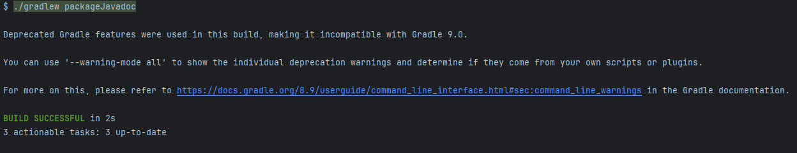

# CA2 - Build Tools
## Parte 1
### Etapa 1 - Configuração do Projeto

O objetivo da Parte 1 desta atribuição é praticar o uso do Gradle através de um exemplo fornecido.
Começamos por fazer o download da aplicação de exemplo disponível no repositório abaixo:
````
https://github.com/lmpnogueira/gradle_basic_demo
````
Depois de termos feito o download, realizamos um commit da aplicação para o repositório e criamos a tag ca2-1.1.0, dentro de uma pasta designada CA2.


### Etapa 2 - Criação de tarefa para executar o servidor
No ficheiro `build.gradle`, criamos uma tarefa `runServer` para executar o servidor


Esta é uma tarefa do tipo JavaExec, ou seja, permite que o Gradle execute uma programa Java
- **DependsOn : classes**: Especifica que a tarefa `runServer` depende da tarefa `classes`
- A tarefa `classes` compila o código fonte, garantindo que as classes Java sejamcontruídas antes de tentar executar a aplicação
- **group = "DevOps"** : Vai agrupar a tarefa na categoria "DevOps", facilitando a organização e a localizaçãona na lista de tarefas do Gradle
- **classpath = sourceSets.main.runtimeClasspath** : Define o caminho que o programa Java irá usar quando for executado
- **mainClass = 'basic_demo.ChatServerApp'** : Especifica o nome totalmente qualificado da classe Java que contém o método principal a ser executado
- **args '5091'** : Fornece argumentos para o método principal da classe `ChatServerApp`, neste caso é o número da porta que o servidor irá executar

Para que o servidor seja executado, usando a tarefa gradle, utilizamos o seguinte comando:
````
./gradlew runServer
````

### Etapa 3 - Execução de testes unitário
Começamos por criar um novo ficheiro de teste `SimpleTest.java` na pasta `src/test/java/basic_demo` com alguns testes unitários.
De seguida, atualizamos o ficheiro `build.gradle` para que possa executar o teste unitário com as dependenicas necessárias.

```groovy
dependencies {
    ""
    testImplementation 'org.junit.jupiter:junit-jupiter-api:5.7.0'
    testRuntimeOnly 'org.junit.jupiter:junit-jupiter-engine:5.7.0'
}
test {
    useJUnitPlatform()
    testLogging {
        events "passed", "skipped", "failed"
        exceptionFormat "full"
        showStandardStreams = true
    }
}
```
- **testImplementation 'org.junit.jupiter:junit-jupiter-api:5.7.0'** : Adiciona a dependência do JUnit 5 para a API de testes
- **testRuntimeOnly 'org.junit.jupiter:junit-jupiter-engine:5.7.0'** : Adiciona a dependência do JUnit 5 para o motor de execução de testes
- **useJUnitPlatform()** : Indica que o Gradle deve usar a plataforma JUnit 5 para executar os testes
- **testLogging** : Configura as mensagens de log que serão exibidas durante a execução dos testes
- **events "passed", "skipped", "failed"** : Define os eventos que serão registados no log, como testes passados, ignorados e falhados
- **exceptionFormat "full"** : Especifica que as exceções devem ser exibidas com informações completas
- **showStandardStreams = true** : Indica que as saídas padrão dos testes devem ser exibidas no log

Utilizamos o seguinte comando para executar o testes:
```
./gradlew test
```


### Etapa 4 - Criação de uma tarefa do tipo Copy
No ficheiro `buil.gradle` para criamos uma nova tarefa que irá fazer um backup.
Esta é um tarefa do tipo Copy, pois permite que o Gradle copie uma pasta.
```groovy
task backup(type: Copy) {
    from 'src'
    into "Backup"

    doLast {
        println "Backup completed! Sources copied to backup folder."
    }
}
```
- **from** : Define o diretório de origem do qual a tarefa irá copiar. Neste caso, é a pasta `src`, que contém o código fonte do projeto
- **into** : Define o diretório de destino onde o conteúdo da pasta `src` será copiado.  Neste caso, ele vai copiar tudo para uma pasta com o nome `backup` no diretório raiz do projeto

Para que o backup seja executado, usando a tarefa gradle, utilzamos o seguinte comando:
```
./gradlew backup
```

### Etapa 5 - Criação de uma tarefa do tipo Zip
Para criar a nova tarefa que consiste compactar o diretório de backup, editamos o 
ficheiro `build.gradle`. Esta é uma tarefa do tipo Zip que permite ao Gradle compactar
um diretório.

```groovy
task ZipBackup(type: Zip) {
    dependsOn backup

    from "backup"

    destinationDirectory = file("Archives")

    archiveFileName = "backup.zip"
}
```
- **dependsOn** : Indica que a tarefa `ZipBackup` depende da execução da tarefa de 
backup. Antes de criar o arquivo Zip, o Gradle primeiro vai executar a tarefa de 
`backup`, que copia os arquivos de origem para a pasta de `Backup`.
- **from "backup"** : Especifica o diretório de origem que a tarefa ZipBackup 
incluirá no arquivo Zip. Aqui, está usando a pasta de backup, que é gerada pela 
tarefa de backup.
- **destinationDirectory = file("Archives")** : Define onde o arquivo Zip será salvo. 
Neste caso, o arquivo Zip será armazenado num diretório de arquivos, que será 
criado dentro da raiz do projeto caso ainda não exista.
- **archiveFileName = "backup.zip"** : Define o nome do arquivo Zip resultante. 
O arquivo será denominado `backup.zip` e será armazenado na pasta de arquivos 
conforme definido acima.

Para que o zip seja executado, usando a tarefa gradle, utilzamos o seguinte comando:
```
./gradlew ZipBackup
```

### Etapa 6 - Gestão Automática de Versões do Gradle e JDK
Neste projeto, não foi necessário instalar manualmente versões específicas do Gradle ou do JDK devido aos seguintes fatores:

- **Gradle Wrapper:**
O projeto está configurado com o Gradle Wrapper (gradlew), que é um script incluído no repositório que permite executar o projeto com a versão específica do Gradle necessária.
Este wrapper faz o download automático da versão de Gradle especificada no projeto ao correr os comandos, garantindo que todos os desenvolvedores utilizam a mesma versão, sem precisar de a instalar manualmente.


- **Suporte à Toolchain de Java:**
A funcionalidade de toolchain do Gradle permite detetar e gerir automaticamente as versões do JDK necessárias para compilar e executar o projeto. A configuração da toolchain no ficheiro build.gradle especifica a versão de linguagem Java necessária, e o Gradle assegura que a versão correta do JDK é utilizada.
Se a versão necessária do JDK não estiver instalada localmente, o Gradle pode fazer o download automaticamente ou utilizar qualquer versão compatível disponível no sistema.
```
java {
  toolchain {
    languageVersion = JavaLanguageVersion.of(17)
  }
}

```
- Gestão de Plugins: 
O projeto utiliza o plugin que resolve automaticamente a versão apropriada do JDK através do Gradle, facilitando a gestão de diferentes versões do JDK em vários ambientes, sem necessidade de intervenção manual.
```
plugins {
  id 'org.gradle.toolchains.foojay-resolver-convention' version '0.8.0'
}

```

- **Deteção Automática dos JDKs Instalados:**
  O Gradle e a funcionalidade java_home do sistema detetam automaticamente as versões do JDK instaladas. Como mostrado na saída do comando, várias versões do JDK foram detetadas, como o Amazon Corretto, Homebrew, e Oracle JDK. Isto garante que o projeto consegue encontrar e utilizar a versão correta do JDK sem necessidade de configuração manual.

O comando gradle -q javaToolchain lista as versões de JDK disponíveis no sistema, permitindo que o Gradle selecione a mais apropriada.


Por fim criamos a tag ca2-part1, que contém todas as alterações feitas no projeto.


## Parte 2 
### Converter o projeto de Maven para Gradle
### Etapa 1 -  Criar um novo projeto Gradle 
Começamos por copiar a pasta gradle do projeto `gradle_basic_demo-main`, assim como os scripts `gradlew` e `gradlew.bat`, uma vez que estes são necessários para a criação de um novo projeto Gradle, a menos que o Gradle já esteja instalado na máquina.
De seguida, para criar um novo projeto Gradle, basta executar o comando abaixo:

```bash
./gradlew init
```


### Etapa 2 - Copiar/Criar as dependencias do projeto Maven para o projeto Gradle
Com base no arquivo `pom.xml` do projeto Maven, é necessário copiar/criar as dependências no arquivo `build.gradle` do projeto Gradle.


As dependencias são adicionadas no bloco `dependencies` do arquivo `build.gradle`.
Apos a adição das dependencias, é necessário sincronizar o projeto Gradle para que as dependencias sejam baixadas e adicionadas ao projeto, seguido da execução do projeto. Para isso, basta executar o comando abaixo:

```bash
./gradlew bootRun
```

De seguida, realizamos um teste para verificar se o projeto foi convertido corretamente. Para isso, basta abrir o navegador e aceder ao endereço `http://localhost:8080/employees` para verificar se a aplicação está a funcionar corretamente, e se conseguimos obter os Employees.


### Etapa 3 - Criação uma tarefa que compacta todo o código-fonte num arquivo Zip
Esta tarefa teve como objetivo criar um backup, em formato Zip, de todo o código-fonte 
presente no diretório src. A tarefa organiza este backup num diretório de backup 
específico, chamado backupAllCode.
A tarefa é do tipo Zip, o que significa que irá comprimir arquivos num formato de arquivo .zip.
```groovy
task backupSourceZip(type: Zip) {
  group = "Backup"
  description = "Creates a zip backup of the entire source code and saves it in the backup directory."

  from('src') {
    include '**/*'
  }

  def backupDir = file("backupAllCode")
  destinationDirectory = backupDir
  archiveFileName = "source-backup.zip"

  doFirst {
    println "New backup directory"
    if (!backupDir.exists()) {
      mkdir backupDir
    } else {
      println "Directory ${backupDir.absolutePath} already exists"
    }
  }

  doLast {
    println "Backup completed! ${backupDir.absolutePath}"
  }
}

```
- `group = "Backup"`: tarefa é associada ao grupo `Backup`, para organização no 
ambiente Gradle
- `description = "Creates ...` : breve descrição que explica a sua funcionalidade
- `from('src')` : Define que o conteúdo a ser comprimido será proveniente da pasta src
- `include '**/*'` : Indica que todos os ficheiros e pastas dentro de src devem ser incluídos no backup
- `println "New backup directory"`: Imprime uma mensagem indicando que será criado um novo diretório de backup.
- `if (!backupDir.exists()) { mkdir backupDir }`: Verifica se o diretório backupAllCode já existe. Se não existir, ele será criado com o comando mkdir.
- `else { println "Directory ${backupDir.absolutePath} already exists" }`: Se o diretório já existir, uma enviada uma mensagem a informar que o diretório já existe.
- `doLast` é executada após o processo de backup estar concluído. Nesta secção, imprimimos uma mensagem de confirmação com o caminho completo onde o backup foi guardado.

Para que o zip de todo o código-fonte seja executado, usando a tarefa gradle, utilzamos o seguinte comando:
```
./gradlew backupSourceZip
```


### Etapa 4 - Criação de uma Tarefa Personalizada para Executar a Aplicação

No projeto, foi criada a tarefa personalizada runWithDist, que depende da tarefa installDist para executar a aplicação utilizando os scripts de distribuição gerados pelo Gradle. Esta tarefa verifica o sistema operativo e executa o script apropriado: no Windows, o ficheiro basic_demo.bat e, em sistemas Unix/Linux/MacOS, o script basic_demo. Isso permite a execução da aplicação em diferentes ambientes sem configurações adicionais.
No ficheiro build.grade foi adicionado a seguinda função:


Para executar a aplicação utilizando a tarefa personalizada, utilize o seguinte comando:

```
./gradlew runWithDist
```
### Etapa 5 - Criação de uma Tarefa Personalizada para Gerar e Compactar a Documentação Javadoc

Para criar uma tarefa personalizada que gera e compacta a documentação Javadoc, adicionamos a tarefa "packageJavadoc" ao arquivo build.gradle:
    
```groovy
task packageJavadoc(type: Zip) {
group = "Documentation"
description = "Generates Javadoc and packages it into a zip file."
  from javadoc.destinationDir
  destinationDirectory = file("$buildDir/docs")
  archiveFileName = "javadoc.zip"
  dependsOn javadoc
    doLast {
        println "Javadoc packaged into ${archiveFileName} at ${destinationDirectory.get().asFile.absolutePath}"
    }
}
  ```
- **group = "Documentation"** : A tarefa é associada ao grupo "Documentation" para organização no ambiente Gradle.
- **from javadoc.destinationDir** : Define o diretório de origem para a tarefa de compactação, que é o diretório de destino da documentação Javadoc gerada.
- **destinationDirectory = file("$buildDir/docs")** : Define o diretório de destino onde o arquivo zip será armazenado. Neste caso, o arquivo zip será armazenado na pasta build/docs.
- **archiveFileName = "javadoc.zip"** : Define o nome do arquivo zip resultante.
- **dependsOn javadoc** : Indica que a tarefa packageJavadoc depende da tarefa javadoc, garantindo que a documentação Javadoc seja gerada antes de ser compactada.


Para executar a tarefa personalizada que gera e compacta a documentação Javadoc, utilizamos o seguinte comando:

```
./gradlew javadoc

./gradlew packageJavadoc
```
O comando ./gradlew javadoc gera a documentação Javadoc, e o comando ./gradlew packageJavadoc compacta a documentação Javadoc num ficheiro zip.
Se formos a pasta build/docs, podemos encontrar o ficheiro javadoc.zip que contém a documentação Javadoc gerada.



### Etapa 6 - Criação de um Novo Source Set para Testes de Integração

No projeto alteramos o ficheiro build.gradle e adicionamos o source set de testes de integração e as respetivas dependências.
```groovy
sourceSets {
  integrationTest {
    java {
      srcDir 'src/integrationTest/java'
    }
    resources {
      srcDir 'src/integrationTest/resources'
    }
    compileClasspath += sourceSets.main.output + configurations.testRuntimeClasspath
    runtimeClasspath += sourceSets.main.output + configurations.testRuntimeClasspath
  }
}


```
Defenimos a task integrationTest para executar os testes de integração.
```groovy
task integrationTest(type: Test) {
  description = 'Run integration tests.'
  group = 'verification'
  testClassesDirs = sourceSets.integrationTest.output.classesDirs
  classpath = sourceSets.integrationTest.runtimeClasspath
  shouldRunAfter test
}

```

Foi criado um source set específico para testes de integração, com o diretório src/integrationTest/java. Configuramos as dependências e a tarefa integrationTest, que compila e executa esses testes.


Depois de implementarmos o codigo no ficheiro "IntegrationTest",utilizamos o seguinte comando.
```bash
gradle integrationTest
```
# Alternativas ao Gradle
## Maven

O Maven é uma das ferramentas mais populares para a automatização de builds no ecossistema Java. Utilizado para a gestão de dependências e do ciclo de vida de projetos, é amplamente adotado em grandes projetos empresariais.

- **Facilidade de uso**: O Maven segue uma abordagem declarativa com o uso de ficheiros XML (pom.xml) para configurar dependências e definir as fases do ciclo de vida do build. Esta estrutura é relativamente simples de compreender, especialmente para quem já está familiarizado com XML.
- **Gestão de dependências**: Um dos pontos fortes do Maven é a gestão robusta de dependências, com repositórios centrais e locais bem estabelecidos, facilitando a integração com bibliotecas e frameworks populares.
- **Padronização** : O Maven promove a padronização do ciclo de vida de builds através de um ciclo bem definido (compilar, testar, arquivar, etc.), o que traz consistência aos projetos.
- **Limitações** : O uso de XML pode tornar-se extenso e pouco legível à medida que o projeto cresce. Além disso, o Maven pode ser menos flexível do que o Gradle para configurações personalizadas.

## Ant

O Ant foi uma das primeiras soluções desenvolvidas para a construção automática de projetos em Java, e apesar de ter perdido relevância em comparação com o Maven e Gradle, ainda é usado em determinados contextos específicos.

- **Facilidade de uso**: O Ant utiliza ficheiros XML, mas ao contrário do Maven, a sua abordagem é mais imperativa. Os utilizadores definem explicitamente cada passo do build, oferecendo grande controlo, mas tornando a ferramenta menos intuitiva para grandes projetos.
- **Flexibilidade**: Por ser imperativo, o Ant é altamente flexível. Permite a definição de tarefas personalizadas para atender a necessidades específicas do projeto.
- **Gestão de dependências**: A gestão de dependências no Ant não é tão avançada como no Maven ou Gradle. Normalmente, as bibliotecas externas precisam ser geridas manualmente ou com a ajuda de plugins adicionais, como o Ivy.
- **Desempenho**: O Ant tende a ser mais rápido em operações simples devido à sua arquitetura leve, mas a falta de convenções pode tornar a configuração complexa em grandes projetos.


## SBT (Scala Build Tool)

Embora originalmente desenvolvido para projetos em Scala, o SBT tem ganho espaço também em projetos Java, especialmente pela sua velocidade e flexibilidade.

- **Facilidade de uso**: O SBT utiliza ficheiros de configuração baseados em Scala, o que pode ser inicialmente complexo para utilizadores vindos de ferramentas como Maven e Gradle. No entanto, a sua sintaxe programática permite um nível elevado de personalização.
- **Builds incrementais**: Um dos pontos fortes do SBT é o suporte nativo a builds incrementais, o que acelera o processo de compilação, recompilando apenas o código alterado.
- **Gestão de dependências**: O SBT usa um sistema semelhante ao Maven e Gradle para a gestão de dependências, facilitando a integração com repositórios públicos e privados.
- **Popularidade**: Apesar de ser mais comum em projetos Scala, a sua aceitação em projetos Java está a crescer, especialmente em ambientes que valorizam a velocidade de builds e a personalização.

## Buck

O Buck é uma ferramenta de build open-source criada pelo Facebook, projetada para escalar em grandes repositórios únicos com múltiplas linguagens e projetos.

- **Desempenho**: O Buck foca-se na eficiência através da realização de builds incrementais, semelhantes ao SBT, permitindo que apenas as partes modificadas do código sejam recompiladas. Isto torna-o muito eficiente para grandes bases de código.
- **Arquitetura modular**: O Buck promove uma abordagem modular, o que facilita a construção e teste de partes isoladas do projeto sem a necessidade de compilar o sistema inteiro.
- **Facilidade de uso**: A curva de aprendizagem do Buck pode ser mais acentuada devido à sua abordagem mais técnica e ao foco em repositórios únicos. No entanto, é uma boa escolha para equipas que gerem projetos de grande escala.
- **Gestão de dependências**: O Buck suporta a gestão de dependências, mas não é tão robusto como o sistema oferecido pelo Gradle ou Maven.

## Conclusão

**Conclusão**

O Gradle é uma das ferramentas de build mais poderosas e flexíveis, sendo amplamente adotado em projetos modernos, especialmente para Android. No entanto, existem várias alternativas, cada uma com os seus pontos fortes:

- O **Maven** é ideal para equipas que valorizam a padronização e a simplicidade, com uma forte gestão de dependências.
- O **Ant** oferece maior controlo e flexibilidade, mas à custa de uma curva de aprendizagem maior e configurações mais complexas.
- O **SBT** destaca-se em builds rápidos e incrementais, especialmente em projetos Scala ou que priorizam eficiência.
- O **Buck** é uma excelente escolha para **repositórios únicos** e grandes projetos que necessitam de builds rápidos e modulares.

A escolha da ferramenta de build ideal depende das necessidades específicas do projeto, da dimensão da equipa e dos requisitos de desempenho e flexibilidade. Para projetos Android e Java de larga escala, o Gradle continua a ser a escolha predominante, mas alternativas como Maven ou SBT podem ser mais adequadas para diferentes cenários.

# Implementação de Alternativa ao Gradle

Para demonstrar a implementação de uma alternativa ao Gradle, vamos considerar o Ant, uma ferramenta de build amplamente utilizada em projetos Java.

## Configuração do Ant

### 1. Instalação do Ant

Para utilizar o Ant, é necessário instalar a ferramenta no sistema. O Ant pode ser descarregado a partir do site oficial do Apache Ant e instalado seguindo as instruções fornecidas, ou em Linux atraves do comando abaixo:

```bash
sudo apt-get install ant
```
### 2. Criação de uma estrutura basica de um projeto Java

Para criar um projeto Java com o Ant, é necessário seguir uma estrutura de diretórios padrão. Por exemplo, um projeto Java simples pode ter a seguinte estrutura:

```
NonRest_Ant/
│
├── build.xml       // Arquivo de build do Ant
├── src/            // Código-fonte Java
│   └── main/
│       └── java/
│           └── PayrollApplication.java
│   └── test/
│       └── java/
│           └── PayrollApplicationTest
└── lib/            // Dependências de bibliotecas (opcional)

```

Se quisermos adicionar bibliotecas externas ao projeto, podemos colocá-las na pasta `lib` e referenciá-las no arquivo `build.xml`.

### 3. Configuração do Projeto com Ant

Para configurar um projeto Java com o Ant, é necessário criar um ficheiro `build.xml` na raiz do projeto. Este ficheiro contém as tarefas de build, compilação, teste e outras operações necessárias para a construção do projeto.

```xml

<project name="ant-sample" basedir="." default="build">

    <!-- properties -->
    <property name="src.dir"     value="src"/>
    <property name="build.dir"   value="build"/>
    <property name="classes.dir" value="${build.dir}/classes"/>
    <property name="jar.dir"     value="${build.dir}/jar"/>
    <property name="doc.dir"     value="doc"/>

    <!-- targets -->
    <target name="compile" description="compile project">
        <mkdir dir="${classes.dir}"/>
        <javac srcdir="${src.dir}" destdir="${classes.dir}" includeantruntime="false"/>
    </target>

    <target name="jar" depends="compile" description="generate the distribution jar">
        <mkdir dir="${jar.dir}"/>
        <jar destfile="${jar.dir}/${ant.project.name}.jar" basedir="${classes.dir}">
            <manifest>
                <attribute name="Main-Class" value="PayrollApplication"/>
            </manifest>
        </jar>
    </target>

    <target name="run" depends="jar" description="run application">
        <java jar="${jar.dir}/${ant.project.name}.jar" fork="true"/>
    </target>

    <target name="build" depends="jar" description="build application"/>

    <target name="doc" description="generate documentation">
        <mkdir dir="${doc.dir}" />
        <javadoc destdir="${doc.dir}" sourcepath="${src.dir}"/>
    </target>

    <target name="clean" description="clean up build files">
        <delete dir="${build.dir}"/>
        <delete dir="${doc.dir}" />
    </target>

    <target name="rebuild" depends="clean,build" description="rebuild application"/>

</project>
  
```

### 4. Compilação e Execução do Projeto

Para compilar o projeto com o Ant, basta executar o comando `ant` na raiz do projeto:

Para compilar o projeto:
```bash
ant compile
```


Para gerar o arquivo JAR:
```bash
ant jar
```


Para executar o projeto:
```bash
ant run
```


Para executar os testes:
```bash
ant test
```

