# Introdução

Este projeto, tem como objetivo explorar a automação de builds utilizando o Gradle. O trabalho está dividido em duas partes: na primeira, focamo-nos na aplicação de conceitos básicos do Gradle através de um exemplo simples, como a criação de tarefas personalizadas e o controlo de versões com tags. Na segunda parte, a nossa tarefa é converter uma aplicação de serviços REST, originalmente desenvolvida com Maven, para Gradle, implementando novas funcionalidades e otimizando o processo de build.
Além disso, é-nos solicitado que apresentemos uma solução alternativa ao Gradle, analisando e comparando as suas funcionalidades e eficiência em relação à ferramenta original. Por fim, toda a documentação deste projeto, incluindo os passos seguidos e as decisões tomadas, será detalhada num ficheiro readme.md, armazenado no repositório do grupo, de forma a garantir a replicação do trabalho desenvolvido.
Os resultados deste trabalho serão documentados num ficheiro readme.md no repositório do grupo, com uma explicação detalhada dos passos e decisões tomadas durante o desenvolvimento, facilitando a sua reprodutibilidade.

# Tutorial

## Parte 1
### 1º Passo - Criação da Pasta CA2 e Part1
**Resolução:** 
Inicialmente criamos um novo diretório onde será feito o projeto.  
Para isso, usamos os seguintes comandos:

    mkdir CA2
    cd CA2
    mkdir Part1

**Resultado:** 

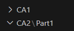

### 2º Passo - Clone do Projeto
**Objetivo:** 
Usar a aplicação Building REST services with Spring que deve ser adicionar ao repositório

**Resolução:** 
Após isso fizemos o clone de um outro projeto para o nosso e removemos o .git para o evitar conflitos

    git clone https://github.com/lmpnogueira/cogsi2425.git
    rm .git

**Resultado:** 

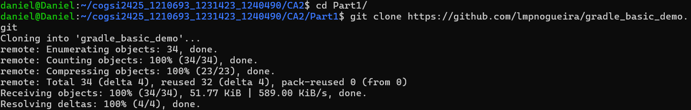

### 3º Passo - Criação dos Issues
**Objetivo:** 
Criar issue(s) no GitHub para as principais tarefas.

**Resolução:** 
Optamos por utilizar a interface do GitHub para criamos os issue de uma forma mais rápida.

**Resultado:** 

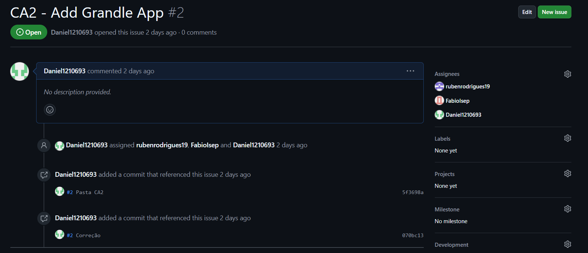

>**Nota:** À medida que fomos desenvolvendo o nosso projeto, fomos criando issue que se adequavam aos problemas que fomos encontrando. Nem sempre foram descritos ao longo do relatório.

### 4º Passo - Criação de Tag CA2-1.1.0
**Objetivo:** 
Usar tags para marcar as versões da aplicação.

**Resolução:** 
Utilizamos os seguintes comandos para a criação da primeira tag nesta segundo CA.

    git tag ca2-1.1.0
    git tag

**Resultado:** 

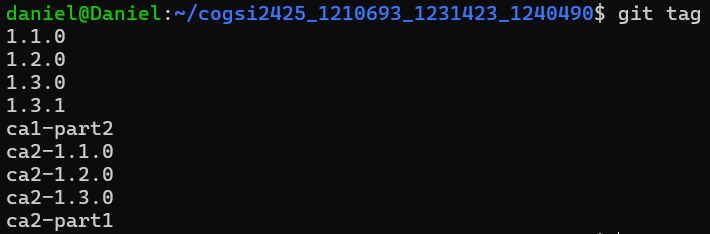
>**Nota:** Nesta screenshot já se encontra com todas as tags feitas para a CA2

### 5º Passo - Task para Executar o Server
**Objetivo:** 
Adicionar uma nova tarefa Gradle para executar o servidor.

**Resolução:** 
Neste passo desenvolvemos o seguinte código para conseguir executar o servidor.

    task runServer(type:JavaExec, dependsOn: classes) {
        group = "DevOps"
        description = "Launches chat server on 59001 port"

        classpath = sourceSets.main.runtimeClasspath
        mainClass = 'basic_demo.ChatServerApp'
        args '59001' 
    }

Este código cria uma task no Gradle chamada `runServer`, que serve para executar uma aplicação Java na porta 59001.  
Basicamente, esta task faz o seguinte: primeiro compila o código, depois vai buscar as bibliotecas necessárias, e finalmente executa o servidor. 
A task faz parte do grupo "DevOps", e passa a porta onde o servidor vai rodar como argumento (59001).

Para executar esta task em primeiro lugar fazemos o comando:

    ./gradelw build

E em seguida o comando:

    ./gradelw runServer

**Resultado:** 

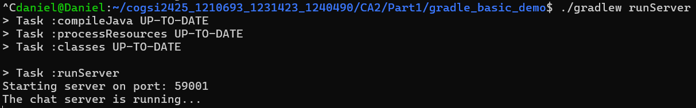

### 6º Passo - Testes Unitários
**Objetivo:** 
Adicionar um teste unitário simples e atualizar o script de build do Gradle para que possa executar o teste.

**Resolução:** 
Dentro do diretório Part1/gradle_basic_demo/src criamos o ficheiro AppTest.java onde serão feitos os testes unitários.

    mkdir test/java/basic_demo
    nano AppTest.java

Código para os testes unitários:

    package basic_demo;
    import static org.junit.Assert.assertNotNull;
    import org.junit.Test;
    public class AppTest {
        
        @Test
        public void testAppHasAGreeting() {
            App classUnderTest = new App();
            assertNotNull("app should have a greeting", classUnderTest.getGreeting());
        
        }
    }

**Resultado:** 

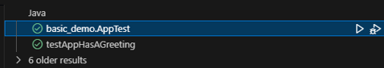

### 7º Passo - Task Backup
**Objetivo:** 
Adicionar uma nova tarefa do tipo copy para ser usada para fazer um backup dos ficheiros da aplicação. 
- Deve copiar o conteúdo da pasta src para uma nova pasta de backup.

**Resolução:** 
Para resolver este objetivo, criamos o seguinte código:

    task backupSources(type: Copy) {
        group = "DevOps"
        description = "Backup of the sources of the application"

        from 'src'
        into 'backup/'
    }

Este código define uma tarefa chamada `backupSources` para realizar o backup dos arquivos de código da aplicação.   
A tarefa pertence ao grupo "DevOps", com a descrição "Backup das fontes da aplicação". Ela copia os arquivos da pasta src para a pasta backup/.

Para além da task para criar o backup, criámos também  uma task para apagar o backup.

    task deleteBackup(type: Delete) {
        delete 'backup' 
    }

Execução da task `./gradlew backupSources`

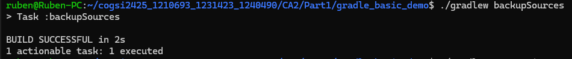

**Resultado:** 

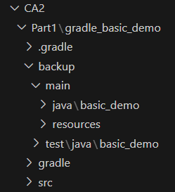

### 8º Passo - Task Zip
**Objetivo:** 
Adicionar uma nova task do tipo Zip para ser usada para criar um arquivo (ou seja, um ficheiro zip) do backup da aplicação.  
- Esta task deve depender da execução da task de backup.

**Resolução:** 
Para resolver este objetivo, criamos o seguinte código:

    task createZip(type: Zip) {
        group = "DevOps"
        description = "Zip archive of the sources of the application"

        from 'src'
        archiveFileName = 'zipfile.zip'
        destinationDirectory = file('backup/')
    }

Este código define uma task chamada `createZip`, que cria um arquivo ZIP contendo os arquivos de código da aplicação.  
A task pertence ao grupo "DevOps" e tem a descrição "Arquivo zip das fontes da aplicação".  
Ela pega nos arquivos da pasta src, cria um arquivo ZIP chamado zipfile.zip e guarda-o na pasta backup/.

Para além da task para criar o zip, criámos também uma task para apagar o zip.

    task deleteZip(type: Delete) {
        delete file('backup/zipfile.zip')
    }   

Execução da task `./gradlew createZip`

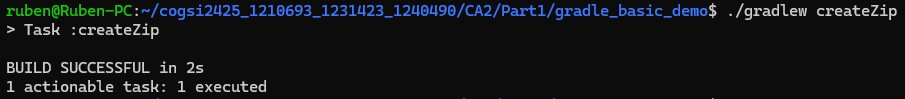

**Resultado:** 

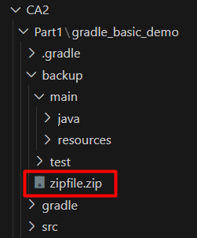

### 9º Passo - javaToolchain
**Objetivo:** 
Explicar por que não foi necessário fazer o download e instalar manualmente versões específicas do Gradle e do JDK para construir e executar esta aplicação.
- No diretório raiz da aplicação, executa “gradle –q javaToolchain” e explica o resultado.

**Resolução:** 
Não houve necessidade de efectuar o download e instalar manualmente versões específicas do Gradle e JDK, porque o projeto usa as ferramentas do Gradle Wrapper e Java Toolchain.  

**Gradle Wrapper**: Quando executamos o comando `./gradlew` (o script Gradle Wrapper), ele faz o download automaticamente da versão correta do Gradle, caso ainda não esteja instalada no computador. Isto garante que a mesma versão do Gradle seja sempre usada, evitando problemas de compatibilidade.  

**Java Toolchain**: O Java Toolchain no Gradle permite definir a versão do Java necessária para compilar, testar e executar o projeto, mesmo que a versão do JDK não esteja instalada localmente. O Gradle faz o download e utiliza automaticamente a versão apropriada do JDK se ela não estiver disponível.

**Resultado:** 

Ao executar o comando `gradle -q javaToolchain`, o Gradle exibe os detalhes do conjunto de ferramentas do Java utilizado, incluindo a versão do JDK usada.

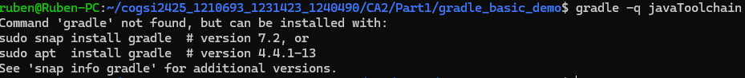

Neste caso como ainda não tinhamos o gradle instalado, não encontrou o comando. 

Após instalarmos o gradle já obtivemos detalhes das versões do Java.

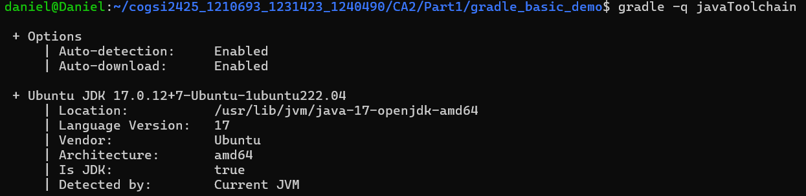

Se em vez de utilizarmos o comando `gradle -q javaToolchain` usarmos o comando `./gradlew -q javaToolchain` já conseguimos obter o mesmo output sem necessitarmos de fazer alguma instalação.

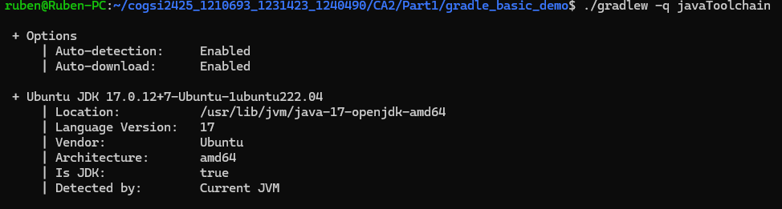

### 10º Passo - Tag Final
**Objetivo:** 
No final da tarefa, marca o teu commit com a tag **ca2-part1**.

**Resolução:** 
Por fim para concluir a primeira parte do projeto, criamos a última tag.

    git tag ca2-part1
    git push origin ca2-part1

**Resultado:** 

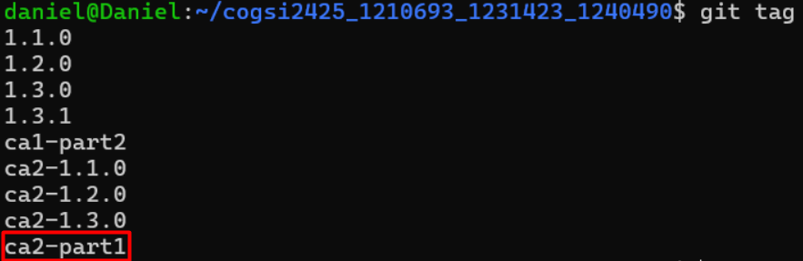

## Parte 2

### 1º Passo - Criação do Projeto Gradle
**Objetivo:** 
Num diretório vazio, utiliza o comando *gradle init* para criar um projeto Gradle.  
 - Substitui a pasta *src* pela da aplicação "Building REST services with Spring".

**Resolução:** 
Para resolver este objetivo criamos um diretório vazio chamado Part2 dentro da pasta CA2

    mkdir Part2

Dentro desse diretório executamos o comando

    gradle init

E selecionamos as seguintes opções

1. 1 "Application"
2. 1 "Java"
3. 17 (Java Version)
4. building-rest (Project Name)
5. 1 "Single application project"
6. 2 "Groovy"
7. 1 "JUnit 4"
8. yes (Generate Build Using new APIs and Behavior)

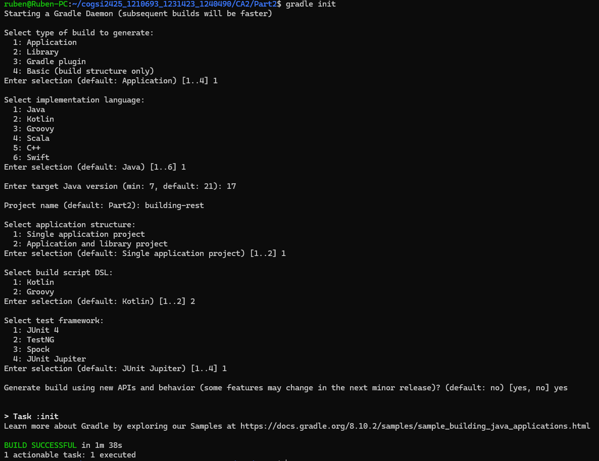

> **Nota:** Estas opções foram feitas com base nas ferramentas já usadas para a parte 1 do projeto, e com base no conforte com que temos nas mesmas.

### 2º Passo - Adição de Todos as Dependências e Plugins
**Objetivo:** 
Certifica-te de que todas as dependências e plugins necessários estão adicionados ao teu script de build do Gradle.  
 - Compila e executa a aplicação com `./gradlew bootRun`.  
 - Utiliza o teu navegador em [http://localhost:8080/employees](http://localhost:8080/employees).

Execução da task `./gradlew bootRun`

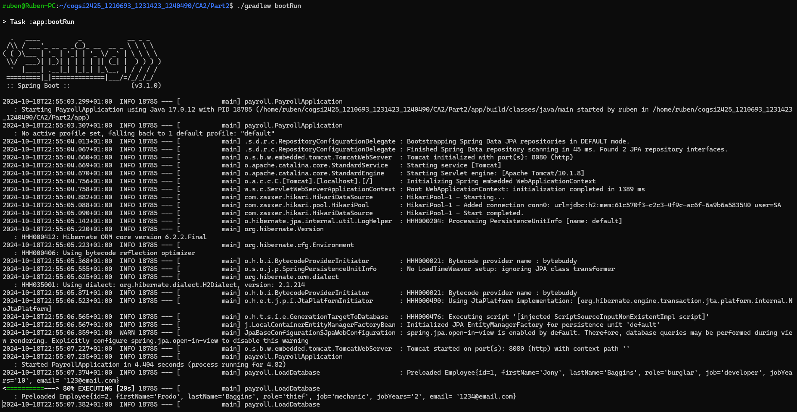

**Resultado:** 

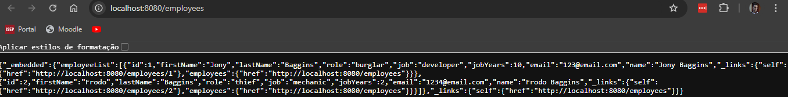

### 3º Passo - Task de Zipar e Armazenar no Diretório Backup
**Objetivo:** 
Criar uma tarefa personalizada que comprime (em formato zip) todo o código-fonte do projeto e o armazena num diretório de backup.
- Esta tarefa deve tratar tanto da cópia como da compressão do código-fonte, garantindo um processo de backup limpo.

**Resolução:** 
Como primeiro ponto foi criada uma branch, tag e issue para trabalhar neste passo, para isso foram feitos os comandos:

**Branch**

    git branch "source-code-zip"

**Tag**

    git tag ca2-1.2.0

**Issue**

Em seguida foi feito o seguinte código para criar o Backup:

    task backupProject(type: Zip) {
        group = "Backup"
        description = "Zips the code into a backup"
    
        from 'src'
        include '*/'
    
        destinationDirectory = file("backups")
    
        archiveFileName = "source-backup-${new Date().format('yyyy-MM-dd_HH-mm-ss')}.zip"
    
        doFirst {
            println "Zipping the source code..."
            delete file("backups")
            mkdir file("backups")
        }
    }

Esta tarefa do Gradle é projetada para compactar o código fonte localizado no diretório src, armazená-lo em um diretório de backup chamado backups, e nomear o arquivo ZIP de acordo com a data e hora atuais.  
Antes de compactar, ele limpa o diretório de backup anterior e cria um novo (doFirst), e ao final, informa que o backup foi realizado com sucesso (doLast).

Execução da task `./gradlew backupProject`

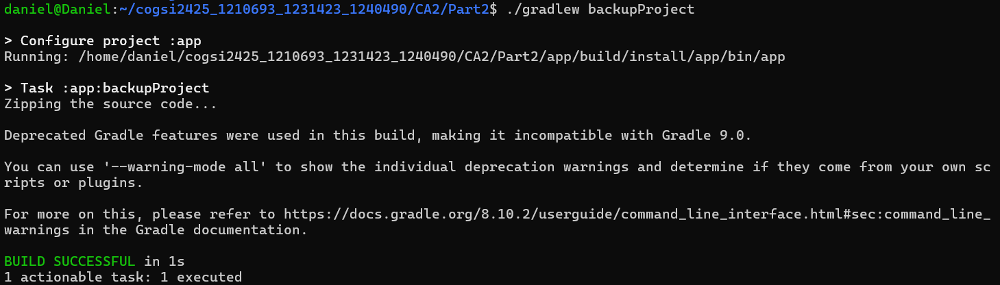

**Resultado:** 

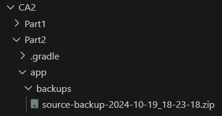

### 4º Passo - Task do InstallDist
**Objetivo:** 
Criar uma tarefa personalizada que dependa da tarefa *installDist* e executar a aplicação utilizando os scripts de distribuição gerados.  
 - Define o script executável com base no sistema operativo.

**Resolução:** 
Como primeiro ponto foi criada uma branch, tag e issue para trabalhar neste passo, para isso foram feitos os comandos:

**Branch**

    git branch "installdist"

**Tag**

    git tag ca2-1.3.0

**Issue**  

Em seguida foi criado o código para a Task.

    task runDistributionScript(type: Exec){
        group = "Distribution"
        description = "Runs the application using the generated distribution scripts."

        dependsOn installDist

        def os = org.gradle.internal.os.OperatingSystem.current()

        def appDir = "$buildDir/install/${project.name}/bin"
        def execScript

        if (os.isWindows()) {
            execScript = "${appDir}/${project.name}.bat"
        } else {
            execScript = "${appDir}/${project.name}"
        }

        println "Running: $execScript"
        executable = execScript
    }

A tarefa `runDistributionScript` é projetada para executar a aplicação usando os scripts de distribuição gerados pelo Gradle.  
Ela determina o sistema operativo para escolher o script apropriado a ser executado, garante que a aplicação esteja instalada antes de tentar executá-la e imprime na consola o comando que será executado.

Execução da task `./gradlew runDistributionScript`

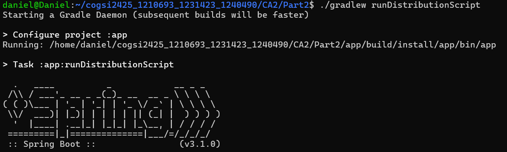

**Resultado:** 

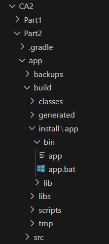

### 5º Passo - Task do Javadoc
**Objetivo:** 
Criar uma tarefa personalizada que dependa da tarefa javadoc, a qual gera a Javadoc para o teu projeto, e depois empacota a documentação gerada num ficheiro zip.

**Resolução:** 
Como primeiro ponto foi criada uma branch, tag e issue para trabalhar neste passo, para isso foram feitos os comandos:

**Branch**

    git branch "javadoc"

**Tag**

    git tag ca2-1.4.0

**Issue**  

Em seguida foi criado o código para a Task.

    task runJavadoc(type: Zip) {
        group = "Javadoc"
        description = "Creates Javadoc and puts it in a ZIP archive."

        dependsOn javadoc

        from javadoc.destinationDir

        destinationDirectory = file("$rootDir/app")

        archiveFileName = "javadoc.zip"

        doLast {
            println "Javadoc successfully created and saved as $destinationDirectory/javadoc.zip"
        }
    }

Este código define uma task chamada `runJavadoc`, que cria a documentação do Javadoc e a coloca num arquivo ZIP.  
A task pertence ao grupo "Javadoc" e tem a descrição "Cria Javadoc e coloca em um arquivo ZIP".  
Ela depende da execução da task javadoc, ou seja, antes de rodar essa task, a documentação Javadoc precisa ser gerada.  
A task copia os arquivos da pasta onde o Javadoc foi gerado, cria um arquivo ZIP chamado javadoc.zip, e o guarda na pasta app no diretório raiz do projeto.  
Após concluir, imprime uma mensagem informando que o Javadoc foi criado e guardado com sucesso.

Execução da task `./gradlew javadoc`

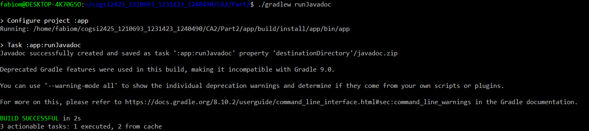

**Resultado:** 

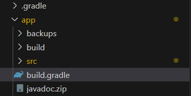

### 6º Passo - Testes Integração
**Objetivo:** 
Criar um novo conjunto de código-fonte para testes de integração.  
 - Adiciona um teste simples e as dependências e tarefas necessárias para executar o teste.

**Resolução:** 
Como primeiro ponto foi criada uma tag e issue para trabalhar neste passo, para isso foram feitos os comandos:

**Tag**

    git tag ca2-1.5.0

**Issue**  

Após isso adicionamos as dependências necessárias para garantir que não haverá problemas na execução dos testes.

    testImplementation 'org.springframework.boot:spring-boot-starter-test'

Em seguida desenvolvemos este código para os testes

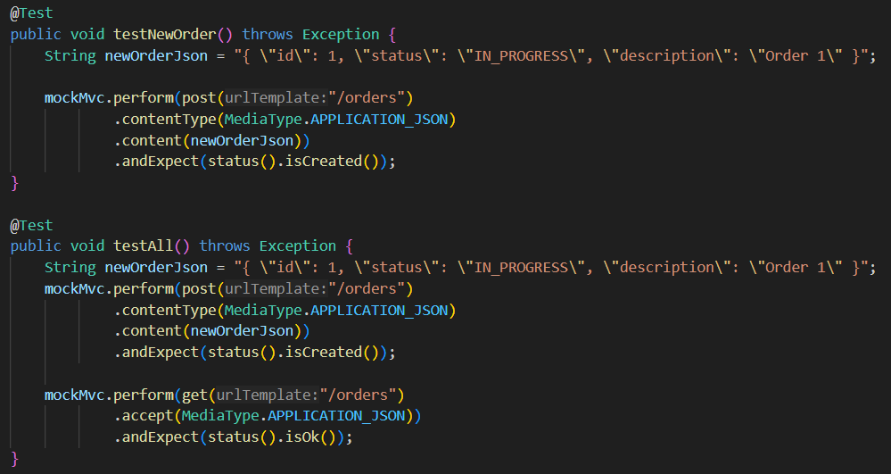

**Resultado:** 

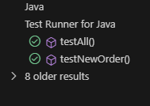

### 7º Passo - Tag Final
**Objetivo:** 
No final da tarefa, marca o teu commit com a tag **ca2-part2**.

**Resolução:** 
Por fim para concluir a segunda parte do projeto, criamos a última tag.

    git tag ca2-part2

**Resultado:** 

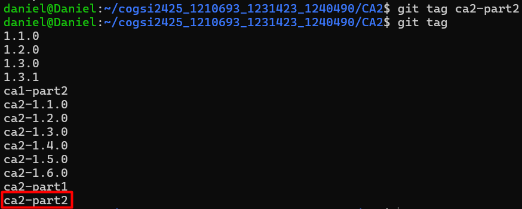

# Alternativas

## Gradle    Descrição:
Gradle é uma ferramenta moderna de automação de builds baseada em Groovy ou Kotlin, focada em performance com suporte a builds incrementais e caching.

### Vantagens: 
 - Rápido
 - Flexível
 - Usa uma linguagem moderna (Groovy/Kotlin) 
 - Ideal para grandes projetos como Android

### Desvantagens: 
 - Curva de aprendizagem mais alta
 - Documentação pode ser mais confusa

## Maven:
Maven é uma ferramenta de build baseada em XML que segue convenções padronizadas, amplamente usada no ecossistema Java para gerir dependências e automação de builds.

### Vantagens: 
 - Fácil de usar
 - Estrutura padronizada
 - Ótimo para projetos Java convencionais

### Desvantagens: 
 - Mais lento
 - XML complexo
 - Menos flexível que o Gradle

## Ant:
Ant é uma ferramenta de build altamente flexível e configurável, que oferece controle total sobre o processo de automação, mas exige scripts detalhados em XML.

### Vantagens: 
 - Muito flexível
 - Permite controle total sobre o build

### Desvantagens: 
 - Requer muita configuração manual
 - Não tem gestão nativa de dependências
 - Tende a ser mais lento

## Bazel:
Bazel é uma ferramenta de build desenvolvida pelo Google, projetada para alta performance e escalabilidade em projetos grandes e complexos, com suporte para múltiplas linguagens

### Vantagens: 
 - Extremamente rápido
 - Ideal para projetos gigantes e complexos
 - Suporta várias linguagens

### Desvantagens: 
 - Difícil de aprender
 - Existe menos plugins e documentação

## Conclusão

Em resumo, o **Gradle** é a opção mais moderna, com excelente performance e flexibilidade, ideal para projetos complexos como Android.  
Já o **Maven** é mais simples de usar e segue convenções padronizadas, sendo ótimo para projetos Java tradicionais, mas com menos flexibilidade.   
O **Ant** oferece total controle sobre o build, mas exige muita configuração manual, tornando-se menos eficiente em comparação com as outras ferramentas.   
Por fim, o **Bazel** é o mais rápido e escalável, perfeito para projetos gigantescos e multiplataforma, mas a sua complexidade torna-o menos adequado para projetos menores.

# Implementação do ANT

## 1º Passo - Instalação do ANT

### Fazer o download do ANT 1.10.15
    wget https://downloads.apache.org/ant/binaries/apache-ant-1.10.15-bin.tar.gz

### Extrair o ficheiro

    tar -xzvf apache-ant-1.10.15-bin.tar.gz

### Mover o diretório do ANT

    sudo mv apache-ant-1.10.15 /opt/ant

### Configurar as variáveis de ambiente

    nano ~/.bashrc

    export ANT_HOME=/opt/ant
    export PATH=$ANT_HOME/bin:$PATH

### Aplicar as alterações

    source ~/.bashrc

### Verificar a instalação

    ant -version

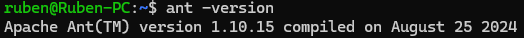

## 2º Passo - Criação dos Ficheiros
Após a instalação do ANT, criamos um novo diretório, onde fizemos a cópia da pasta src e criamos um ficheiro build.xml e ivy.xml, por fim, criamos uma pasta chamada lib com as bibliotecas necessárias.

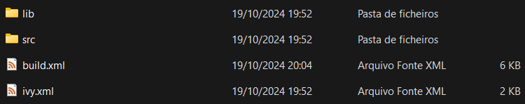

### Ficheiro Build.xml
Configuração do ficheiro Build.xml

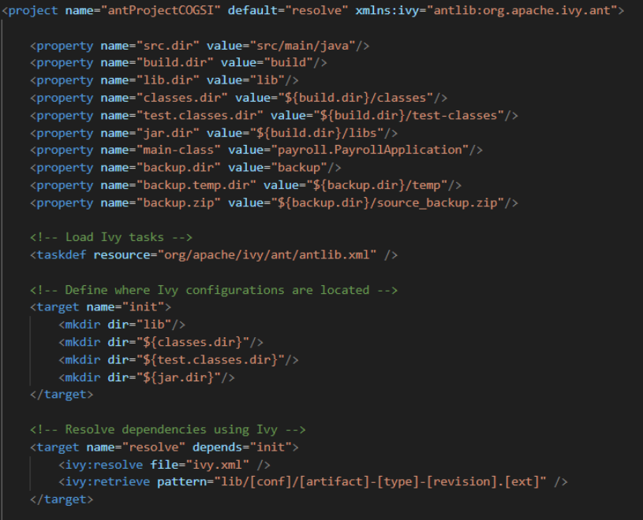

### Ficheiro Ivy.xml
Configuração do ficheiro Ivy.xml

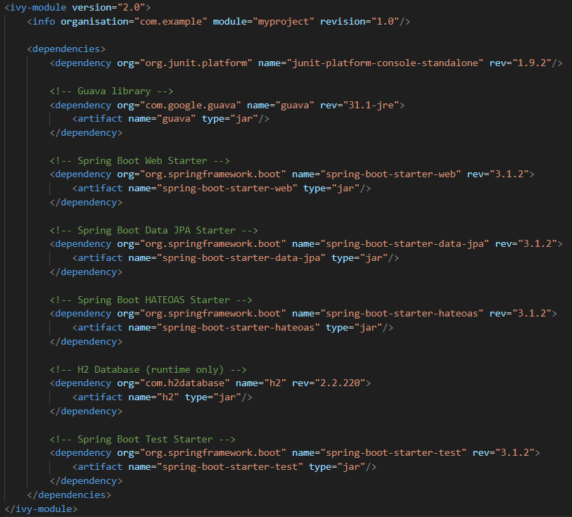

## 3º Passo - Task Backup

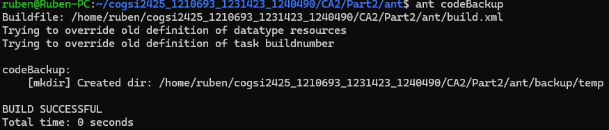

## 4º Passo - Task Copy

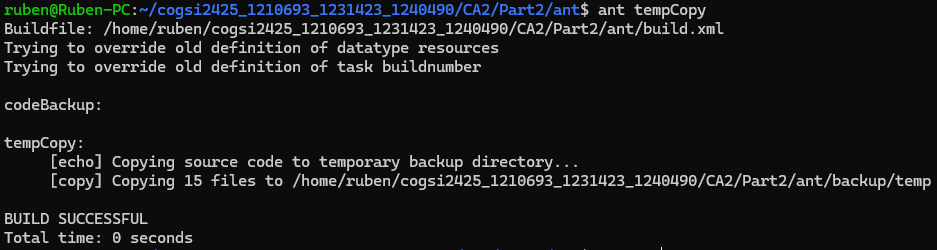

## 5º Passo - Task Zip

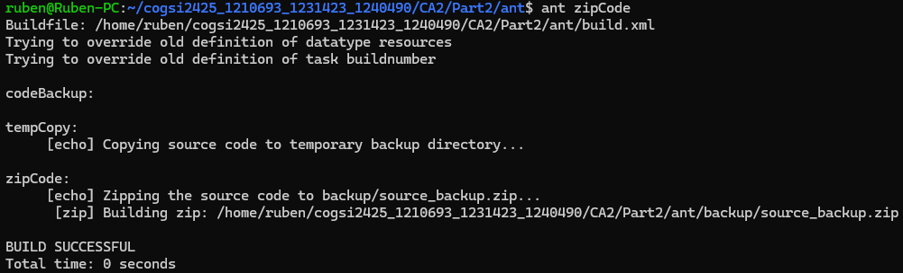

## 6º Passo - Task Javadoc

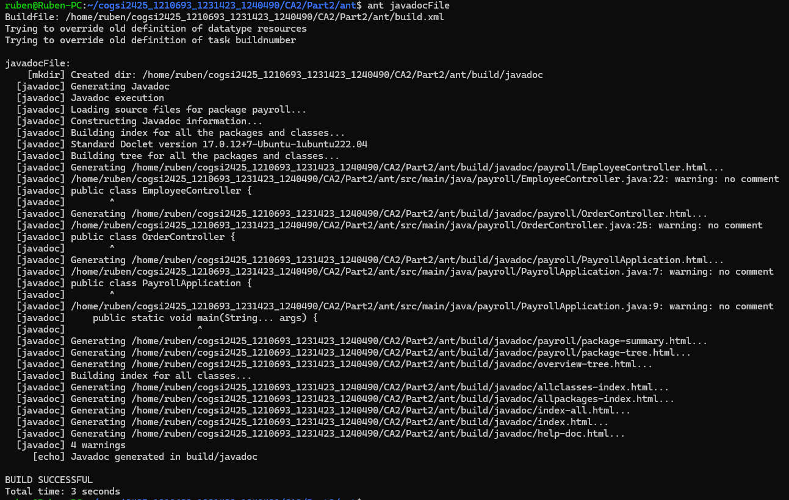
