# CA2 Report

## Part1

### Step 1- Create gradle task to execute server

To create the new task to execute the server we edited the build.gradle file
and added the following task named runServer

    task runServer(type:JavaExec, dependsOn: classes){
        group = "DevOps"
        description = "Launches a chat server that can be connected by clients on localhost:59001 "

            classpath = sourceSets.main.runtimeClasspath

            mainClass = 'basic_demo.ChatServerApp'
            args '59001'
    }

This a task of type JavaExec wich allows Gradle to execute a Java Program

- dependsOn: classes: This specifies that the runServer task depends on the classes task. The classes task compiles the project's source code, ensuring that the Java classes are built before attempting to run the application.
- group = "DevOps": This groups the task under the "DevOps" category, making it easier to organize and locate within Gradle's task listing.
- classpath = sourceSets.main.runtimeClasspath: This defines the classpath that the Java program will use when it runs.
- mainClass = 'basic_demo.ChatServerApp': This specifies the fully qualified name of the Java class that contains the main method to be executed
- args '59001': This provides arguments to the main method of the ChatServerApp class, in this case the port number the server will run

For the server to be executed, using the gradle task, we can use the following gradle command:

    ./gradlew runServer

### Step 2- Add unit test and update gradle build script

In this step, we updated the build.gradle file to include dependencies necessary for unit testing and configured
the test task to use JUnit 5. Additionally, a basic unit test was implemented to verify the setup.

#### Alterations to the build.gradle file:

To support unit testing, the following dependencies were added to the dependencies section:

    dependencies {
        testImplementation 'org.junit.jupiter:junit-jupiter-api:5.7.0'
        testRuntimeOnly 'org.junit.jupiter:junit-jupiter-engine:5.7.0'
        testImplementation 'org.mockito:mockito-core:3.7.7'
    }

- JUnit Jupiter API (version 5.7.0): Provides the necessary annotations and test functionality.
- JUnit Jupiter Engine (version 5.7.0): Used to run the tests written with JUnit 5.
- Mockito Core (version 3.7.7): Enables mocking during unit tests, allowing for isolated testing of components.

#### Configuration of the test task:

    test {
        useJUnitPlatform()
        testLogging {
            events "passed", "skipped", "failed"
        }
    }

- useJUnitPlatform(): Ensures that the tests are executed using JUnit 5.
- testLogging: Logs details of test execution, including passed, skipped, and failed tests.

#### Unit Test Class Implementation:

To validate the test setup, a basic test class was added:

    package basic_demo;

    import org.junit.jupiter.api.Test;
    import static org.junit.jupiter.api.Assertions.*;

    class ChatClientTest {

        @Test
        void run() {
            assertTrue(true);
        }
    }

This simple test checks the validity of the setup by asserting that a true statement is valid.

To execute the tests, the following Gradle command can be used:

    ./gradlew test

This command runs all unit tests in the project and outputs the results, showing which tests passed, were skipped, or failed, in accordance with the logging settings defined in the test task.

### Step 3 - Create a new task of type Copy

To create the new task to do a backup we edited the build.gradle file
and added the following task named backup

    task backup(type: Copy) {
        from 'src'

        into "backup"
    }

This a task of type Copy which allows Gradle to copy a folder.

- from: This defines the source directory that the task will copy from. In this case, it's the src folder, which contains the source code of the project.
- into: This sets the destination directory where the contents of the src folder will be copied. In this case, it will copy everything into a folder named backup in the project’s root directory.

For the backup to be executed, using the gradle task, we can use the following gradle command:

    ./gradlew backup

### Step 4 - Create a new task of type Zip

To create the new task to zip the backup directory we edited the build.gradle file
and added the following task named zipBackup

    task zipBackup(type: Zip) {
        dependsOn backup

        from "backup"

        destinationDirectory = file("archives")

        archiveFileName = "backup.zip"
    }

This a task of type Zip which allows Gradle zip a directory.

- dependsOn backup: This indicates that the zipBackup task depends on the execution of the backup task. Before creating the ZIP file, Gradle will first run the backup task, which copies the source files into the backup folder.
- from "backup": This specifies the source directory that the zipBackup task will include in the ZIP archive. Here, it's using the backup folder, which is generated by the backup task.
- destinationDirectory = file("archives"): This defines where the ZIP file will be saved. In this case, the ZIP file will be stored in an archives directory, which will be created inside the project root if it doesn't already exist.
- archiveFileName = "backup.zip": This sets the name of the resulting ZIP file. The archive will be named backup.zip and will be stored in the archives folder as defined above.

For the zip to be executed, using the gradle task, we can use the following gradle command:

    ./gradlew zipBackup

It wasn't necessary to manually download and install specific versions of Gradle and the JDK for this application because the project uses Gradle's Wrapper and Java toolchains.

Gradle Wrapper: This feature allows the project to include a specific version of Gradle in the project itself. When we run ./gradlew (the Gradle wrapper script), it automatically downloads the correct version of Gradle for the project if it's not already available on the machine. This ensures the build always uses the same Gradle version, avoiding compatibility issues.

Java Toolchains: Java toolchains in Gradle make it possible to define the Java version required to compile, test, and run the project, even if the correct JDK is not installed locally. Gradle will automatically download and use the appropriate version of the JDK if it’s not available.

When we run the command gradle -q javaToolchain, Gradle outputs details about the Java toolchain being used. This includes the version of the JDK used by Gradle, confirming that you don’t need to manually manage the JDK for this project.

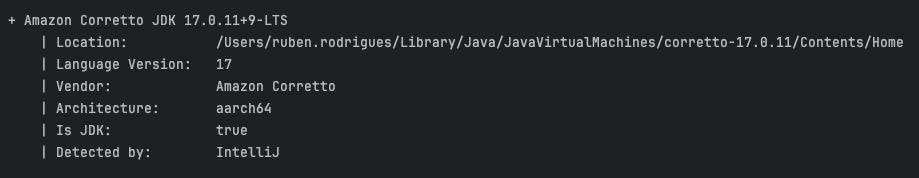

## Part 1 - Alternative(Ant)

### Step 0 - Comparison between Ant and Gradle in Build Automation

#### Build Automation Features

Gradle and Apache Ant are both popular build tools for Java applications, but they offer distinct approaches to automation, flexibility, and extensibility.

1 - Declarative vs. Procedural Approach:

- Gradle: Gradle uses a declarative approach to build automation, which means that the build
file (typically written in Groovy or Kotlin) describes what to do. Gradle implicitly handles
dependencies between tasks and automatically applies best practices for task execution.
  - Example: In the Gradle build file, we defined tasks like runServer and runClient, and
Gradle automatically handled the task execution order and classpath setup based on project configuration.
- Ant: Ant, on the other hand, follows a procedural approach, meaning that you explicitly
define how each step should be executed. Every action, such as compiling code or creating
directories, must be specified explicitly.
  - Example: In the Ant build file, we had to manually specify the directories for compiled
classes, explicitly call javac to compile code, and define classpaths in various targets.
Ant also requires manual definition of dependencies between tasks (e.g., the runServer
target depends on the jar target).

2 - Extensibility and Plugins:

- Gradle: Gradle offers a wide range of plugins that extend its functionality, making it
highly flexible. For example, plugins for Java, Kotlin, Android, and more are easily integrated
into a build script with a single line of configuration.
    - Example: In the provided Gradle build file, the application plugin is used to simplify
the task of building and running Java applications, which includes configuring the main class
and handling dependencies like Log4J.
- Ant: Ant does not have a formal plugin system like Gradle. However, you can extend it by
writing custom Ant tasks or incorporating external libraries. Writing custom tasks in Ant
requires additional boilerplate code.
    - Example: To implement custom logic in Ant, you would need to write Java classes
extending Ant’s Task class, whereas in Gradle, writing new tasks is as simple as adding
them to the build script using the task keyword.

3 - Dependency Management:

- Gradle: Gradle has built-in dependency management, relying on Maven or Ivy repositories.
It handles transitive dependencies and ensures that the correct versions of libraries are used.
  - Example: In the Gradle file, we defined dependencies like Log4J and JUnit directly using
the implementation and testImplementation configurations, and Gradle fetched them from Maven
Central automatically.
- Ant: Ant lacks built-in dependency management. You need to manually manage dependencies
by downloading the libraries and including them in the lib folder or specifying their location.
  - Example: In the Ant file, we had to manually place JAR files (Log4J and JUnit) in the
lib directory and add them to the classpath.

#### Extending with New Functionality

Both tools can be extended with new tasks or features, but the process is more streamlined in Gradle.

- Gradle:
  - Adding new functionality in Gradle is simple. You can define new tasks using the task
keyword, and existing tasks can be modified or extended with task configuration blocks.
  - Example: We defined new tasks like runServer and runClient directly in the Gradle build file.
Each task was configured with a description, classpath, and arguments without any need to write
additional Java code or create custom task classes.
  - Gradle’s plugin ecosystem further simplifies adding complex functionality like Docker
integration, code quality tools, or continuous integration support.
- Ant:
  - Ant allows the creation of new tasks, but it typically requires writing a custom task
class in Java and registering it in the build file. This makes extending Ant more complex
than Gradle.
  - Example: In the Ant build file, we had to explicitly define every task using the
<target> element and manage dependencies between tasks using depends. To create more advanced
tasks, I would need to write custom Java code.
  - While Ant has some prebuilt tasks and libraries, integrating complex functionality
often requires much more manual configuration than in Gradle.

#### Comparison of Task Definition

- Gradle: Tasks are defined declaratively and can be reused or configured dynamically with
minimal code. For example, the runClient and runServer tasks were defined with just a few
lines of configuration using the JavaExec task type.

- Ant: Tasks in Ant are defined procedurally using <target> elements. Each task must be
manually defined, and the build script tends to grow significantly as more functionality is
added. For instance, the runServer task required explicit classpath and argument management.

#### Applying Ant to Solve the Same Goals

If we were to solve the same goals using Ant (as outlined in this assignment), the process
would be as follows:

1 - Building the Application:

- We would need to define a compile target that compiles the Java source code, and a jar
target to package the compiled classes into a JAR file. This was implemented in the Ant
build file with explicit use of <javac> and <jar> tasks.

2 - Running the Server and Client:

- In Ant, the runServer and runClient tasks were defined using the <java> task, with
classpaths and arguments manually specified. These tasks launch the respective classes
with the correct arguments (e.g., 59001 for the server port).

3 - Unit Testing:

- We used the <junit> task in Ant to run unit tests. The classpath for test execution had
to be manually managed, and test reports were generated in a specified directory. This
approach is more manual than Gradle’s built-in test task, which uses the JUnit platform
out of the box.

4 - Backup and Archiving:

- In Ant, we created a backup target that copies the source code to a backup directory,
followed by a zipBackup target that creates a ZIP archive. These tasks were implemented
using <copy> and <zip>, which required explicit file handling and directory setup, unlike
the simplified Copy and Zip tasks in Gradle.

#### Conclusion of Comparison between Ant and Gradle in Build Automation

Overall, Gradle offers a more modern, declarative, and efficient way to manage build automation
compared to Ant. It simplifies dependency management, extends functionality easily via plugins,
and offers a clean way to define tasks without needing boilerplate. Ant, while powerful and
flexible, requires more manual setup, making it less efficient for large or complex projects
where Gradle’s features shine.

While Ant can solve the same goals as Gradle (as demonstrated in this assignment), Gradle is
generally more suitable for modern projects, especially with its better support for complex
builds, plugins, and automated dependency management.

### Step 1- Create Ant task to execute server

To execute the chat server in Ant, we created a custom target in the build.xml file named
runServer. This target is responsible for compiling the project, packaging it into a JAR
file, and then running the chat server. Here's the breakdown of how the task was implemented:

    <target name="runServer" depends="jar">
        <java classname="basic_demo.ChatServerApp" fork="true" failonerror="true">
            <classpath>
                <pathelement path="${jar.dir}/basic_demo.jar"/>
                <fileset dir="${lib.dir}">
                    <include name="log4j-api-2.24.1.jar"/>
                    <include name="log4j-core-2.24.1.jar"/>
                </fileset>
            </classpath>
            <arg value="59001"/> <!-- Server Port -->
        </java>
    </target>

- depends="jar": This ensures that the server will only run after the project has been compiled and the JAR file is created.
- classname="basic_demo.ChatServerApp": This specifies the fully qualified name of the class containing the main() method that launches the server.
- fork="true": Ensures that the Java process is launched in a separate process, allowing for better process control.
- Classpath: The necessary libraries, including Log4J, are added to the classpath to ensure the server runs without issues. This is similar to how Gradle’s sourceSets.main.runtimeClasspath is set up.
- arg value="59001": This argument specifies the port number the server will use.

To run the server, you just need to use the following command:

    ant runServer

### Step 2- Adding Unit Tests and Configuring Ant for JUnit

Next, we set up unit testing using JUnit in Ant. For this, we created a target named test
which compiles the test classes and runs them using the junit task:

    <target name="test" depends="compileTests">
        <mkdir dir="${build.dir}/test-reports"/>
        <junit printsummary="on" haltonfailure="yes" haltonerror="yes" fork="true" showoutput="true">
            <classpath>
                <pathelement path="${classes.dir}"/>
                <pathelement path="${test.classes.dir}"/>
                <fileset dir="${lib.dir}">
                    <include name="junit-platform-console-standalone-1.9.2.jar"/>
                </fileset>
            </classpath>
            <formatter type="plain"/>
            <batchtest todir="${build.dir}/test-reports">
                <fileset dir="${test.classes.dir}">
                    <include name="**/*Test.class"/> <!-- Include all test classes -->
                </fileset>
            </batchtest>
        </junit>
    </target>

- JUnit Platform: The standalone JUnit platform is added to the classpath to execute the tests, which is similar to how JUnit is configured in Gradle using the useJUnitPlatform() function.
- Test Logging: The test results are printed, and the task halts on failure or error, providing a quick summary, just like in Gradle with testLogging.
- Batch Test: It scans the compiled test classes (*Test.class) and runs all of them.

To run the unit tests, we used:

    ant test

### Step 3: Creating a Backup Task

To ensure that the project’s source code is properly backed up, we created a task named
backup. This task copies the source files into a separate backup directory. The configuration
is as follows:

    <target name="backup" description="Backup the source files">
        <mkdir dir="backups"/> <!-- Ensure backup directory exists -->
        <copy todir="backups">
            <fileset dir="${src.dir}">
                <include name="**/*.java"/> <!-- Include all Java source files -->
            </fileset>
        </copy>
        <echo message="Backup completed! Sources are copied to the backup directory."/>
    </target>

- mkdir: Creates the backups directory if it doesn't exist already.
- copy: Copies all the .java files from the source directory (src/main/java) into the newly created backups directory.
- echo: Prints a confirmation message once the backup process is completed.

We ran this task with:

    ant backup

### Step 4: Creating a Zip Archive of the Backup

To compress the backup into a ZIP file, we added a task named zipBackup.
This task zips the backups directory into an archive file, ensuring that the backup can
be stored more efficiently:

    <target name="zipBackup" depends="backup" description="Create a zip archive of the backup">
        <zip destfile="backup.zip" basedir="backups"/>
        <echo message="Backup archive created at ${backup.zip}."/>
    </target>

- depends="backup": The zipBackup task depends on the backup task, ensuring that the backup is created before it's zipped.
- zip: Compresses the backups directory into a ZIP file called backup.zip.
- echo: Outputs a message confirming that the archive was successfully created.

To create the ZIP archive, we ran:

    ant zipBackup

### Java Toolchains and JDK Compatibility

Unlike Gradle's automatic handling of Java toolchains, in Ant we manually specified the
Java version to ensure compatibility across environments. The following lines in the javac
task ensure that Java 17 is used for compiling both the source code and the tests:

    <compilerarg value="--release"/>
    <compilerarg value="17"/>

This guarantees that the project is compiled using Java 17, similar to the way Gradle’s Java
toolchains handle the JDK version management automatically.

## Part 2

### Step 1 Convert building Rest Services to Gradle (instead of Maven)

In the empty directory we used the gradle init command to create a Gradle Project
The following options were shown:

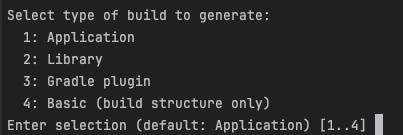

We selected "Application" (1)

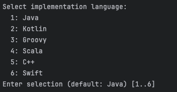

Then selected "Java" (1)

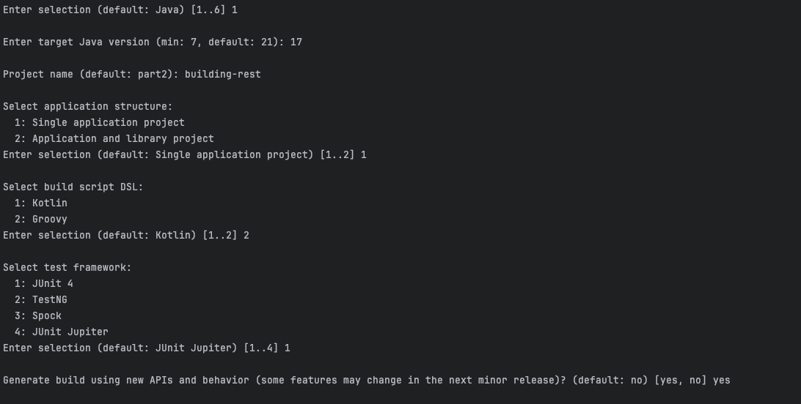

For the application structure we went with Single Application Project (1) since we don't want to create a library

We used Groovy (2) as the build script DSL following the same structure as the first part

For the test framework we used JUnit 4 (1) following the same approach as the first part

After having the base Gradle project we replaced the *src* folder with the one from the Building Rest Services

Some dependencies were missing, so we added the same dependencies from the pom.xml into the build.gradle file:

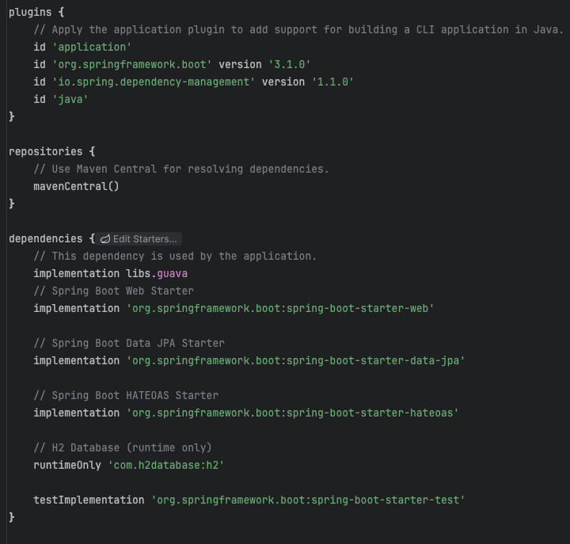

We had to add plugins and dependencies

The plugins section in Gradle is used to apply plugins to the project. Plugins extend the capabilities of the build system by adding tasks, conventions, and behavior. Plugins can be used for different purposes, like building Java applications, managing dependencies, deploying applications, running tests, and more.

We added "org.springframework.boot", which helps building and packaging Spring Boot Applications, it adds useful tasks like bootRun, bootJar...
We also added "io.spring.dependency-management" which helps manage dependency versions in a more centralized way
And also added "java" which applies the Java Plugin, that adds tasks to compile Java code (compileJava), runTests(test) and package the project into a Jar (jar)

After adding the plugins we added the same dependencies present in the pom.xml

### Step 2 - Create Custom task to zip source code and store in back up directory

To zip source code and store in back up directory we added the new following task called backupSource:

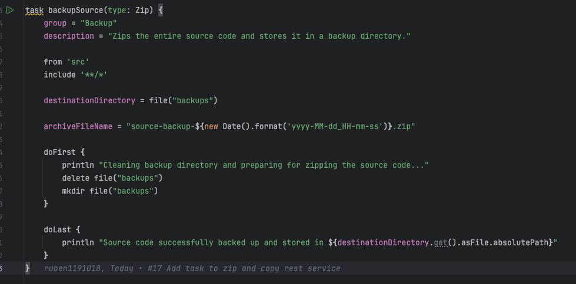

This task is of type Zip meaning it compresses files into a zip file

It takes all the files in the src directory

And the zip file is saved in a directory called backups

Before zipping, the doFirst block cleans up the old backups and recreates a new directory

After the task finishes, the doLast block prints a message indicating the source code has been backed up along with the location of the zip file

### Step 3 - Create a custom task that depends on the installDist task and runs the application using the generated distribution scripts

To do this we added the new following task called runDistApp:

    task runDistApp(type: Exec){
        group = "Application"
        description = "Runs the application using the generated distribution scripts."

        dependsOn installDist

        def os = org.gradle.internal.os.OperatingSystem.current()

        def appDir = "$buildDir/install/${project.name}/bin"
        def execScript

        if (os.isWindows()) {
            execScript = "${appDir}/${project.name}.bat"
        } else {
            execScript = "${appDir}/${project.name}"
        }

        println "Running the application using: $execScript"

        executable = execScript
    }

- dependsOn installDist: This ensures that the installDist task is executed before the custom task (runDistApp). The installDist task generates the necessary distribution files and scripts under the build/install directory.

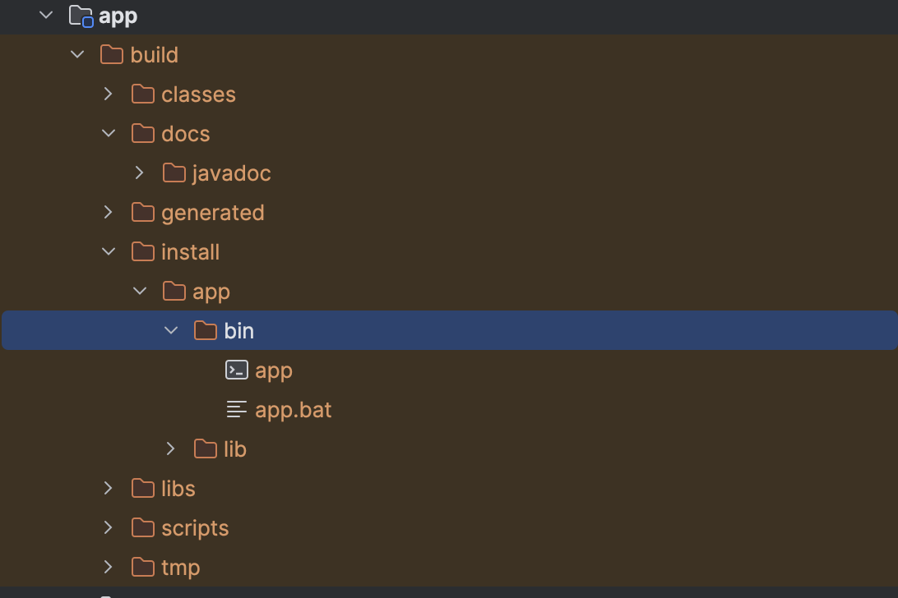

- org.gradle.internal.os.OperatingSystem.current(): This Gradle API helps in detecting the current operating system, which is used to choose the correct executable script (either .bat for Windows or .sh for Unix-based systems).

- appDir: This variable contains the path to the generated distribution scripts

- Determine Script Path: Based on the operating system, the script to run is selected. For Windows, it's a .bat file, and for other OSes, it's a .sh file.

- executable: Since this is a Exec Type, we define the correct script file as the executable.

To run this:

./gradlew runDistApp

### Step 4 - Create a custom task that depends on the javadoc task, which generates the Javadoc for your project, and then packages the generated documentation into a zip file

To do this we added the new following task called packageJavadoc:

    task packageJavadoc(type: Zip) {
        group = "Documentation"
        description = "Generates Javadoc and packages it into a ZIP file."

        dependsOn javadoc

        from javadoc.destinationDir

        destinationDirectory = file("$rootDir/app")

        archiveFileName = "javadoc.zip"

        doLast {
            println "Javadoc has been generated and packaged into $destinationDirectory/javadoc.zip"
        }
    }

- dependsOn javadoc: This makes the packageJavadoc task depend on the javadoc task. Gradle will run the javadoc task first to generate the documentation before executing this task.

- from javadoc.destinationDir: This defines the source directory for the ZIP file as the output of the javadoc task. The javadoc.destinationDir holds the path where the generated Javadoc is stored.

- destinationDirectory = file("$$rootDir/docs"): This specifies where the ZIP file will be stored. In this case, it will be placed in the app folder.

- archiveFileName = "javadoc.zip": This sets the name of the ZIP file that will be created.

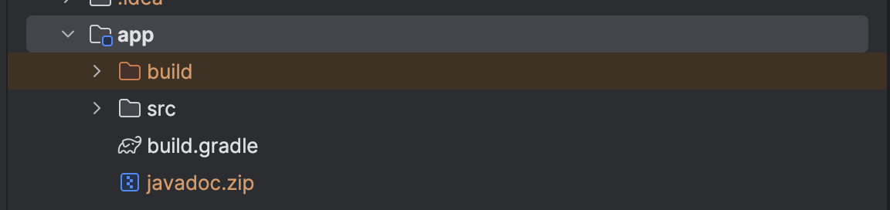

### Step 5 - Create a new source set for integration tests

To start working on the integration tests we had to make sure we had the correct the dependencies:

    testImplementation 'org.springframework.boot:spring-boot-starter-test'

This dependency is a starter for testing Spring Boot applications with libraries including JUnit Jupiter, Hamcrest and Mockito

We also added the following configuration to use JUnit Platform as the test engine.

    test {
        useJUnitPlatform()
    }

We developed an integration test for the Get All Orders endpoint. To prepare for each test, we introduced a setUp method annotated with @BeforeEach,
which ensures a clean test environment.
This method clears all existing records from the database
, then creates and saves two new orders with distinct statuses and descriptions.
By resetting the database and populating it with fresh data, we ensure consistent test
results.

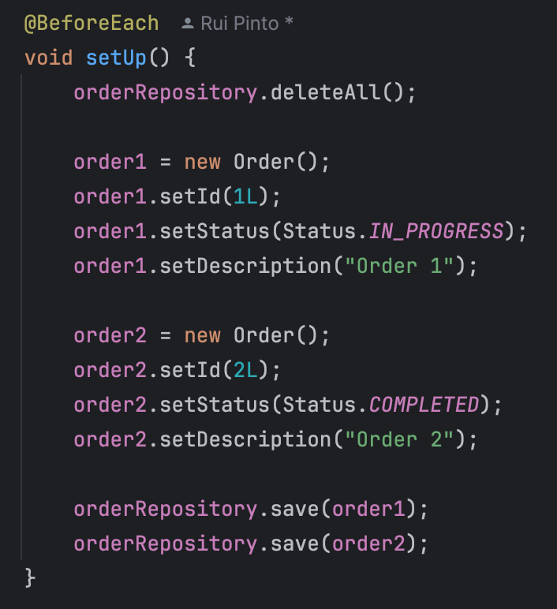

After that we created a method to perform the Get All Orders and validate that the response was Ok 200.
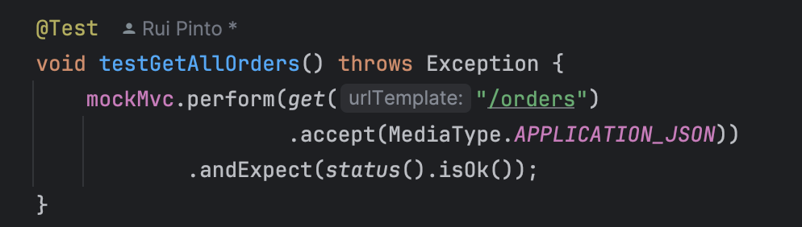

## Part 2 - Alternative(Ant)

### Step 1- Convert the building rest services to Ant (instead of Maven)

For this part we decided to use Ivy in combination with Ant
Ivy complements Ant by automating dependency management. With Ivy, we can define the project dependencies in a simple ivy.xml file, and it will automatically download and manage the correct versions of libraries from central repositories (like Maven Central).

In a new directory we created the build.xml file and an ivy.xml file.

In the build.xml file we defined the ivy dependency using the following code:

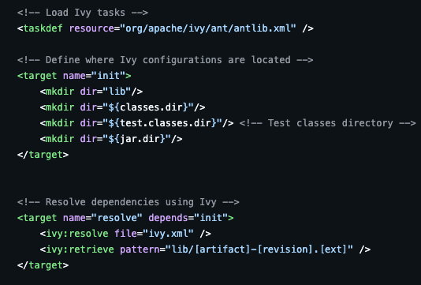

The Ivy tasks were loaded, the path to where ivy configurations are located and where the ivy.xml file is located was also configured

In the ivy.xml file we defined the dependencies we needed

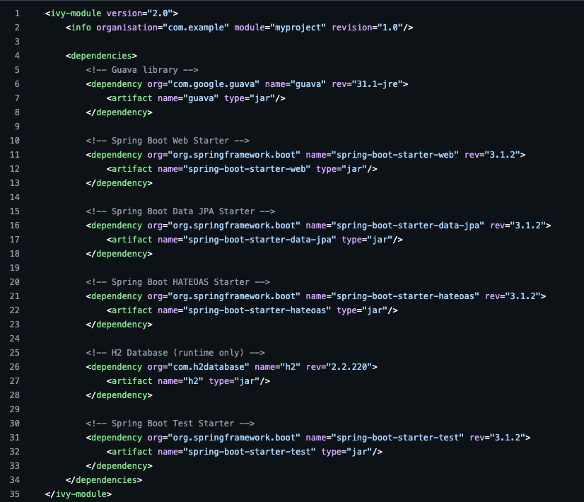

After that we ran the "ant" command, to install all the dependencies needed

In the same build.xml we added the compile and jar targets, to compile and create the jar for the application

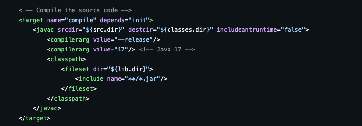

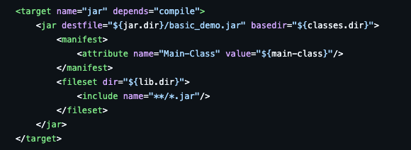

We ran the ant jar, that depends on the compile task, so it runs both targets

To be able to run the application we added the following target, named runApplication

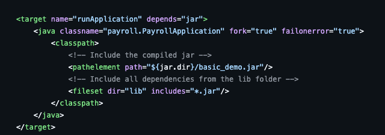

To run the application we just need to run the following command

    ant run application

### Step 2 Create a custom task that zips and stores in backup directory

For this step we created 5 tasks that work like steps that depende on each other to clean the backup, create the backup directory, copy the source code to a temporary backup directory and to zip the copied source code

To run this step, we just need to run the zipSourceCode target, that runs all the other ones, that are dependent, with the following command:

    ant zipSourceCode

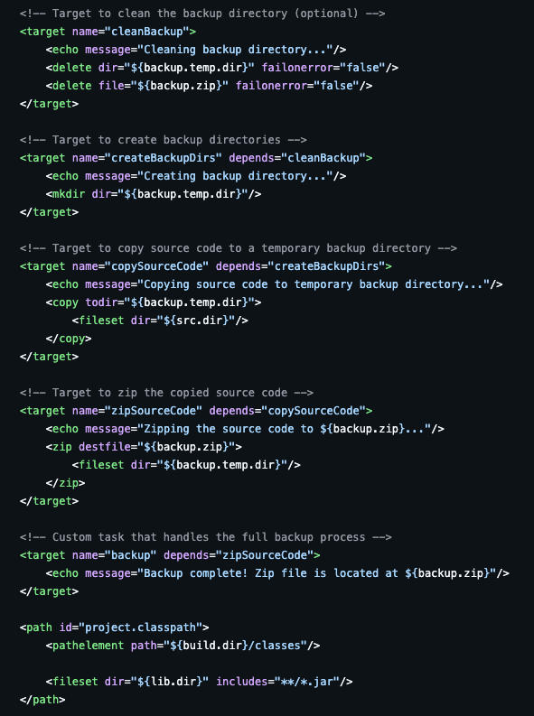

### Step 3 -  Create a custom task that depends on the installDist task and runs the application using the generated distribution scripts

Apache Ant employs a simpler, XML-based scripting model and lacks built-in, high-level tasks such as Gradle's installDist.
Tasks like copying JAR files, managing dependencies, and generating platform-specific scripts (e.g., shell scripts for Unix-based systems or batch scripts for Windows) must be manually defined in Ant.

Furthermore, Ant does not include a built-in mechanism for detecting the operating system and adjusting the build process accordingly.
Achieving OS-specific behavior in Ant involves using external properties or conditionals, which introduces additional complexity and verbosity.

### Step 4 Generates javadoc and zips it.

    <path id="project.classpath">
        <pathelement path="${build.dir}/classes"/>
        <fileset dir="${lib.dir}" includes="**/*.jar"/>
    </path>

We started by difining a named path, which can be referenced by other elements.
Specifies a set of files, that includes all .jar files found in the library directory and its subdirectories.

    <property name="javadoc.dir" value="${build.dir}/javadoc"/>

This line defines a property called javadoc.dir, which indicates the directory where the generated Javadoc documentation will be stored.

    <target name="generateJavadoc">
        <mkdir dir="${javadoc.dir}"/>
        <javadoc destdir="${javadoc.dir}" sourcepath="${src.dir}" classpathref="project.classpath">
            <packageset dir="${src.dir}">
                <include name="**/*.java"/>
            </packageset>
        </javadoc>
        <echo message="Javadoc generated in ${javadoc.dir}"/>
    </target>

This defines a new target called generateJavadoc and creates the directory where the Javadoc documentation will be generated if it does not already exist.
Then the task javadoc will generate the javadoc documentation using the src directory.

    <property name="zip.name" value="javadoc.zip"/>

This defines a property called zip.name, which stores the name of the ZIP file that will be created to package the Javadoc documentation.

    <target name="packageJavadoc" depends="generateJavadoc">
        <mkdir dir=""/>
        <zip destfile="${zip.name}">
            <fileset dir="${javadoc.dir}"/>
        </zip>
        <echo message="Javadoc packaged into /${zip.name}"/>
    </target>

This defines another target called packageJavadoc, which depends on the generateJavadoc target.
It creates a ZIP file with the name defined in the zip.name property, using the file set of the javadoc directory.

To run this step, we just need to run the zipSourceCode target, that runs all the other ones, that are dependent, with the following command:

    ant packageJavadoc

### Step 5 - Create a new source set for integration tests Add a simple test and the needed dependencies and tasks to run the test

We added an integration test that starts the application and performs a get to the all orders endpoint, validating the return code ( 200 Ok ) .
Before the test validation, we cleaned the database and added two orders in the database.

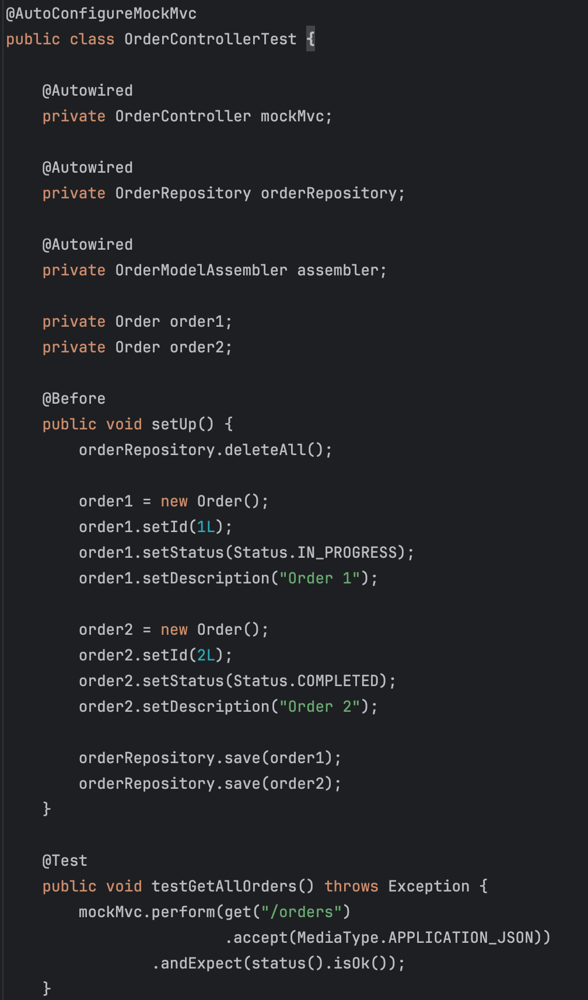

Next, we set up unit testing using JUnit in Ant. For this, we created a target named test
which compiles the test classes and runs them using the junit task:

    <property name="test.classes.dir" value="${build.dir}/test-classes"/>

    <target name="test" depends="compileTests">
        <mkdir dir="${build.dir}/test-reports"/>
        <junit printsummary="on" haltonfailure="yes" haltonerror="yes" fork="true" showoutput="true">
            <classpath>
                <pathelement path="${classes.dir}"/>
                <pathelement path="${test.classes.dir}"/>
                <fileset dir="${lib.dir}" includes="**/*.jar"/>
            </classpath>
            <formatter type="plain"/>
            <batchtest todir="${build.dir}/test-reports">
                <fileset dir="${test.classes.dir}">
                    <include name="**/*Test.class"/>
                </fileset>
            </batchtest>
        </junit>
    </target>

First we defined one property with the test classes directory.
We added the class path with the all the java classes, tests and libs that we needed.

- Test Logging: The test results are printed, and the task halts on failure or error, providing a quick summary, just like in Gradle with testLogging.
- Batch Test: It scans the compiled test classes (*Test.class) and runs all of them.

To run the unit tests, we used:

    ant test