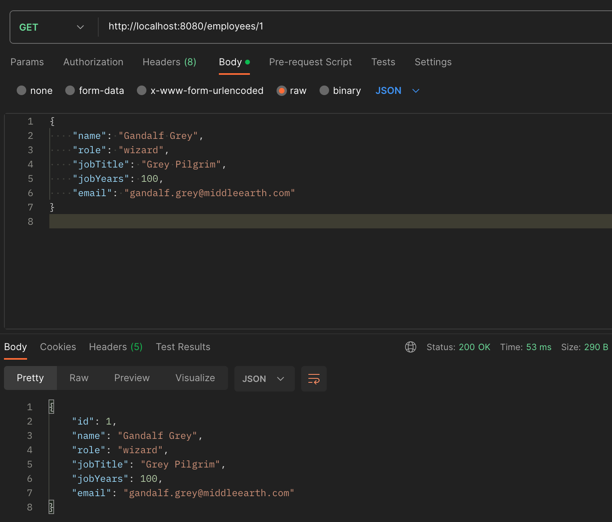
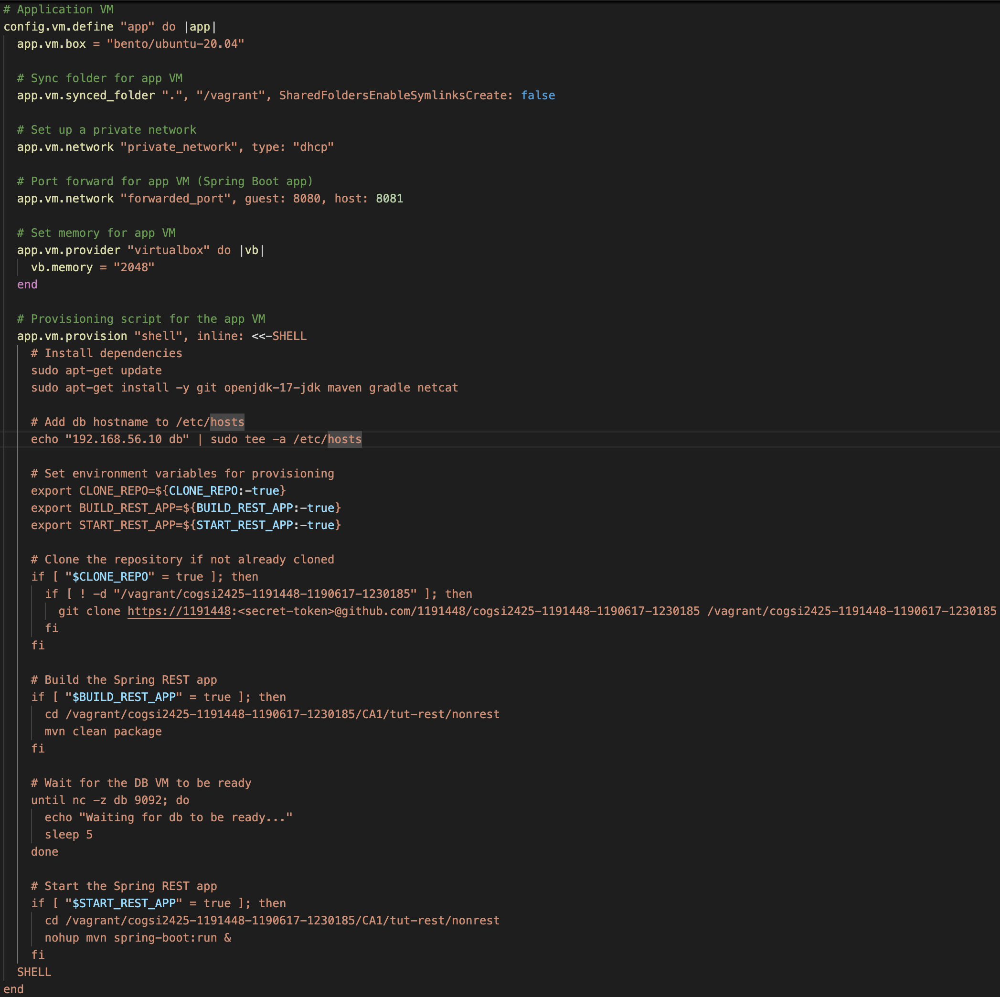
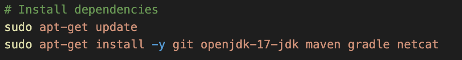
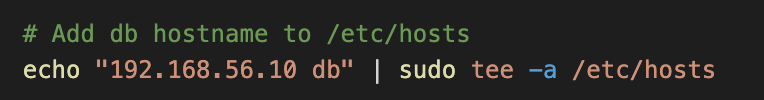
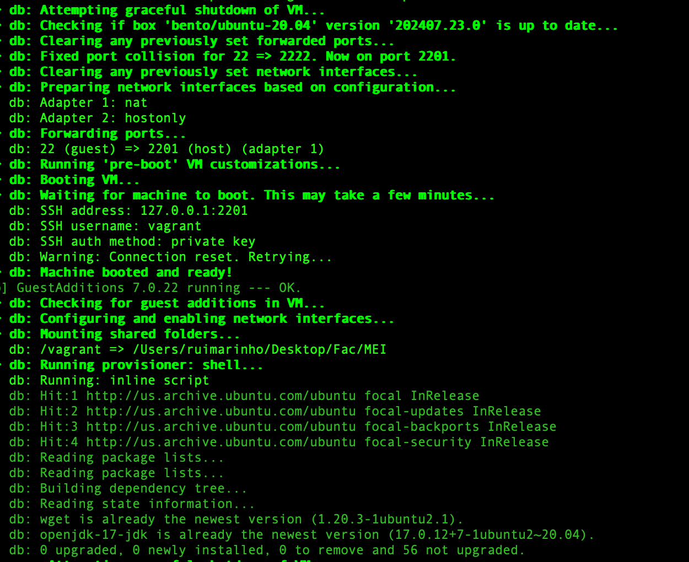
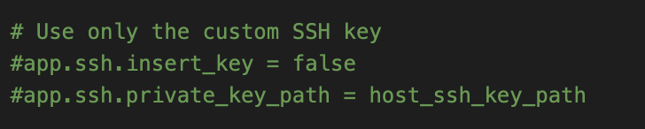
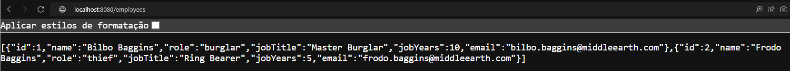

# CA3 – Virtualization
This document explains the steps taken to configure a virtual environment using **Vagrant** for running the projects from previous assignments. The setup includes creating a virtual machine (VM), automating dependency installation, configuring network access, and ensuring persistent data storage for the H2 database. The overall goal is to build an automated and reproducible environment that meets the assignment requirements.

---

## **Installing Vagrant and VirtualBox**

### **Environment Setup**
The first step in this assignment was to set up the necessary tools for virtualization and automation. Vagrant was chosen as the main tool to manage the virtual machine, and VirtualBox was used as the virtualization provider. This setup ensures that the environment is portable and easily reproducible across different systems.

#### **Vagrant Installation**
Vagrant was installed on macOS via **Homebrew**:

```bash
brew tap hashicorp/tap
brew install hashicorp/tap/hashicorp-vagrant
```


This version of Vagrant ensures compatibility with the latest macOS versions and integrates well with VirtualBox, which is also installed through Homebrew.

#### **VirtualBox Installation**
VirtualBox was chosen as the provider because it is lightweight, open-source, and well-supported by Vagrant. VirtualBox was installed using:

```bash
brew install --cask virtualbox
```

**Justification for Choice**: 
- **Vagrant** is widely used for VM management and provides an easy-to-use interface for managing virtual environments.
- **VirtualBox** is chosen because it is free and open-source, with good macOS support. It also integrates seamlessly with Vagrant.

#### **Vagrant Plugin Installation**
To ensure VirtualBox works smoothly with Vagrant, the **vagrant-vbguest** plugin was installed, which ensures that the guest additions inside the VM are kept in sync with the host system:

```bash
vagrant plugin install vagrant-vbguest
```


### **Initializing the Vagrant Environment**

After installing the necessary tools, the next step was to initialize a new Vagrant environment in the project directory.

```bash
mkdir CA3/part1
cd CA3/part1
vagrant init bento/ubuntu-20.04
```


This command created a **Vagrantfile** that defines the configuration of the virtual machine.

#### **Why Ubuntu 20.04?**
- **Ubuntu 20.04 LTS (Long-Term Support)** was selected as the base OS for the VM because it is a stable, widely-used distribution with excellent community and enterprise support. The LTS version ensures that we will receive security updates and support for several years.

#### **Alternatives Considered**:
- **Other providers** such as **VMware Fusion** or **Docker** were considered but not implemented. While Docker would have made the setup faster and more lightweight, the assignment’s focus on Vagrant and traditional VMs made VirtualBox a more suitable choice. VMware Fusion was not used because it requires a paid license for full features.

### **Configuring the Vagrantfile**

After initializing Vagrant, the **Vagrantfile** was modified to include the following configurations:

- **Port Forwarding**: This allows the Spring REST service running inside the VM to be accessed via `http://localhost:8080` on the host machine.
- **Private Network**: Configured for running the chat server inside the VM, with the client running on the host.
- **Synced Folders**: Ensures that files in the project directory are accessible both from the host and inside the VM, allowing for easy file sharing and persistence.


#### **Provisioning Script**:
The provisioning script ensures that all necessary dependencies—**Git**, **JDK**, **Maven**, and **Gradle**—are installed automatically when the VM is started.

#### **Why Automate?**
Automating the installation of dependencies ensures that the environment can be set up consistently across different machines and by different users. This reduces the chances of errors due to missing dependencies and makes the development process more efficient.

---

### **Bringing Up the Virtual Machine**

Once the Vagrantfile was configured, the VM was started using the following command:

```bash
vagrant up
```


This process involved several steps:

- **Downloading and importing the Ubuntu 20.04 base box**: Ensures that the latest supported version is used for the VM.
- **Network configuration**: Including NAT and host-only adapters for proper network functionality.
- **Port Forwarding**: Configured to enable local access to services running within the VM (e.g., Spring REST on port 8080).
- **Provisioning**: Automatic installation of required software like Git, JDK, Maven, and Gradle to set up the development environment.

#### **Potential Issues Encountered**:
- **Guest Additions Mismatch**: There was a version mismatch between the Guest Additions installed on the host and the VM. This was resolved by using the `vagrant-vbguest` plugin, which automatically updates Guest Additions in the VM to match the host system.
- **SSH Key Replacement**: Vagrant replaced the default insecure SSH key with a secure key for better security.

#### **Secure SSH Access**:

After the VM was fully provisioned and running, secure SSH access was established. Vagrant automatically replaced the default insecure key with a secure keypair, enhancing the security of the VM access.

```bash
vagrant ssh
```


This command allows access to the VM's terminal from the host, enabling us to interact with the development environment.

#### **Alternative Considerations**:
- **Docker** could have been used for a more lightweight environment, but Vagrant was chosen for its easy integration with full VM environments, which provide more flexibility for running a variety of services and tools.

---

### Cloning the Repository and Running Applications

Once the VM environment was set up, the next step involved cloning the project repository from GitHub. Due to GitHub’s recent policy changes, which eliminated password-based authentication in favor of token-based authentication, the cloning process was executed using a personal access token (PAT). This change ensures enhanced security and aligns with modern best practices for Git management.


#### **Vagrantfile Configuration**

The **Vagrantfile** was updated to ensure proper network configuration, allowing communication between the host machine and the VM. This involved forwarding specific ports to make the applications accessible.

- **Port Forwarding**:
  - Port **8080** was forwarded to enable access to the Spring REST service from the host machine's browser.
  - Port **59001** was forwarded to allow communication between the chat client running on the host and the chat server running inside the VM.


The choice to forward ports rather than rely on a private network was based on the need to enable access from the host machine to the VM’s services without additional configuration. Port forwarding simplifies the process by making services available on the same ports across both machines.

#### **Running the Spring REST Application**

To execute the Spring REST application within the virtual machine, the following steps were taken:

1. **Navigating to the Project Directory**

   The Spring REST application is located in the `CA1/tut-rest/nonrest` directory. To navigate there, the following command was used:

   

2. **Building the Application**

The application was built using Maven. Since the Maven wrapper (`mvnw`) was not available, the global Maven installation was used. The following command was executed to clean and package the application:


3. **Running the Application**

   After packaging, the application was started using Maven’s `spring-boot:run` command, which automatically handles dependency management and starts the embedded Tomcat server:

   


This successfully started the application on port **8080** within the virtual machine, as configured in the **Vagrantfile** for port forwarding. The Spring REST service is now accessible from the host machine at `http://localhost:8080`:


#### **Running the Gradle Basic Demo Application**

After cloning the repository, the **Gradle basic demo** project was built and executed. This involved navigating to the appropriate directory, cleaning and building the project, and then running the server.

1. **Navigating to the Gradle Project Directory**

   

2. **Building the Application**

   The project was built using the Gradle wrapper provided in the repository:

   

   This ensured that all dependencies were correctly resolved and that the project was properly compiled. The **Gradle 8.9** version used for this process allowed for compatibility with modern Java versions and included several performance improvements over older versions.

    The Gradle wrapper (`./gradlew`) was used to ensure that the correct version of Gradle is applied, regardless of the environment. This approach eliminates issues that could arise from version mismatches and ensures a consistent build environment.

3. **Running the Chat Server**

   To start the chat server, the following command was executed:

   

This command launched the server, allowing it to listen for incoming client connections on port **59001**.

Running the chat server within the VM, while interacting with it from the host machine, demonstrates the VM's capability to host services that are accessible externally. This method of deployment ensures that the VM behaves like a production environment, enabling users to test and interact with the application as if it were running in a real-world setup.

#### **Interacting with Application from the Host Machine**

Once the chat server was successfully running inside the VM, the next step was to interact with it from the host machine. The chat client was executed on the host machine, establishing a connection to the server within the VM using the forwarded port **59001**:


This successfully established a connection between the client on the host and the server within the VM, demonstrating seamless network communication.

This interaction showcases the benefit of port forwarding in enabling cross-machine communication, facilitating testing, and interaction with the VM-based server without additional configuration on the host machine. The decision to forward ports rather than rely on advanced network bridging simplifies the setup and ensures that the service is accessible across different network setups.


### **Automating Cloning, Building, and Starting Applications**

To streamline the development workflow and ensure consistency across environments, we automated the processes of cloning project repositories, building the applications, and starting the necessary services. This was achieved by configuring the Vagrant provisioning process, allowing the entire setup to be executed with minimal manual intervention.

This automation not only improves efficiency but also ensures that the environment is reproducible, helping to eliminate issues caused by differences in development environments. This section explains how we configured Vagrant to automate these tasks and provides justifications for the decisions made.

#### **Rationale for Automating the Setup**

The automation of the environment setup is a crucial step in ensuring reproducibility and reducing human error. By automating the cloning of the repository, building the applications, and starting them, we achieve several benefits:

1. **Reproducibility**: All developers or users of this VM will have an identical setup, ensuring the applications behave consistently across environments.
2. **Efficiency**: Automation saves time, as manual steps like repository cloning, dependency installation, and application start-up are performed automatically.
3. **Eliminating Configuration Errors**: By using automated scripts, we ensure that dependencies are installed correctly and applications are set up in a consistent manner.

#### **Automating the Cloning, Building, and Starting Process**

We modified the **Vagrantfile** to automatically:

1. **Clone the GitHub Repository**: 
   - The project repository, which contains the necessary applications (the Gradle-based chat application and the Spring REST service), is cloned directly into the virtual machine (VM) during provisioning.

   Automating this step ensures that the latest version of the code is always available and that it is cloned in a consistent and controlled manner. This removes the need for manual cloning, reducing the risk of errors caused by incorrect repository paths or credentials.

2. **Build and Start the Applications**:
   - Once the repository is cloned, the chat server and REST service are built using **Gradle** and **Maven** respectively. Both applications are started automatically after being built.

   Automating the build and start processes saves time and ensures that the applications are consistently started with the correct configurations. This eliminates the need for manual intervention, making the setup process seamless.

#### **Using Environment Variables**

We also introduced the use of environment variables to control which steps are executed during provisioning. This gives flexibility, allowing us to skip certain steps (like cloning or starting applications) when not required.

- **`CLONE_REPO`**: Controls whether the repository is cloned during provisioning.
- **`BUILD_REST_APP`** and **`BUILD_CHAT_APP`**: Control the build steps for the Spring REST and Chat applications.
- **`START_REST_APP`** and **`START_CHAT_APP`**: Control whether the applications are started automatically.

By using environment variables, we provide more flexibility to the user. For example, if the repository is already cloned or if the user does not wish to restart the applications on every VM provision, they can set an environment variable to skip these steps. This avoids redundant operations, optimizing the provision process.

#### **Updated Vagrantfile Configuration**

Below is the relevant portion of the updated `Vagrantfile`:


#### **Key Configurations**

1. **Repository Cloning**: By setting up the cloning step within the provisioning script, the VM will automatically pull the latest code from the repository, ensuring that users always work with the most recent version. The cloning step is conditional, so it can be skipped if the repository already exists.
2. **Automated Builds**: Both applications are built immediately after cloning using **Maven** (for the Spring REST application) and **Gradle** (for the Chat application). This ensures that all necessary dependencies are downloaded and that the applications are ready to run.
3. **Application Startup**: Each application is started in the background using `nohup`, which allows the services to keep running even after the provisioning process completes. This setup enables immediate access to the applications post-provisioning.
4. **Environment Variables**: By using environment variables, we provide flexibility and control over the provisioning process, making it easy to customize setup steps as needed.

#### **Testing and Verification**

Once the provisioning process completes, we can verify that both the chat server and the REST service are running inside the VM. To do so:

1. **SSH into the VM**:
   ```bash
   vagrant ssh
   ```

   
   
2. **Check for Running Processes**:
   
   ```bash
   ps aux | grep -e '[s]pring-boot:run' -e '[r]unServer'
   ```
   
   
   
   This command should display processes for both the chat server and the Spring REST service, indicating that both applications are running.
   
3. **Verify Ports are Listening**:
   ```bash
   ss -tuln | grep '8080\|59001'
   ```

   
   
   This confirms that both the chat server (on port `59001`) and the REST service (on port `8080`) are running and accessible.

#### **Testing the Applications**

- **Chat Server**: The chat server can be accessed from the host machine on port `59001`, allowing clients on the host machine to communicate with the server running inside the VM.
- **Spring REST Service**: The Spring REST service can be accessed from a browser on the host machine via `http://localhost:8080`, making it easy to interact with the API from outside the VM.

### Configuring H2 Database for Persistent Storage in the Spring Boot Application

In this section, we outline the steps to configure the **H2 database** in the Spring Boot application (`nonrest`) to persist data across Virtual Machine (VM) restarts. By default, the H2 database operates in-memory, meaning all data is lost when the application stops or the VM is shut down. To address this limitation, the H2 database will be configured to use file-based storage, ensuring that data remains accessible even after the application or VM restarts. This is achieved by storing the H2 database in a shared directory between the VM and the host machine.

#### 1. Setting Up a Synced Folder for Database Persistence

To enable persistent storage, a shared folder between the VM and the host machine is required. This shared folder ensures that any data written by the H2 database is saved on the disk, preventing data loss when the VM is stopped or restarted. The following configuration is added to the `Vagrantfile` to create a shared directory for storing the H2 database.


This configuration ensures that the VM has access to the `/vagrant/h2_data` directory, which is synchronized with the host machine, providing a persistent location for the H2 database files. Any data written to this directory will be saved on the host machine, making it available after a VM restart.

#### 2. Configuring the Spring Boot Application for File-Based Storage

The next step involves updating the Spring Boot application's configuration to use file-based storage for the H2 database. This is achieved by modifying the `application.properties` file located in the `src/main/resources` directory of the `nonrest` project. The following properties are added:


This configuration changes the default behavior of H2, instructing it to store the database in the `/vagrant/h2-database/testdb` directory, which is synchronized with the host machine. This ensures that the database data is retained across VM restarts. Additionally, the H2 web console is enabled for easier access to the database via the `/h2-console` URL, and Hibernate is configured to automatically update the database schema.

#### 3. Enabling Remote Access to the H2 Console

The H2 console allows developers to inspect the database during development. However, by default, the console restricts remote connections for security reasons. To enable remote access to the H2 console from the host machine, the following property is added to the `application.properties` file:


This allows access to the H2 console through `http://localhost:8080/h2-console` from the host machine. To log in to the console:

- **JDBC URL**: `jdbc:h2:file:/vagrant/h2-database/testdb`
- **User Name**: `sa`
- **Password**: `password`

This configuration provides access to the H2 console for debugging purposes, allowing you to inspect the contents of the H2 database and verify that data is being persisted to disk.

*Note*: While enabling remote access to the H2 console is helpful for development, it should be disabled in production environments due to security risks.

#### 4. Inserting and Retrieving Data Using the Spring Boot API

Once the H2 database is configured for file-based storage, the application can be used to insert and retrieve data via the Spring Boot API. The data is persisted in the shared folder, ensuring it survives across application and VM restarts.

To add data to the **employees** table, a POST request can be made to the `/employees` endpoint using a tool such as Postman. In the example below, employee data for **Gandalf Grey** is inserted into the database:


The API request inserts the following data:
- Name: Gandalf Grey
- Role: wizard
- Job Title: Grey Pilgrim
- Job Years: 100
- Email: gandalf.grey@middleearth.com

After submitting this data, a GET request can be sent to the `/employees` endpoint to retrieve the list of all employees. The following image shows that the data has been successfully inserted into the database:



This demonstrates that the data has been correctly stored in the H2 database.

#### 4. Verifying Data Persistence Across VM Restarts

To ensure the Spring Boot application retains data across VM restarts, the following steps were performed:

1. The VM was restarted using the following command to reload the VM and apply provisioning steps:

   

2. After restarting, a GET request to `http://localhost:8080/employees` was made to retrieve the list of employees. The GET request successfully returned the previously inserted employee, indicating that the H2 database persisted the data across VM restarts. As seen in Figure 2, the employee details were retrieved after the VM restart.

   

   


This confirms that the H2 database, configured with file-based storage, successfully retains data across VM restarts, as required.

### Part 2: Dual-VM Environment for a Spring Boot Application with an H2 Database

This part provides a comprehensive account of establishing a virtualized environment using Vagrant to host a Spring Boot REST application and an H2 database on two distinct virtual machines (VMs). The purpose of this configuration is to separate the application and database components, enhancing the modularity and manageability of the development environment. Such a setup mirrors real-world deployment scenarios where distinct services (i.e., application server and database) communicate over a network. This documentation emphasizes the systematic allocation of resources, network configurations, and provisioning methods to ensure seamless connectivity between the application and the database.

### Configuration Overview

The Vagrantfile for this setup plays a central role in defining the configurations for each VM, specifying the resources, network requirements, and provisioning scripts. The setup creates two VMs: `app` for the application and `db` for the database. By using `bento/ubuntu-20.04` as the base OS for both VMs, we ensure compatibility and resource efficiency. The separation of application and database functions across two VMs provides a controlled environment to test inter-service communication, replication of deployment constraints, and streamlined troubleshooting.




### 1. Virtual Machine Resource Allocation

Resource allocation is a critical consideration in virtualized environments. To optimize performance and ensure that neither the application nor the database encounters memory-related issues, we allocated specific memory limits for each VM:
- **Application VM (app)**: Allocated `2048 MB` to support the Spring Boot application. This allocation ensures that sufficient memory is available to accommodate Java processes, Gradle builds, and concurrent client requests.
- **Database VM (db)**: Allocated `1024 MB`, which is adequate for the H2 database server operating in server mode.

By specifying these memory allocations within the Vagrantfile, we prevent performance bottlenecks, especially in scenarios involving memory-intensive operations on the application VM. This setup simulates a balanced, production-like environment where both services are optimized to perform independently within their assigned resources.

### 2. Networking and Inter-VM Communication

To facilitate secure, isolated communication between the application and database, both VMs were configured to operate on a private network. This configuration restricts external access, ensuring that only the `app` VM can communicate with the `db` VM over an internal IP range. Private networking within Vagrant assigns each VM a unique IP address on a local subnet, promoting secure, low-latency communication between services without exposing these services to the broader network.

Additionally, port forwarding is enabled on the `app` VM to allow the host machine to access the Spring Boot application. Port 8080 on the guest VM (`app`) is mapped to port 8081 on the host, making the application accessible for local testing.

---

### 3. Database VM (db) Provisioning and Configuration

The `db` VM is dedicated to hosting an H2 database server configured to operate in server mode, enabling the application to connect as a client. This configuration is essential as it provides a persistent, network-accessible database, unlike the typical in-memory configuration.

#### Step-by-Step Process for Database Setup

The provisioning script for `db` undertakes the following tasks:
1. **Installing Java Development Kit (JDK)**: H2 requires a Java runtime environment, so we begin by installing `openjdk-17-jdk`. This ensures that all Java-based processes, including the H2 server, run smoothly.
   
   
   
   

2. **Downloading the H2 Database JAR**: The H2 database is downloaded directly from the Maven repository to `/vagrant/h2-2.1.214.jar`. This centralized location allows for easy reference by other services or scripts within the VM. The following command fetches the necessary JAR file:
   
   ```bash
   wget -O /vagrant/h2-2.1.214.jar https://repo1.maven.org/maven2/com/h2database/h2/2.1.214/h2-2.1.214.jar
   ```
   
   
   
3. **Starting H2 in Server Mode**: To initiate H2 in server mode, the following command is executed, running H2 on port `9092` and storing data within the `/vagrant/h2_data` directory. The `-tcpAllowOthers` option enables the `app` VM to connect to the database:
   
   
   
   Here, `nohup` is used to run the process in the background, allowing other provisioning steps to proceed. Verifying the successful setup of H2 involved checking for an active listener on port `9092` using:
   
   ```bash
   sudo lsof -i -P -n | grep LISTEN
   ```


### 4. Application VM (app) Provisioning and Configuration

The `app` VM is configured to host the previous Spring Boot REST application. This application connects to the H2 database on the `db` VM and operates as a client in this setup.

#### Step-by-Step Process for Application Setup

1. **Dependency Installation**: The `app` VM requires multiple packages, including `git`, `openjdk-17-jdk`, `maven`, `gradle`, and `netcat`. These dependencies are installed as follows:
   
   
   
2. **Repository Cloning and Application Build**: A specific GitHub repository containing the Spring Boot application is cloned into the `/vagrant` directory. This repository includes the REST application code, enabling deployment through Vagrant. The Maven build process is executed to compile and package the application:
   
   
   
   
   
3. **Hostname Resolution Automation**: Since the `app` VM must resolve the `db` hostname to communicate with the H2 database, a line is appended to the `/etc/hosts` file during provisioning. This ensures hostname resolution is automatically configured:
   
   
   
4. **Automated Database Availability Check**: Before launching the application, a `nc` (netcat) check loops until the H2 database server on the `db` VM is accessible on port `9092`. This ensures that the Spring Boot application will not start until the database is fully operational:
   
   
   
5. **Starting the Spring Boot Application**: With the database confirmed as available, the application is launched in the background using:
   
   

### 5. Testing and Verification

To verify the successful setup and connectivity between the `app` and `db` VMs, we conducted several tests:

1. **VM Startup and Reload**: After updating the Vagrantfile, the following commands were used to validate syntax and reload configurations:
   ```bash
   vagrant validate
   vagrant reload --provision
   ```
   
   
   
   
   
2. **Database Connectivity Check**: From the `app` VM, we tested connectivity to the H2 database by using `netcat`:
   
   ```bash
   nc -zv db 9092
   ```
   
   
   
3. **Port Status Verification on `db`**: We confirmed that the H2 database was listening on port `9092` by running:
   
   ```bash
   sudo lsof -i -P -n | grep LISTEN
   ```


After setting up the `app` VM and ensuring that the application is running on port `8080` (forwarded to `8081` on the host), we use **Postman** to interact with the `/employee` endpoint of the application. This test ensures that the Spring Boot application can communicate with the H2 database running in server mode on the `db` VM.

#### Performing a `POST` and `GET` Request to Add/List a New Employee

In **Postman**, we simulate the process of adding an employee to the system. This is done by sending a `POST` request to the `/employee` endpoint of the application:


This indicates that the Spring Boot application has successfully processed the request and stored the new employee in the H2 database.

To verify that the employee has been added to the H2 database, we perform a `GET` request to retrieve the list of all employees stored in the database:


This confirms that the Spring Boot application is able to communicate with the H2 database, retrieve data, and return it as a response to the client.


#### Verifying Data Through the H2 Console

After confirming that the REST API is functioning and that data is being stored in the H2 database, we can further validate the database state by accessing the **H2 Console**. This web-based interface allows for direct interaction with the database, enabling queries and inspections of the data stored by the application.


Once connected to the H2 Console, we can query the database directly to verify that the data submitted via **Postman** is stored in the H2 database.


Verifying the database through the H2 Console serves as a direct method to ensure the integrity of data storage. While **Postman** provides a way to test the API endpoints, the H2 Console allows for direct database access, offering insights into the backend workings of the system. This approach is critical for debugging, validation, and ensuring that the application is interacting with the database as expected.

---

### Secure SSH Configuration for Vagrant VMs

To enhance security in our dual-VM environment, we configured Vagrant to use a custom SSH key for secure access to both the `app` and `db` VMs. This setup prevents unauthorized access by restricting SSH connections to users who possess the specified custom key (`vagrant_custom_key`). In production-like setups, securing SSH access with custom keys is crucial for protecting sensitive data and controlling access to critical services like the H2 database and Spring Boot application.

Initially, Vagrant needs the default SSH key to establish the first connection and perform provisioning tasks, especially for configuring `authorized_keys` with the custom key. 

### Important Setup Requirement: Initial Run with Default SSH Key

This configuration requires a two-step approach to properly secure SSH access with a custom key.

**First Run**: The first time the `Vagrantfile` is run, users should **comment out** the lines:




Running with the default Vagrant key on the first `vagrant reload --provision` allows Vagrant to access the VM and perform initial provisioning, which includes appending the custom public key to the `authorized_keys` file in `/home/vagrant/.ssh`.

#### Creating and Placing the Custom SSH Key in the Project Directory

1. **Custom Key Creation**:
   - A secure SSH key pair (`vagrant_custom_key` and `vagrant_custom_key.pub`) is generated specifically for this Vagrant environment. The private key (`vagrant_custom_key`) is kept securely on the host machine, while the public key (`vagrant_custom_key.pub`) is placed in the project’s shared directory (`/vagrant`) to ensure Vagrant can access it during provisioning.
   
     
   
2. **Public Key Placement in Vagrant Directory**:
   
   - Placing the `vagrant_custom_key.pub` file in the Vagrant project directory allows for easy access during provisioning, as it is automatically synchronized with the VM’s `/vagrant` directory. This placement is essential because both VMs need to append the public key to their `authorized_keys` file to allow SSH access using the associated private key.
   - Additionally, sharing the public key in this way aligns with secure practices; the public key can be safely distributed across environments without risking unauthorized access.

#### Appending the Public Key to the VM’s `authorized_keys` File

During provisioning on Vagrantfile, the following command appends the custom public key to each VM’s `authorized_keys` file on both db and app:


This approach ensures that:
- **Controlled Access**: By appending the public key to `/home/vagrant/.ssh/authorized_keys`, we explicitly grant SSH access only to users possessing the corresponding private key (`vagrant_custom_key`). This restricts VM access to authorized users only, securing both VMs from unauthorized logins.
- **Security Best Practices**: Setting the permissions on `authorized_keys` to `600` and adjusting ownership to `vagrant` reinforces security. This prevents any other users or processes from modifying the authorized keys, a crucial step for environments with sensitive services, such as our Spring Boot application and H2 database.

To confirm the custom key was successfully appended, use the following command on either VM to display the contents of `authorized_keys`:


This should display the public key associated with `vagrant_custom_key`, verifying that only users with the corresponding private key have SSH access.

#### Configuring Vagrant to Use Only the Custom Key

**Enabling the Custom Key**: Once the initial provisioning completes, users can **uncomment** the previously referenced lines in the `Vagrantfile`:

By uncommenting these lines and reloading the VM, we instruct Vagrant to disable the default key and rely solely on the custom SSH key for all future SSH connections.

In the `Vagrantfile`, we specify `config.ssh.insert_key = false` and define `config.ssh.private_key_path` as the path to our custom key:


- **Disabling Default Key Insertion**:
  - By setting `insert_key = false`, we prevent Vagrant from adding its default insecure key to the VM’s `authorized_keys`. The default Vagrant key is commonly used for convenience in development environments, but it is not secure for setups requiring restricted access. This step ensures that only our custom SSH key is used.
- **Specifying the Custom Key**:
  - By setting `private_key_path` to our custom key, Vagrant will automatically use this key for all SSH sessions. This setup simplifies SSH access by allowing the `vagrant ssh` command to authenticate using the specified key without needing additional configuration each time.

This configuration guarantees that Vagrant uses our designated custom key for SSH access, enhancing security and preventing the VM from being accessed by anyone without the correct private key.

#### Testing and Verification

After the Vagrant setup completes, the following steps verify that only users with the custom key can access the VMs:

1. **Using `vagrant ssh` for Access**:
   - Running `vagrant ssh db` or `vagrant ssh app` uses the custom key defined in `config.ssh.private_key_path`. Since Vagrant is configured to use only the custom key, any attempt to SSH using the default Vagrant key would fail.

     
   
     
   
   **Example with an Incorrect Key**: If an incorrect or non-existent key path is provided, Vagrant will fail to connect, resulting in an error like:
   
   
   
2. **Manual SSH Connection**:
   
   - To confirm the restriction, we tested manual SSH connections using:
     
     
     
   - Connecting with the correct custom key was successful, while attempts with an invalid key prompted password authentication or denied access, confirming the setup’s effectiveness:
   
     
   
     

### Securing the `db` VM by Restricting Access with `ufw`

To enhance the security of the `db` VM, firewall rules are applied through `ufw` to restrict access on port `9092`, ensuring only the `app` VM can connect to the H2 database. This setup prevents unauthorized access to the database, enabling a secure, controlled communication channel between the `app` and `db` VMs.

#### Implementing Firewall Rules in the `Vagrantfile`

The `Vagrantfile` automates this firewall configuration using shell provisioning commands to ensure that the required `ufw` rules are established on the `db` VM as part of the setup process. The following additions were made to the `Vagrantfile` under the `db` VM configuration block:


#### Explanation of the Configuration

- **Enable `ufw`**: The command `sudo ufw enable` activates the firewall, allowing only specified connections to the `db` VM. This step is essential for creating a secure environment.
- **Allow SSH Access**: By using `sudo ufw allow ssh`, SSH access is permitted for ease of management. Using the generic `ssh` identifier instead of specifying `22/tcp` keeps the configuration straightforward while achieving the same functionality.
- **Allow Access on Port `9092` from `app` VM**: The command `sudo ufw allow from 192.168.56.11 to any port 9092` allows only the `app` VM, with IP `192.168.56.11`, to connect to the database on port `9092`. This rule specifically grants the `app` VM exclusive access to the H2 database, securing the connection against other sources.
- **Deny All Other Connections to Port `9092`**: The final rule, `sudo ufw deny 9092`, blocks access to port `9092` from any IP other than `192.168.56.11`. This command ensures that no other VM or machine can connect to the database port, providing an added layer of security for the H2 database.

#### Verifying the Rules
Once the VM is provisioned, you can verify these `ufw` rules by SSHing into the `db` VM and executing:

```bash
sudo ufw status numbered
```
The output should resemble:


This output confirms that:
- Port `22` is open for SSH connections.
- Port `9092` allows access only from the `app` VM’s IP (`192.168.56.11`).
- All other attempts to access port `9092` are denied, securing the H2 database from unauthorized access.

This `ufw` configuration on the `db` VM achieves a secure setup by limiting database access solely to the `app` VM, ensuring that sensitive data within the H2 database remains protected. Through these steps, we establish a restricted and secure environment, aligning with best practices for network security.


### Alternative - Part 1

As an alternative to Vagrant, we decided to use Docker and Docker Compose. We opted for this approach for several reasons:

- **Ease of Use and Configuration**: Docker allows us to define and instantiate services more quickly and with fewer resources than Vagrant, which uses full VMs. As a result, containers are lighter, easier to share, and simpler to replicate.

- **Isolation and Consistency**: Like Vagrant, Docker also isolates environments, but with the added advantage of using containers, which are less resource-intensive than VMs. With Docker Compose, we can configure and orchestrate a complete environment with multiple containers (one for the application and one for the database) in a single docker-compose.yml file, making it easy to replicate the environment on any system with Docker.

- **Speed and Efficiency**: Containers start almost instantly, as they share the host OS kernel. With Vagrant, using full VMs takes longer to start and requires more resources.

- **Compatibility and Portability**: Docker is widely used for both development and production, which simplifies the process of migrating the local environment to a server without significant changes.

- **Orchestration and Scalability**: In a real-world setup, where an application and a database need to run in separate containers, Docker enables easy scalability and compatibility with orchestration systems like Kubernetes, making it a valuable choice for development and DevOps.

We started by installing Docker. For this, we needed to install several packages, Docker itself, and Docker Compose.

#### We started by updating the system:

```bash
sudo apt update

sudo apt upgrade -y
```

#### Then we installed the required packages.

```bash
sudo apt install -y apt-transport-https ca-certificates curl software-properties-common
```


#### We added the GPG key for the official Docker repository

```bash
curl -fsSL https://download.docker.com/linux/ubuntu/gpg | sudo gpg --dearmor -o /usr/share/keyrings/docker-archive-keyring.gpg
```

#### We added the Docker repository to APT

```bash
echo "deb [arch=$(dpkg --print-architecture) signed-by=/usr/share/keyrings/docker-archive-keyring.gpg] https://download.docker.com/linux/ubuntu $(lsb_release -cs) stable" | sudo tee /etc/apt/sources.list.d/docker.list > /dev/null
```

Then we updated the system again.

```bash
sudo apt update
```


#### Then we proceeded with the installation of docker:

```bash
sudo apt install -y docker-ce docker-ce-cli containerd.io
```

#### We verified the docker installation:

```bash
docker --version
```


Then we proceeded with the installation of Docker Compose

#### We started by downloading the lateste stable version:

```bash
sudo curl -L "https://github.com/docker/compose/releases/download/$(curl -s https://api.github.com/repos/docker/compose/releases/latest | grep -oP '"tag_name": "\K(.*)(?=")')/docker-compose-$(uname -s)-$(uname -m)" -o /usr/local/bin/docker-compose
```

#### We granted execute permissions to the binary file: 

```bash
sudo chmod +x /usr/local/bin/docker-compose
```

#### At the end, we verified the Docker Compose installation:

```bash
docker-compose --version
```


#### After this, we created the necessary files to set up the container and run the applications within it. For this, we created the Dockerfile:


#### We created the docker-compose.yml:


#### We created another file, which is the entrypoint.sh.

This entrypoint.sh script automates the process of cloning, building and initializing projects, based on environment variables.


#### We ran the applcation to see the results:

```bash
sudo docker-compose up --build
```

#### Results

The builds were all of them done with success and the application ran as we were expecting.

We checked if the app is running by visiting the https://localhost:8080/employees address.


To test the gradle app, as the server was already running with the container running, it was enough to create a client to try to enter the chat. It was done outside the container, in two separate terminals (Gonçalo and Pedro):


To improve the database issue, I changed CA1's LoadDatabase.java to ensure that it only adds the 2 instances to the database if it is empty, otherwise it does not add it, so as not to repeat data


To test whether it saves execution information for execution, a user was added using postman and then we restarted the docker to confirm the data persisting:

This is the data shown before adding the new user:


The addition of the new user:


After restarted the docker, with the commands:

```bash
sudo docker-compose down
sudo docker-compose up --build
```

We checked the information of the database again:


There was another file that we had to add to CA1 in order to configure the database to persist the information. That file is the application_alternative_part1.properties file located in the path CA1/tut-rest/nonrest/src/main/resources/.


### Alternative - Part 2

To complete the second part, we reused much of the code developed for the first part, making only the changes strictly necessary to run the application in two separate containers: one for the application and another for the database.

We had to create two different directories, one for the app and another for the db, modify the docker-compose.yml file to cover both parts, create a Dockerfile for each container, and add a new application.properties file in the CA1 directory for this part. Below is the information that was added.

#### Part 2 Structure

The structure of part 2 is as follows:


#### App directory

The Dockerfile:


The entrypoint.sh script, which is very similar to the one used in the part1:


#### DB directory

The Dockerfile:


#### Outside directories

The docker-compose.yml file:


#### Other files

We had to create other files to test some things and to put the containers running correctly. 

One of them was the application_alternative_part2.properties, that was added to the CA1 folder, in the same path as the one which was added in part 1 of alternative.


#### Results

After this, we tested the application to check if all was running correctly.

We ran the command:

```bash
sudo docker-compose up --build
```

In the logs of the vscode, all of the services were running correctly, as shows the image:


Then, we visited the https://localhost:8080/employees address to check the information:




To terminate, we checked the database by visiting the https://localhost:81 address:


#### SSH authentication and Firewall

When using Docker as an alternative to Vagrant, secure access to containers is managed differently. Docker does not use SSH for direct access to containers, unlike virtual machines managed by Vagrant, which require SSH authentication to control external access. Instead, Docker allows direct and secure communication through internal networks and specific port mappings. Thus, container security is ensured through network segmentation and strict port mapping control. This approach allows for robust internal access control without the need to configure SSH keys, making the process simpler and more suited to a container environment.