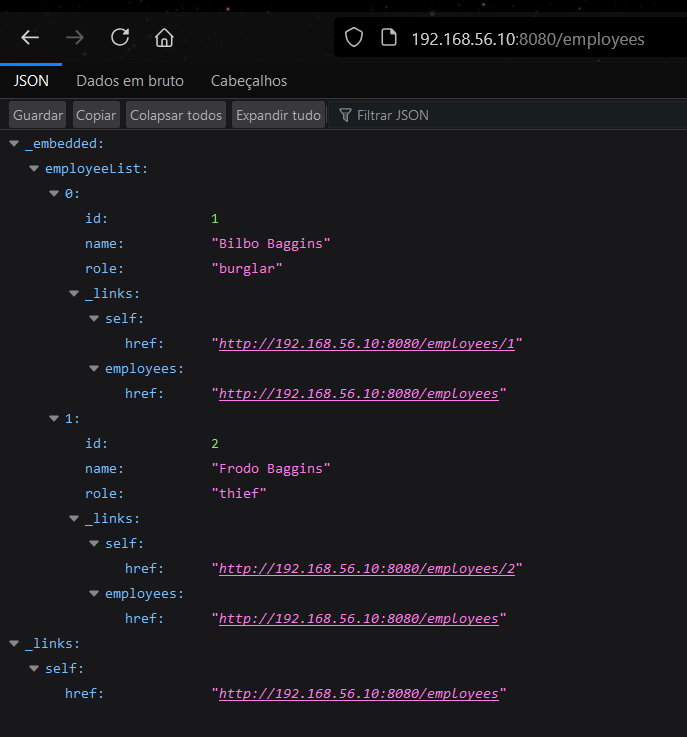
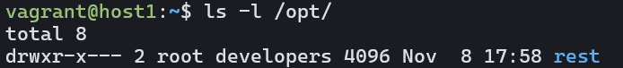
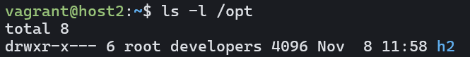
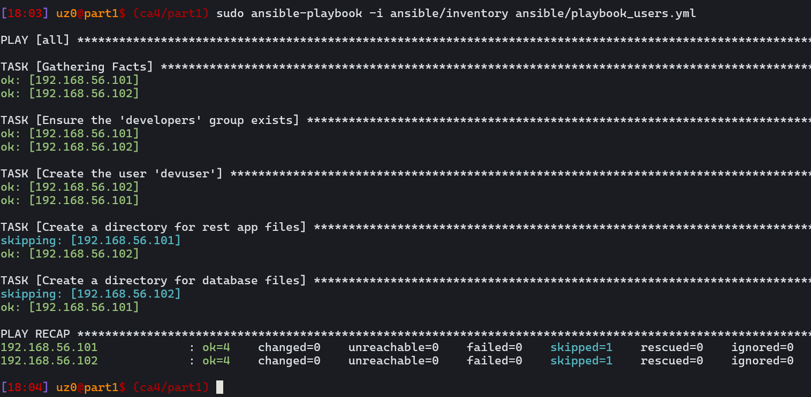

# CA4: Virtualization Tool (Ansible) Report

## Introduction to Ansible
Ansible is a powerful automation tool for IT operations, facilitating configuration management, application deployment, and task automation.


# Part 1

## Task 1: Configure Spring Boot to Connect to H2 in Server Mode

This task aims to configure a Spring Boot application to connect to an H2 database operating in server mode. By default, Spring Boot uses an embedded H2 database, but server mode allows connections from external clients, enabling a separate VM to run the database.

---

### Vagrantfile Configuration
The Vagrantfile sets up two VMs:
- **App VM** (host1) for the Spring Boot application.
- **DB VM** (host2) for the H2 database server.

```ruby
Vagrant.configure("2") do |config|
  config.ssh.insert_key = false
  
  # VM for hosting the H2 Database
  config.vm.define "host2" do |host2|
    host2.vm.box = "bento/ubuntu-20.04"
    host2.vm.hostname = "host2"
    host2.vm.network "private_network", ip: "192.168.56.101"
    host2.vm.provision "file", source: "../../../.ssh/part2_db.pub", destination: "~/.ssh/authorized_keys"
    host2.ssh.private_key_path = [
      "~/.vagrant.d/insecure_private_key",
      "../../../.ssh/part2_db"
    ]
    host2.vm.synced_folder "./db_shared", "/vagrant"
    host2.vm.provider "virtualbox" do |vb|
      vb.memory = "2048"
      vb.cpus = 2
    end

    # Ansible provisioning for the H2 database
    host2.vm.provision "ansible" do |ansible|
      ansible.playbook = "ansible/playbook_general.yml"
      ansible.inventory_path = "ansible/inventory"
      ansible.compatibility_mode = "2.0"
    end

    # Ansible provisioning for the H2 database
    host2.vm.provision "ansible" do |ansible|
      ansible.playbook = "ansible/playbook_db.yml"
      ansible.inventory_path = "ansible/inventory"
      ansible.compatibility_mode = "2.0"
    end

  end
  
  # VM for hosting the Spring Boot Application
  config.vm.define "host1" do |host1|
    host1.vm.box = "bento/ubuntu-20.04"
    host1.vm.hostname = "host1"
    host1.vm.network "private_network", ip: "192.168.56.102"
    host1.vm.provision "file", source: "../../../.ssh/part2_app.pub", destination: "~/.ssh/authorized_keys"
    host1.ssh.private_key_path = [
      "~/.vagrant.d/insecure_private_key",
      "../../../.ssh/part2_app"
    ]
    host1.vm.synced_folder "./app_shared", "/vagrant"
    host1.vm.provider "virtualbox" do |vb|
      vb.memory = "2048"
      vb.cpus = 2
    end

    # Ansible provisioning for the Spring Boot application
    host1.vm.provision "ansible" do |ansible|
      ansible.playbook = "ansible/playbook_general.yml"
      ansible.inventory_path = "ansible/inventory"
      ansible.compatibility_mode = "2.0"
    end

     # Ansible provisioning for the H2 database
    host1.vm.provision "ansible" do |ansible|
      ansible.playbook = "ansible/playbook_app.yml"
      ansible.inventory_path = "ansible/inventory"
      ansible.compatibility_mode = "2.0"
    end
  end

end
```


### Inventory File
The inventory file specifies SSH configurations and IPs for each VM.

```yaml
[host1]
192.168.56.102 ansible_user=vagrant ansible_password=vagrant ansible_ssh_private_key_file=~/.ssh/part2_app
[host2]
192.168.56.101 ansible_user=vagrant ansible_password=vagrant ansible_ssh_private_key_file=~/.ssh/part2_db
```

### Common Ansible Configuration

```yaml
- name: Configure both hosts (host1 and host2)
  hosts: all
  become: true  # Use become for elevated privileges
  tasks:
    - name: Update package list and install dependencies
      apt:
        name:
          - git
          - openjdk-17-jdk
          - wget
          - unzip
          - maven
        state: present
        update_cache: yes

    - name: Set JAVA_HOME environment variable
      copy:
        content: 'export JAVA_HOME=/usr/lib/jvm/java-17-openjdk-amd64'
        dest: /etc/profile.d/java_home.sh
        mode: '0644'
```

### Host 2 Ansible configuration:
```yaml
- hosts: host2
  become: true
  tasks:
    - name: Download H2 Database
      get_url:
        url: https://github.com/h2database/h2database/releases/download/version-2.3.232/h2-2024-08-11.zip
        dest: /tmp/h2.zip

    - name: Create /opt directory
      file:
        path: /opt
        state: directory
        mode: '0755'

    - name: Unzip H2 Database
      unarchive:
        src: /tmp/h2.zip
        dest: /opt
        remote_src: yes

    - name: Create shared directory for H2 database
      file:
        path: /vagrant/part2/h2db
        state: directory
        mode: '0770'

    - name: Create H2 server systemd service file
      copy:
        dest: /etc/systemd/system/h2db.service
        content: |
          [Unit]
          Description=H2 Database Server
          After=network.target

          [Service]
          ExecStart=/usr/bin/java -cp "/opt/h2/bin/h2-2.3.232.jar" org.h2.tools.Server -tcp -tcpAllowOthers -tcpPort 9092 -baseDir /vagrant/part2 -ifNotExists
          User=root
          Restart=always

          [Install]
          WantedBy=multi-user.target

    - name: Start H2 Database service
      systemd:
        name: h2db
        state: started
        enabled: true


    - name: Configure UFW firewall
      ufw:
        rule: allow
        port: "{{ item.port }}"
        from_ip: "{{ item.from_ip }}"
      with_items:
        - { port: '9092', from_ip: '192.168.56.100' }
        - { port: '22', from_ip: 'any' }

    - name: Enable UFW
      ufw:
        state: enabled
        logging: 'on'
        direction: 'incoming'
        default: 'deny'
      notify: restart ufw
```

### Host 1 Ansible configuration:

```yaml
- hosts: host1
  become: true
    - name: Download and install Gradle
      get_url:
        url: https://services.gradle.org/distributions/gradle-8.10.2-bin.zip
        dest: /tmp/gradle.zip

    - name: Create /opt/h2 directory
      file:
        path: /opt/gradle
        state: directory
        mode: '0755'

    - name: Unzip Gradle
      unarchive:
        src: /tmp/gradle.zip
        dest: /opt/gradle
        remote_src: yes

    - name: Set PATH for Gradle
      lineinfile:
        path: /etc/profile.d/gradle.sh
        line: 'export PATH=$PATH:/opt/gradle/gradle-8.10.2/bin'
        create: yes
        mode: '0644'

    - name: Set JAVA_HOME environment variable
      copy:
        content: 'export JAVA_HOME=/usr/lib/jvm/java-17-openjdk-amd64'
        dest: /etc/profile.d/java_home.sh
        mode: '0644'

    - name: Clone the repository if not present
      git:
        repo: 'https://<TOKEN>@github.com/JM-Teixeira/cogsi2425-1210957-1210951-1201326.git'
        dest: /opt/repo/cogsi2425-1210957-1210951-1201326
        clone: yes
        update: no

    - name: Create /opt/repo/cogsi2425-1210957-1210951-1201326/rest/src/main/resources directory
      file:
        path: /opt/repo/cogsi2425-1210957-1210951-1201326/rest/src/main/resources
        state: directory
        mode: '0755'


    - name: Create application.yaml for H2 configuration
      copy:
        content: |
          spring:
            datasource:
              url: jdbc:h2:tcp://192.168.56.101:9092/h2db
              username: sa
              password:
              driverClassName: org.h2.Driver
            jpa:
              hibernate:
                ddl-auto: update
        dest: /opt/repo/cogsi2425-1210957-1210951-1201326/rest/src/main/resources/application.yaml
        mode: '0644'

    - name: Wait for H2 database to be ready
      wait_for:
        host: 192.168.56.101
        port: 9092
        delay: 5
        timeout: 300
        state: started

    - name: Build the application
      command: "../mvnw clean install"
      args:
        chdir: /opt/repo/cogsi2425-1210957-1210951-1201326/rest

    - name: Start the REST application
      command: "nohup ../mvnw spring-boot:run"
      args:
        chdir: /opt/repo/cogsi2425-1210957-1210951-1201326/rest
      async: 600
      poll: 0

    - name: Wait for REST application to be ready
      wait_for:
        host: 192.168.56.102
        port: 8080
        delay: 5
        timeout: 300
        state: started

    - name: Configure UFW firewall for REST application
      ufw:
        rule: allow
        port: 8080
        proto: tcp

```


#### Explanation
- The `Vagrantfile` provisions two VMs with private IPs, SSH keys, and Ansible playbooks specified for each VM, similiar to CA3, altought is  ues ansible to provision each virtual machine, specifying the playbook and the inventory which Ansible will use
- The Ansible inventory ensures that both VMs can be managed by Ansible, with separate SSH configurations for each host.

**Final Result**

After running `vagrant up`, both VMs are initialized, and the Ansible playbooks run automatically. Below are screenshots showing the services initialization:




---

## Task 2: Use Ansible to Configure PAM for Complex Password Policy

### Description
This playbook installs `libpam-pwquality` and configures `/etc/pam.d/common-password` to enforce a complex password policy.

```yaml
- hosts: all
  become: true
  tasks:
   - name: Install libpam-pwquality
      package:
        name: "libpam-pwquality"
        state: present

    - name: Configure pam_pwquality for password policy
      lineinfile:
        path: "/etc/pam.d/common-password"
        regexp: "pam_pwquality.so"
        line: "password required pam_pwquality.so minlen=12 lcredit=-1 ucredit=-1 dcredit=-1 ocredit=-1"
        state: present
```

#### Explanation of Changes
- **Installing `libpam-pwquality`**: The PAM module is necessary for complex password policies.
- **Password Rules Configuration**: Ensures a password with:
  -  minimum length of 12 
  -  1 lower case
  -  1 upper case
  -  1 digit
  -  1 special character

**Final Result**

After execution, the policy requires passwords with at least one lowercase, uppercase, digit, and special character. Below is a screenshot demonstrating the enforced password policy with `devuser`:

---

## Task 3: Create Group `developers` and User `devuser`

### Description
This playbook creates a `developers` group and a `devuser` user, assigning permissions to restricted directories for the REST application and H2 database.

```yaml
- hosts: all
  become: true
  tasks:
    - name: Ensure the 'developers' group exists
      group:
        name: developers

    - name: Create the user 'devuser' and assign to 'developers' group
      user:
        name: devuser
        shell: /bin/bash
        password: "$6$V7nZrmOrqgSEjAg/$thYBlBskjZz7lSyi/Tt2FSRtz/8SedNUinG09SdHpIZHtPo7Cnh7/2PhKobJ/dwh1xuJKPFSKOAEW6Fdpv/aq."
        groups: developers
        append: yes

    - name: Create a directory for the REST application files on host 192.168.56.102
      file:
        path: /opt/rest
        state: directory
        mode: '0750'
        group: developers
      when: inventory_hostname == "192.168.56.102"

    - name: Create a directory for the H2 database files on host 192.168.56.101
      file:
        path: /opt/h2
        state: directory
        mode: '0750'
        group: developers
      when: inventory_hostname == "192.168.56.101"

  handlers:
    - name: Reload PAM configuration
      command: "pam-auth-update --force"

```

#### Explanation
- **Group and User Creation**: Creates the `developers` group and `devuser` with secure password settings.
- **Restricted Directory Setup**: Ensures `/opt/rest` on host1 and `/opt/h2` on host2 are accessible only to members of the `developers` group.
- The user `devuser` was created with password `K&n[,{K9vjf8` and the string on ansible playbook is the hash for password


**Final Result**

`devuser` has restricted access to these directories, enhancing security for the REST application and database files. Screenshots of the different directories are shown below:






This configuration ensures that Ansible modifies only the directories intended for each specific host. The image below demonstrates that Ansible applies configurations selectively, executing tasks only when necessary and skipping them otherwise.



---

## Task 4: Ensure Playbooks are Idempotent

### Description
This task ensures playbook idempotency. Each playbook task is structured to make no unintended changes upon re-execution, meaning tasks like group and user creation or directory setup only occur if necessary.

The playbooks are crafted to be idempotent, meaning they can run multiple times without making unnecessary changes if the target state is already achieved.

Using conditions like when ensures that tasks are executed only if specific conditions are met, such as checking for the existence of directories or users before creating them.

State-Based Modules: Modules such as `file`, `apt`, and `ufw` inherently support idempotency by checking the desired state before applying changes.

#### Explanation

- **Error Handling**: `ignore_errors` and conditional statements (`when`) prevent unintended side effects if a task is already completed.


**Final Result**

The playbooks were successfully run multiple times with no unintended changes observed.

---


> **Commit marked with 'ca4-part1'**


# Alternative Virtualization Tool - Analysis

In this analysis, we will examine five popular tools used for creating, managing, and automating environments: **Ansible**, **Docker**, **Terraform**, **Chef**, and **Puppet**. Each tool offers unique strengths and weaknesses regarding virtualization and infrastructure management. The purpose of this comparison is to understand how these tools align with virtualization requirements and how they compare with Ansible.

---

## 1. Ansible

### Key Features
- **Purpose**: Simplifies configuration management and application deployment through automation.
- **Technology**: Agentless, using SSH for communication, making it lightweight and compatible with multiple operating systems.
- **Ease of Use**: Uses YAML syntax for playbooks, which is straightforward and human-readable.
- **Configuration**: Configurations are organized into playbooks and roles, allowing modularity and reusability.

### Strengths
- **Agentless Operation**: No need for agents on target systems; relies on SSH, which is widely supported.
- **Modularity**: Supports roles and playbooks, making it easy to reuse configurations.
- **Integration**: Integrates well with other automation and orchestration tools, such as Terraform.
- **Community Support**: Large library of modules and extensive community resources.

### Limitations
- **Resource Management**: Primarily focused on configuration management rather than resource provisioning.
- **Complexity in Large-Scale Orchestration**: Not as suited for complex, multi-environment orchestration compared to Terraform.
- **Declarative vs. Procedural**: Ansible is more procedural, which can lead to longer playbook execution times for complex tasks.

---

## 2. Docker

### Key Features
- **Purpose**: Streamlines application deployment using lightweight, isolated containers.
- **Technology**: Containers share the host OS kernel, making them more resource-efficient than virtual machines.
- **Ease of Use**: Docker commands and Dockerfile configurations allow fast containerization of applications.
- **Portability**: Containers run consistently across any system that supports Docker.

### Strengths
- **Resource Efficiency**: Uses fewer resources than VMs as containers share the host OS kernel.
- **Speed**: Containers can be started in seconds, unlike VMs that may take minutes.
- **Portability and Consistency**: Docker images ensure an application runs the same way across different environments.
- **Microservices**: Well-suited for microservices architectures where applications are broken into smaller, manageable services.

### Limitations
- **Complexity of Networking**: Container networking can become complex when integrating with non-containerized systems.
- **Persistent Storage**: Handling persistent storage can be more complex compared to VMs.
- **Limited Full Isolation**: Containers share the host OS kernel, so they don’t provide the same isolation as VMs.

---

## 3. Terraform

### Key Features
- **Purpose**: Manages infrastructure as code (IaC), automating the provisioning of entire IT environments.
- **Technology**: Supports multi-provider integration (e.g., AWS, Azure, VMware, Docker, VirtualBox).
- **Ease of Use**: Uses HashiCorp Configuration Language (HCL) for defining infrastructure in a declarative way.
- **State Management**: Maintains a state file to keep track of resource configurations.

### Strengths
- **Scalability and Flexibility**: Can manage infrastructure ranging from a single server to complex multi-cloud architectures.
- **Multi-Provider Support**: Supports provisioning VMs, containers, and cloud resources across various platforms.
- **Infrastructure as Code**: Allows versioning and tracking of infrastructure changes, enhancing consistency and collaboration.
- **Automation**: Capable of fully automating the deployment, updating, and teardown of infrastructure.

### Limitations
- **Learning Curve**: Requires more expertise to use effectively compared to Ansible and Docker.
- **Stateless Provisioning**: Does not inherently manage running states of applications like Docker Compose does.
- **Initial Setup**: More setup and planning required to configure a robust infrastructure.

---

## 4. Chef

### Key Features
- **Purpose**: Automates infrastructure configuration, deployment, and management using a declarative Ruby-based DSL.
- **Technology**: Chef uses a client-server architecture with nodes (client machines) that run Chef client to pull configurations.
- **Ease of Use**: Configuration is written in Ruby using a domain-specific language (DSL), requiring more expertise.
- **Configuration**: Resources are grouped into recipes and cookbooks for reusability.

### Strengths
- **Flexibility**: Powerful scripting capabilities due to Ruby-based DSL, allowing highly customizable configurations.
- **Scalability**: Handles large infrastructures well and integrates with cloud providers.
- **Compliance and Auditing**: Chef has built-in support for continuous compliance and auditing, making it suitable for security-driven environments.

### Limitations
- **Learning Curve**: Requires knowledge of Ruby and Chef-specific DSL, making it less accessible than simpler tools like Ansible.
- **Complexity in Setup**: The client-server architecture may require additional setup and management.
- **Resource Intensive**: Chef can be more resource-heavy due to its client-server model.

---

## 5. Puppet

### Key Features
- **Purpose**: Automates infrastructure management using a declarative language to define system configurations.
- **Technology**: Uses a client-server model with a master-agent setup or a serverless model in recent versions.
- **Ease of Use**: Configuration is written in Puppet's DSL, which is similar to Ruby but more specific to infrastructure management.
- **Configuration**: Resources are defined in manifests and grouped into modules.

### Strengths
- **Declarative Language**: Puppet uses a highly readable declarative syntax that allows for clear system configuration definitions.
- **Extensive Ecosystem**: Large collection of pre-built modules for various infrastructure management tasks.
- **Compliance and Reporting**: Built-in tools for monitoring and compliance reporting, making it suitable for environments with regulatory requirements.

### Limitations
- **Complexity**: More complex than Ansible for simpler use cases due to the need for Puppet agents and a master server.
- **Learning Curve**: Puppet’s DSL can be harder to learn for users unfamiliar with its syntax.
- **Performance**: Can be slower than agentless solutions like Ansible, especially when managing large infrastructures.

---

## Comparative Analysis

### 1. Ease of Use
- **Ansible**: User-friendly for configuration management and ad-hoc tasks. Simple YAML syntax is accessible even for beginners.
- **Docker**: Slightly more complex but user-friendly for deploying applications in containers. Requires understanding of containerization concepts.
- **Terraform**: Most complex due to its comprehensive infrastructure management capabilities. Requires familiarity with HCL and cloud/virtualization concepts.
- **Chef**: Requires knowledge of Ruby and Chef DSL, making it less accessible than Ansible.
- **Puppet**: Uses a declarative language but can be complex for smaller setups due to its master-agent architecture.

### 2. Resource Utilization
- **Ansible**: Light on resources as it is agentless and relies on SSH connections.
- **Docker**: Highly efficient, using shared OS resources to reduce memory and CPU usage.
- **Terraform**: Resource usage depends on the type of infrastructure it provisions (e.g., VMs vs. containers). Can be optimized for different levels of resource allocation.
- **Chef**: Requires more resources due to its client-server architecture.
- **Puppet**: Can be resource-heavy, especially with the agent-master setup.

### 3. Portability
- **Ansible**: Highly portable since it relies on SSH and doesn’t require an agent.
- **Docker**: Highly portable, with containers running the same way on any Docker-supported environment.
- **Terraform**: Extremely portable due to its ability to define infrastructure code that can be applied to various providers.
- **Chef**: Less portable due to its reliance on a client-server architecture.
- **Puppet**: Less portable compared to Docker or Ansible, due to the need for agents or a server.

### 4. Scalability
- **Ansible**: Suitable for configuration management in medium to large-scale environments but lacks native orchestration features.
- **Docker**: Highly scalable for both development and production environments, especially for microservices.
- **Terraform**: Designed for large-scale infrastructure management across multi-cloud and hybrid environments.
- **Chef**: Scalable for large infrastructures but can require additional management due to its client-server architecture.
- **Puppet**: Scalable for large infrastructures but can become complex with a large number of nodes.

### 5. Automation and Orchestration
- **Ansible**: Automates configuration and provisioning tasks but lacks orchestration capabilities for complex multi-service environments.
- **Docker**: Can automate container builds and orchestration through Docker Compose and integration with Kubernetes.
- **Terraform**: Advanced automation for complete infrastructure lifecycle management, supporting dependencies, modules, and state management.
- **Chef**: Automates configuration management and application deployment, with strong support for continuous compliance.
- **Puppet**: Automates infrastructure management and provides reporting and compliance tools.

---

## How Terraform Compares to Ansible

- **Broader Scope**: Terraform handles infrastructure across cloud services, on-premises environments, and containers, making it more versatile than Ansible, which focuses on configuration management.
- **Infrastructure as Code**: While Ansible provisions configurations, Terraform fully embraces IaC principles, enabling version control and collaborative management.
- **Resource Management**: Terraform optimizes resource allocation based on environment specifications, offering more flexibility compared to Ansible's agentless, ad-hoc operation model.

<br>


# Conclusion
In conclusion, our analysis reveals that while Ansible, Docker, Terraform, Chef, and Puppet each contribute to environment automation and management, they serve distinct purposes and address different challenges within infrastructure and configuration management. Specifically, Ansible’s primary role is **configuration management and deployment automation**, where it excels through its **agentless architecture and user-friendly syntax**. In contrast, tools like Terraform, Chef, Puppet, and Docker focus on diverse aspects of infrastructure provisioning, containerization, and compliance rather than on configuring environments post-provisioning.

Therefore, we find it unclear why some of these tools are often positioned as direct **alternatives to Ansible**, as they do not serve the same core purposes. While they are complementary in creating and managing IT environments, they do not replace Ansible's capabilities in **real-time configuration management** and **system-level automation**. Consequently, for managing configurations and deploying applications seamlessly, Ansible remains unmatched, while other tools are better suited for infrastructure provisioning, container orchestration, or maintaining system compliance.