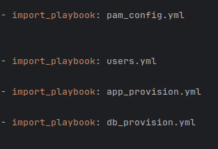
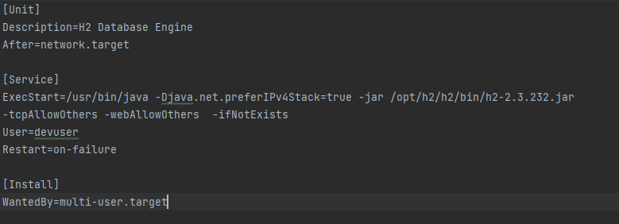
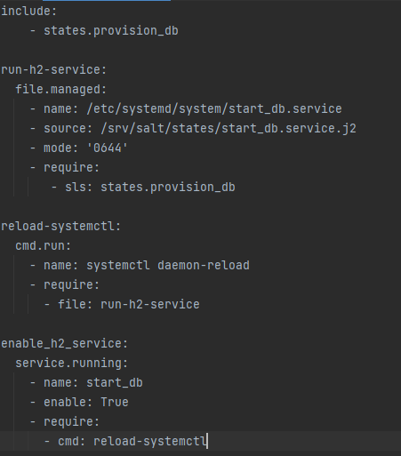

# CA4 - Configuration Management

## Analysis

In this section, we will analyse Ansible and its alternatives for configuration management.

### Ansible

Ansible is a open-source tool for configuration management owned by Rad Hat. It is used in a wide variety of
fields due to how many modules it has. It is an important tool when it comes to to managing configurations in the
infrastructure, as it automates the process of applying the configurations and help streamline the configuration. It is
a very helpful tool, specially in infrastructures that support a wide variety of applications and have to maintain a lot
of resources.

#### Advantages and shortcomings

Some of the advantages of Ansible are:

- It has a wide variety of modules, meaning that it can be used for pretty much anything from installing packages in a VM to creating 
VMs to creating VMs on the cloud or on-prem
- Using a yaml syntax makes it easy to read.


Some disadvantages are:
- For complex workflows, playbooks can get quite extensive
- Since it works over SSH, it may be slower than other alternatives.

### Alternatives

In this section, we will analyse some of the alternatives to Ansible

#### Chef

Chef, or Progress Chef, is a configuration management tool based on Ruby.

#### Advantages and shortcomings


Some advantages of Chef are:
- It is highly efficient in large environments
- Like ansible, has a lot of tools and integrations
- It supports tracking and reporting

Some disadvantages are:
- It is Ruby based, meaning a steeper learning curve
- It requires more time for initial set up


#### Puppet

Puppet is tool owned Perforce Inc for configuration management. It has its own declarative language
that resembles a lot JSON files in its syntax.

#### Advantages and shortcomings

Some advantages of Puppet are:
- It is declarative, like ansible, making it easy to learn and understand.
- It has event-driven configuration, providing insights into infrastructure drift
- Apart from the Puppet DSL, it also supports Ruby

Some disadvantages are:
- It is not as scalable as Ansible
- Due to how many tools it offers, it is not really suitable to small projects, like this one.


#### Salt

#### Advantages and shortcomings

Some advantages of Salt are:

- Natively supported by vagrant
- Like Ansible, uses a yaml syntax, which makes it easy to read.
  
Some disadvantages are:
- In larger projects, playbooks can become complex
- lack of support for windows hosts

## Implementation - Ansible

In this section, we will implement the solution for the assignment in Ansible.


### Set up secrets

Before anything, we must create a file with the secrets that will be used in our playbooks, for that we will use ansible-vault-

To create a new encrypted vault file we must run the following command.

```shell
ansible-vault create secrets.yml
```

This will prompt us to define a password, and then will open hte file in a vim environment. There we can then add our secrets.
When we exit, the file will be encrypted, and we need the defined password to decrypt it.

In this file, in a yml format, we will define the following attributes:

- github_token
- user_password

The user password must be in a hashed format, for it to work properly in our environment.

To edit the file, we must run the following command:

```shell
ansible-vault edit secrets.yml
```

This will ask us for the vault password and will open the decrypted file in vim for us to edit.


We then specify, in the playbooks that use these secrets, 


We also need to pass the vault password when running the playbooks. We can both write the password in the command line or pass
it on a file, in this case, since we are using Vagrant, we will pass it from a file. So we create a file called .vault-pass with only the defined 
vault password file on it, and then add the following to the Vagrantfile:


This will pass the password into the playbook execution and decrypt the secrets file when necessary.


### Configure VM provisioning 

During this section we will adapt the provision scripts made in CA3 to ansible. For this there will be two
playbooks, one for the database and one for app VM. Each playbook must only execute on one host in this section.

#### DB provisioning

The first thing we must define int his playbook, it that it must only execute for the database VM, for 
that the header of the playbook must look like this.


We define that the playbook will only execute on database VMs in the hosts field, we also define that we will need
privilege escalation with the become attribute, as we need sudo permissions for most tasks. We also define three variables that we will need 
during our playbook to install H2.


We now go into each of the tasks.

The first three tasks are for installing the necessary packages using the apt module of ansible, checking if they are on the latest version.
The first package installation also updates the cache


The reason for the packages being separated is that we may want certain packages in specific versions, and not on the latest one by default.


Now we proceed for the installation of the h2 database in the vm. First we make sure the installation directory exists and then check
if there is already a h2.sh script inside it, this is done to make sure our playbook is idempotent.


Then, if the previous task did not find the h2 running script, we will get the zip file to install h2 from GitHub and put it on the
already defined installation directory.


We will now proceed to set up the systemd service to execute the database

For that we will create a j2 file for the template. J2 files are template file used by ansible.

The file looked like this.


We then pass the file onto the VM, reload the daemon and make sure that the service is started and enabled.


Now we will set up the firewall for the Virtual Machine.

First we make sure ufw is installed, started and enabled.


We then apply the firewall rules, restricting access to the database port to only our app VM and allowing SSH so we can access the machine


#### App provisioning

Now we will go into the app VM provision playbooks

First we define that the playbook is for the app VM in the hosts field. We also define that we
will need privilege escalation and also to use our secrets file as a var file. If we do not provide the vault password
at this point there will be an error as ansible cannot decrypt the file.


Now, we will proceed onto the tasks.

First we install the necessary packages using the apt module in ansible, in a similar way in how we have done in the db VM.


We then clone the repository, using the github_token secret that we defined in the secrets file. We
also give execution permissions to the files that need it to execute our application.


Now, we set up a systemd service for the app to start every time we boot the machine, similar in how we done in the db VM. We use a J2 template 
file with the following contents.


Afterward, we pass the file onto the VM, reload the daemon and make sure the service is started and enabled. 


### Define password policy

We will now go into defining the password policy for our VMs.

This new playbook will be executed in all VMs, so we pass the all argument in the hosts field. Since we need sudo privileges to edit the
PAM module files, we also pass the become argument with yes values.


We then need to make sure the "libpam-pwquality" package is in the system using the following task.


We now need to make sure the following like exists in the /etc/pam.d/common-password file:

```
password  required  pam_pwquality.so  minlength=12  lcredit=-1  ucredit=-1  dcredit=-1  ocredit=-1  retry=3  enforce_for_root
```

This line defines the password complexity, that it must have at least 12 characters, 1 lower case letter, 1 upper case
letter, one number and one special character. Also, only allows 3 retries and enforces these rules for the root user.


To make sure this configuration is applied, we must use the following task, that will check if the previous reference configuration exists 
in the file.


### Create groups and users

We will now create users and groups and define permissions in our VMs.

Since this playbook is for all hosts, and we need sudo privileges and the secrets file to set the
user password, our playbook will have the following configuration.


First this we need to do we make sure that the development group exists in the VM, as well as 
the user. The user password is the one we defined in the secrets.yml file. We also have a third task
to make sure that user is assigned to that group.


Now we will have to make changes to the db and app provisioning playbooks, because of permission management to certain folders.

#### DB Provisioning

In this playbook, we need to add two tasks, one to make sure the development group exists, and one
to set the permissions to our database folder, so it is only accessible to members of that group.


#### App Provisioning

Similar way to the db provisioning, we also need to make sure the development group exists
and the set permissions to our repository folder, so it is accessible only to members of the development 
group.


### Assembling everything together
Now we will assemble everything together in one main playbook. This way we can control which
playbooks are executed first and simplify our configuration in the Vagrantfile.

First we define, that the playbook applies to all the hosts, we do not need to define the become
attribute here, we can leave that to each individual playbook.


Then we define what playbooks are we going to use and in what order are they going to be executed, starting
by the playbooks that apply to all hosts, being the first one the one in where we define the password policy,
then the one in where we create the users, and then the ones related to each individual VM.



Each playbook will only execute on the host that is defined to it, the ones that are set for the app VM will
only execute against the app VM and the ones set for the db VM will only execute against the db VM.

The full final configuration in the Vagrant file had the following look:

```
Vagrant.configure("2") do |config|
  config.vm.define "db" do |db|
    db.vm.box = "ubuntu/focal64"
    db.vm.hostname = "host2"
    db.vm.network "private_network", ip: "192.168.56.10"
    db.vm.provision "file", source: "~/.ssh/db_key.pub", destination: "~/.ssh/authorized_keys"
    db.ssh.private_key_path = ["./.vagrant/machines/db/virtualbox/private_key", "~/.ssh/db_key"]
    db.ssh.insert_key = false
    db.vm.provider "virtualbox" do |vb|
        vb.memory = "2048"
        vb.cpus = 2
    end
  end

  config.vm.define "app" do |app|
    app.vm.box = "ubuntu/focal64"
    app.vm.hostname = "host1"
    app.vm.network "private_network", ip: "192.168.56.20"
    app.vm.network "forwarded_port", guest: 8080, host: 5000
    app.vm.provision "file", source: "~/.ssh/app_key.pub", destination: "~/.ssh/authorized_keys"
    app.ssh.private_key_path = ["./.vagrant/machines/app/virtualbox/private_key","~/.ssh/app_key"]
    app.ssh.insert_key = false
    app.vm.provider "virtualbox" do |vb|
      vb.memory = "2048"
      vb.cpus = 2
    end
  end


  config.vm.provision "ansible" do |ansible|
      ansible.playbook = "./ansi-playbooks/main.yml"
      ansible.compatibility_mode = "2.0"
      ansible.vault_password_file = "./.vault_pass"

  end

end
```

The provision scripts were replaced with the provisioning via Ansible, in which is defined in the
vagrant file like this:

```
  config.vm.provision "ansible" do |ansible|
      ansible.playbook = "./ansi-playbooks/main.yml"
      ansible.compatibility_mode = "2.0"
      ansible.vault_password_file = "./.vault_pass"

  end

```

This sets the executing of our main playbook and also passes the vault pass as an argument
for when it is needed.


### Make sure ansible playbooks are idempotent

To make our playbooks idempotent, we can use many methods, if we resort to the modules that come with ansible, our
playbooks are going to be mostly idempotent, as they check for the status of certain things in the system before doing anything.

In certain cases we have to create conditions or add attributes to the tasks for example when statements. In our case
is the cases in which we have to get files from remote origins, like when we get the zip to install h2 in the db VM or 
clone the repository in the app VM.

There are only two cases where this happens, 


The first example of this is when we get the zip to install the h2 database.

For that, we first check if one of the scripts contained in the file exists already.


Then, based if the script exists or not, we get the zip file from GitHub. This is defined in the when attribute of
the task, that defines that the task only execute if that condition is met.


Using the same logic, did the same when it comes to cloning the repository, checking if the execution script exists and cloning
the repository if it does not exist.


The rest of the tasks are idempotent themselves, as they do not require interaction with remote hosts, and check the
status of thing before doing any changes by default.

To test if our playbooks are idempotent we could run one of the two vagrant command:

```shell
vagrant provision
```

```shell
vagrant reload --provision
```

Or running the following ansible command, with the vagrant generated inventory.

```shell
ansible-playbook -C -i ./.vagrant/provisioners/ansible/inventory/vagrant_ansible_inventory main.yml --ask-vault-pass
```

Both VMs should be running to run these tests, otherwise they will fail.


## Implementation - Salt

Salt usually operates in a master-slave configuration, where the host can send 
commands (in pull configuration the slave/minion requests commands) to provision 
any number of machines. Alternatively, each minion can operate in a masterless 
configuration in which the provisioning files are shared with the minion.
The master-slave configuration, while also requiring the setup of 
the master/host, allows centralized control of any number of machines, 
and so is more suitable for larger scale operations.
Considering our situation, the masterless configuration was chosen instead.

### Configure VM provisioning

Since Salt is supported by vagrant by default, we need to set it as the provisioner for both VMs. Since masterless mode is going to be used, we also need to share
the contents of the "pillar" and "salt" folders, which contain, respectively, variables such as github API keys and the Salt state files for provisioning.


Each VM now knows all the Salt state files, but not which belong to which VM. We created a "minion_*.conf" file for each VM, which is assigned in the Vagrantfile 
and contains the Salt id of each machine and where it should look for the state files. In a master-server configuration, this file would contain the IP address of the master,
but in our masterless configuration the local files are assigned instead. 


With each VM given an id, we can assign the States that each machine will run when provisioned in the "top.sls" file.


### Define password policy

Similarly to the Ansible version, this salt state has two steps.
First, the libpam-pwquality package is installed if it is not already present in
the machine, and second, the line:

```
password  required  pam_pwquality.so  minlength=12 lcredit=-1  ucredit=-1  dcredit=-1  ocredit=-1  retry=3  enforce_for_root
```

Is added after "pam_pwquality.so" if it is not already present. This configuration ensure any
passwords have at least 12 characters, at least one of which is a lowercase letter,
uppercase letter, number and special symbol.


### Create groups and users

In order to create the developers group and the devuser user, the group_user.sls state
was created. This state creates the developers group if it is not present, then
creates the devuser user if it is not present, hashing the password stored in the
secrets.sls file and assigning to the user the developer group.


### Database provisioning

After the password policy is set and the group and user are created, the provision_db.sls state is executed 
and the applications necessary to run the database service are installed.
The H2 release is downloaded and extracted, if it is not already present, and the .zip file is deleted.


The firewall is also enabled with the required ports left open and the directory where the database 
is stored is made accessible only to the members of the developers group.


Finally, the start_h2_server.sls state is executed, using the start_db.service.j2 script to create a service.





### Application provisioning

Similarly, in the provision_app.sls state the necessary applications are downloaded, the repository is cloned if necessary,
and the directory is assigned to the developers group.


In the start_app.sls state, the ncat command is used in a loop in order to ensure the database service in the other VM is running,
then the execution permissions for gradle and the run_spring_2 script are modified so the spring application can be executed.


### Make sure Salt playbooks are idempotent

In order to ensure that running the same salt state multiple times will not lead to
unexpected results, salt states will usually only make changes when the desired state 
is different from the current state. The "require" and other similar methods ensure 
that states are executed in the correct order, which also helps prevent duplicate changes.

For example, the clone_repo state in provision_app.sls will only clone the repo if it is not 
present or if it is not up to date.

