# CA4 report

# Theme Ansible

## Introduction to Ansible

Ansible is an open-source tool that helps automate IT tasks, like setting up servers, deploying applications, and managing configurations. <br>It’s popular because it’s simple to use and doesn’t require installing anything special on the servers it manages.

With Ansible, you write "playbooks" in YAML, a straightforward text format, to define what tasks should be done.<br> Ansible then connects to each server over SSH, reads the playbook, and carries out tasks like installing software, copying files, or configuring services.

Since it doesn’t need extra agents installed on servers, Ansible is fast to set up and great for managing many servers at once.<br> This makes it popular for tasks like setting up cloud environments, automating deployments, and ensuring all systems have the correct configurations.

<p align="center">
  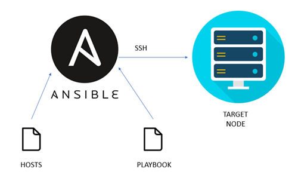
</p>


This image shows how Ansible automates tasks on remote servers, called "target nodes." It uses SSH to connect from the Ansible control node to the target nodes. The "hosts" file lists the servers to manage, while the "playbook" file defines the tasks Ansible will execute on each target node.


## Installing Ansible

In order to install ansible we followed the default python instalation

`python -m pip install --user ansible`

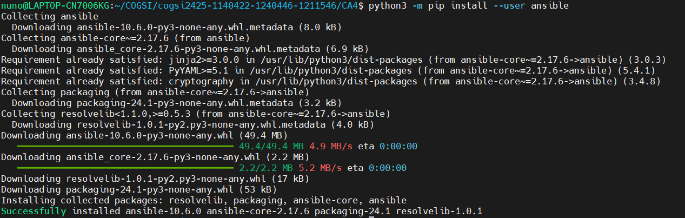


# Part 1

## The Goal of this assignment is to evolve Part 2 of CA3 to use Ansible as a provisioner in both VMs

In order to change our configuration to use Ansible we had to change our Vagrantfile

```
Vagrant.configure("2") do |config|
  config.vm.box = "bento/ubuntu-20.04"
  config.vm.boot_timeout = 33300

  config.vm.provider "virtualbox" do |v|
    v.memory = 1024
    v.cpus = 2
  end

  config.vm.define "db" do |db|
    db.vm.hostname = "db"
    db.vm.network "private_network", ip: "192.168.56.20"
    db.vm.network "forwarded_port", guest: 8082, host: 8082
    db.vm.network "forwarded_port", guest: 9092, host: 9092
  end

  config.vm.define "web" do |web|
    web.vm.hostname = "web"
    web.vm.network "private_network", ip: "192.168.56.21"
    web.vm.network "forwarded_port", guest: 8080, host: 8080
  end

  config.vm.provision "ansible" do |ansible|
    ansible.playbook = "./provisioning/playbook.yml"
  end
  
end
```

We took every specific configuration of the VMs and added our provision shell with Ansible, defining the path to our playbook.yml

Our inventory file was automatically generated under `.vagrant/provisioners/ansible/inventory/vagrant_ansible_inventory`, for team working we ignore this folder in our .gitignore but below is the code present in that file:

``` 
# Generated by Vagrant

db ansible_ssh_host=172.18.144.1 ansible_ssh_port=2222 ansible_ssh_user='vagrant' ansible_ssh_private_key_file='/mnt/c/Users/nunoo/CA4/.vagrant/machines/db/virtualbox/private_key'
web ansible_ssh_host=172.18.144.1 ansible_ssh_port=2200 ansible_ssh_user='vagrant' ansible_ssh_private_key_file='/mnt/c/Users/nunoo/CA4/.vagrant/machines/web/virtualbox/private_key'
```

Our playbook.yml can be devided in three parts:
  - the first where we create the configurations for all the hosts,
  - the second, where we configure the database VM
  - the third, where we configure the web VM

An important command so we didn't have to provision everytime with vagrant was:
`ansible-playbook -i .vagrant/provisioners/ansible/inventory/vagrant_ansible_inventory provisioning/playbook.yml`
This allowed us to play our ansible playbook and provision it manually.

Below is the code for the set up of all the machines, but we will look in depth in the following chapters:

```
---
- name: Provision VM
  hosts: all
  become: true
  tasks:
    - name: Update apt repo and cache
      apt:
        update_cache: yes
      register: update_cache
      changed_when: update_cache is changed
      failed_when: update_cache is failed
      ignore_errors: true
    
    - name: Install openjdk
      apt:
        name: openjdk-17-jdk
        state: present
      register: install_openjdk
      failed_when: install_openjdk is failed 
      ignore_errors: false

    - name: Install libpam-pwquality
      ansible.builtin.package:
        name: "libpam-pwquality"
        state: present
      register: install_libpam
      failed_when: install_libpam is failed 
      ignore_errors: false

    - name: Configure pam_pwquality
      ansible.builtin.lineinfile:
        path: "/etc/pam.d/common-password"
        regexp: "pam_pwquality.so"
        line: "password required pam_pwquality.so minlen=12 lcredit=-1 ucredit=-1 dcredit=-1 ocredit=-1 retry=3 enforce_for_root"
        state: present

    - name: Ensure group 'developers' exixsts
      ansible.builtin.group:
        name: developers
        state: present

    - name: Ensure user 'devuser' exists
      ansible.builtin.user:
        name: devuser
        shell: /bin/bash
        password: $6$r30uVewInertUUMC$o6AxbQHmPQF1vb3lGSpvqa198yD8a4NQRzaPJbmDbzJ.9d.DQTW7twwXmkWKMHz38fA6c/M4g3NWBkF2lwnYL.
        state: present

    - name: Assign 'devuser' to the 'developers' group
      ansible.builtin.user:
        name: devuser
        groups: developers
        append: yes
        state: present

    - name: Create a directory named 'developers_hut'
      file:
        path: /opt/developers_hut
        state: directory
        mode: 0770
        group: developers
```

To configure and set up our database VM we created 6 tasks:
1. Download H2 Database JAR from Maven Central Repository, for the specific destination
2. Starts the H2 database in server mode, enabling TCP and web access.
3. Displays the output of the previous task (starting the H2 database) by printing `java_output.stdout_lines`, which contains the command output as a list of lines.
4. Installs UFW, a user-friendly firewall for managing firewall rules on Ubuntu/Debian systems.
5. Configures UFW rules to allow incoming connections on specific ports.
6. Enables UFW with default deny policy for incoming connections.

```
- hosts: db
  become: true
  tasks:
    - name: Download H2 Database JAR
      ansible.builtin.get_url:
        url: "https://repo1.maven.org/maven2/com/h2database/h2/2.3.232/h2-2.3.232.jar"
        dest: "/opt/developers_hut/h2-2.3.232.jar"
        mode: 0770
        owner: "devuser"
        group: "developers"


    - name: Start H2 database
      ansible.builtin.shell: "nohup java -cp /opt/developers_hut/h2-2.3.232.jar org.h2.tools.Server -tcp -tcpAllowOthers -web -webAllowOthers -ifNotExists &"
      register: java_output
      changed_when: false

    - name: Display output 
      ansible.builtin.debug:
        var: java_output.stdout_lines

    - name: Install UFW
      apt:
        name: ufw
        state: present

    - name: Configure UFW Firewall Rules
      community.general.ufw:
        rule: allow
        port: "{{item.port}}"
        from_ip: "{{item.from}}"
      loop:
        - { port: '22', from: 'any' }
        - { port: '9092', from: '192.168.56.21' }
        - { port: '8082', from: '192.168.56.21' }

    - name: Enable UFW
      community.general.ufw:
        state: enabled
        default: deny
```

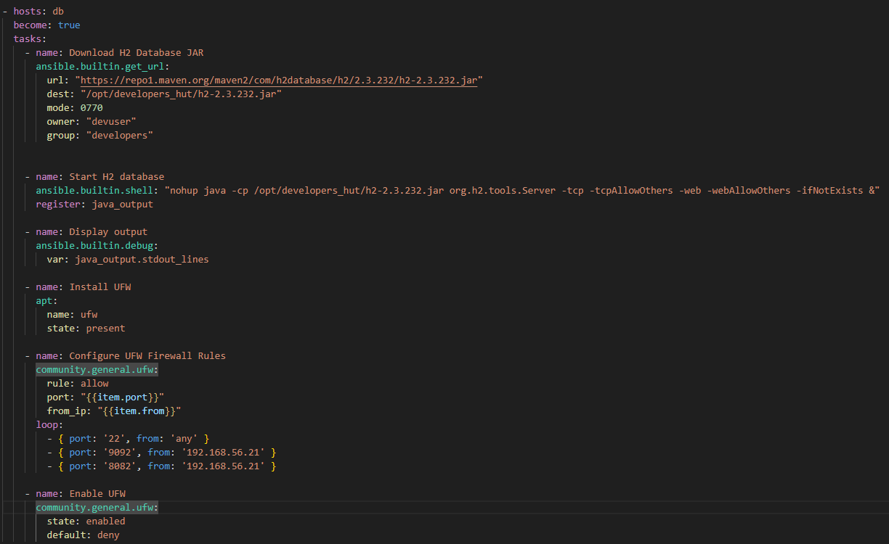


To configure and set up our web VM we created the following tasks:
1. Installs Gradle, a build automation tool commonly used in Java projects.
2. Copies a local SSH deploy key (my_vagrant_key) to the VM for accessing a private GitHub repository.
3. Adds GitHub’s SSH host key to the known_hosts file, avoiding SSH prompts when connecting to GitHub.
4. Clones our private GitHub repository using the SSH deploy key. Relevant parameters:
   - update: Ensures the latest version of the repo is pulled 
   - accept_hostkey: Accepts GitHub's host key if it’s not already known
5. Copies the Spring application directory to /opt/developers_hut/SPRING_APP (only accessible by developers group). Relevant parameter:
   - creates: Prevents the command from re-running if the file already exists.
6. Copies the wait_for_H2.sh script to /opt/developers_hut. Relevant parameter:
   - creates: Prevents the command from re-running if the file already exists.
7. Runs the Gradle command to clean and build the application.
8. Makes the wait_for_H2.sh script executable and runs it to wait for the H2 database server.
9. Starts the Spring application using the runApp Gradle command.


```
- hosts: web
  become: true
  tasks:
    - name: Install gradle
      apt:
        name: gradle
        state: present

    - name: Copy deploy key to VM 
      ansible.builtin.copy:
        src: "~/.ssh/my_vagrant_key"
        dest: "/home/vagrant/.ssh/my_vagrant_key"
        mode: 0600
        owner: vagrant
        group: vagrant

    - name: Add GitHub to known_hosts
      ansible.builtin.known_hosts:
        path: /home/vagrant/.ssh/known_hosts
        name: github.com
        key: "{{ lookup('pipe', 'ssh-keyscan -t rsa github.com') }}"
        state: present
      become: yes
      become_user: vagrant
      ignore_unreachable: false

    - name: Clone team GitHub repository using deployment key
      ansible.builtin.git:
        repo: "git@github.com:1140422/cogsi2425-1140422-1240446-1211546.git"
        dest: /home/vagrant/COGSI
        key_file: "/home/vagrant/.ssh/my_vagrant_key"
        update: yes
        accept_hostkey: yes
      become: yes
      become_user: vagrant
      ignore_unreachable: false

    - name: Copy Spring Application to developers folder
      ansible.builtin.shell:
        cmd: "cp -r /home/vagrant/COGSI/CA2/PART2 /opt/developers_hut/SPRING_APP && chown -R devuser:developers /opt/developers_hut/SPRING_APP"
        creates: /opt/developers_hut/SPRING_APP

    - name: Copy wait_for_h2 script to developers folder
      ansible.builtin.shell:
        cmd: "cp /home/vagrant/COGSI/CA3/PART2/wait_for_H2.sh /opt/developers_hut/ && chown devuser:developers /opt/developers_hut/wait_for_H2.sh"
        creates: /opt/developers_hut/wait_for_H2.sh

    - name: Build app
      ansible.builtin.shell:
        cmd: "/opt/developers_hut/SPRING_APP/gradlew clean build"
        chdir: /opt/developers_hut/SPRING_APP/
      changed_when: false

    - name: Execute wait for H2 Database
      ansible.builtin.shell:
        cmd: "chmod u+x /opt/developers_hut/wait_for_H2.sh && ./wait_for_H2.sh"
        chdir: /opt/developers_hut/
      changed_when: false

    - name: Run app
      ansible.builtin.shell:
        cmd: "nohup /opt/developers_hut/SPRING_APP/gradlew runApp &"
        chdir: /opt/developers_hut/SPRING_APP/
      changed_when: false
```

When we executed the playbook we got an output like this:
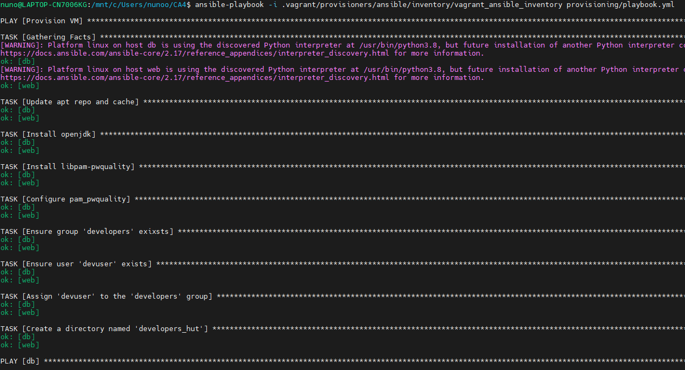
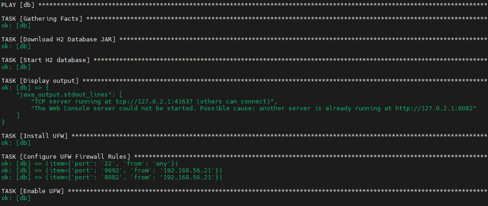
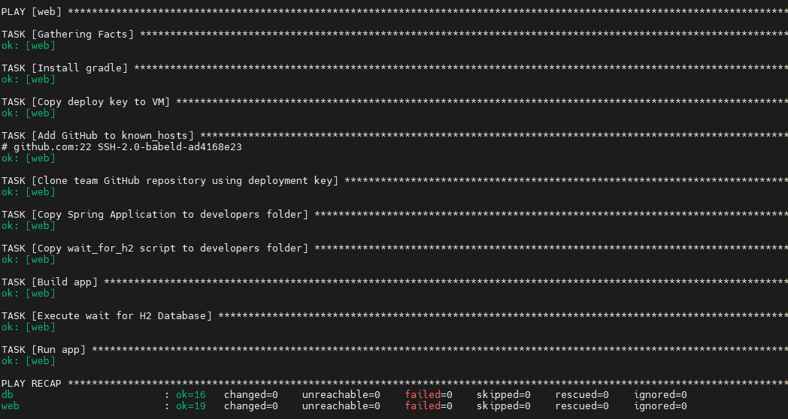

## Use Ansible to configure PAM to enforce a complex password policy

To enforce a complex password policy we installed a PAM module and edited the line of /etc/pam.d/common-password file to include this line

`password required pam_pwquality.so minlen=12 lcredit=-1 ucredit=-1 dcredit=-1 ocredit=-1 retry=3 enforce_for_root`

with this configuration we require a password with a minumum length of 12 (minlen=12)
lcredit - at least one lower case letter
ucredit - at least one upper case letter
dcredit - at least 1 digit
ocredit - at least one special character
enforce_for_root - even root can not change the passwords without meeting this criteria.

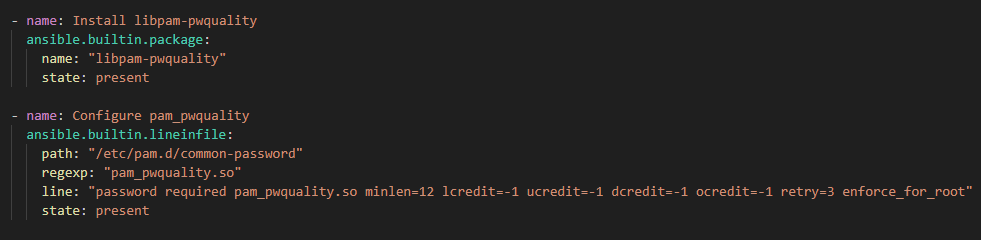

After we tested this solution to guarantee it worked:

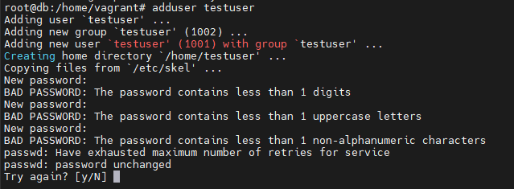

## Use Ansible to configure users, groups and their permissons

We created for every VM a user: devuser and a group: developers, we also created under /opt a folder only accessible for members of developers group:

```
    - name: Ensure group 'developers' exixsts
      ansible.builtin.group:
        name: developers
        state: present

    - name: Ensure user 'devuser' exists
      ansible.builtin.user:
        name: devuser
        shell: /bin/bash
        password: $6$r30uVewInertUUMC$o6AxbQHmPQF1vb3lGSpvqa198yD8a4NQRzaPJbmDbzJ.9d.DQTW7twwXmkWKMHz38fA6c/M4g3NWBkF2lwnYL.
        state: present

    - name: Assign 'devuser' to the 'developers' group
      ansible.builtin.user:
        name: devuser
        groups: developers
        append: yes
        state: present

    - name: Create a directory named 'developers_hut'
      file:
        path: /opt/developers_hut
        state: directory
        mode: 0770
        group: developers
```

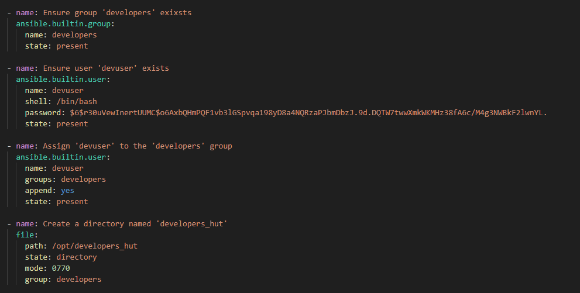

## Ensure that playbooks are idempotent

To make this playbook idempotent, we aplied some adjustments, such as:
1. `create` Parameters: in tasks that copy or create files and directories. This prevents the task from running again if the file or directory already exists, ensuring the task only runs when necessary.
2. `failed_when` Condition: For tasks with potential errors (such as installations that might fail if the package is already present), we used `failed_when` to control failure conditions. This allows the task to succeed if the desired state is already in place, avoiding unnecessary failures.
3. `ignore_errors` Setting: We selectively used `ignore_errors` to allow the playbook to continue in cases where a non-critical error occurs, which is useful for tasks that don’t need to block further steps.


# Alternatives Research | Comparisson | Implementation

# Comparison of SaltStack (Salt), Chef, Puppet, and Pulumi with Ansible

| Aspect          | **Ansible**                | **SaltStack**            | **Chef**                | **Puppet**                  | **Pulumi**                |
| --------------- | -------------------------- | ------------------------ | ----------------------- | --------------------------- | ------------------------- |
| **Ease of Use** | Simple, YAML-based         | Event-driven, YAML-based | Ruby DSL, steeper curve | Own language, steeper curve | Programming languages     |
| **Use Cases**   | Config mgmt, orchestration | Real-time automation     | IaC, config management  | Config mgmt, compliance     | Cloud-native IaC          |
| **Scalability** | Medium-large               | Highly scalable          | Large environments      | Highly scalable             | Cloud-native scaling      |
| **Language**    | YAML                       | YAML, Python             | Ruby                    | Puppet DSL, Ruby            | Python, JS, TS, Go, C#    |
| **Community**   | Large, mature              | Active, real-time focus  | Established             | Large, enterprise focus     | Growing rapidly           |
| **Strengths**   | Simple, agentless          | Event-driven, parallel   | Extensible with Ruby    | Strong compliance           | Flexible IaC, cloud focus |

* IaC stands for Infrastructure as code

## Tool Descriptions

- **Ansible**: Known for its simplicity and ease of use, especially for tasks involving quick provisioning and configuration. Ansible is agentless and operates over SSH, using YAML-based playbooks for high readability and accessibility.
- **SaltStack**: Offers an event-driven architecture and both agentless (SSH) and agent-based (ZeroMQ) modes. Known for real-time monitoring and high scalability in complex infrastructure.
- **Chef**: Uses a Ruby-based DSL, which can be challenging for non-developers. Commonly used in DevOps-heavy organizations where infrastructure as code and application configuration are prioritized.
- **Puppet**: Known for its declarative syntax and catalog-driven approach, making it highly effective in large enterprises for configuration management and compliance.
- **Pulumi**: Stands out with its use of general-purpose programming languages (Python, JavaScript, Go, etc.), making it a strong choice for cloud-native and dynamic environments.

# Our Choice Puppet

## Ansible VS Puppet
* Ansible is agentless, uses simple YAML syntax, and connects over SSH, making it easy to set up and manage, ideal for smaller environments or ad-hoc tasks.
* Puppet, on the other hand, relies on an agent, uses a Ruby-based DSL, and is better suited for larger, more complex environments with a need for state management and extensive automation.

## Agent Installation:
* We don't need to install Puppet on our host machine, but all of our Vagrant machines need to have it. 
* Therefore, we need to start by adding this to a Vagrant provisioner:

```bash 
# Global Shell provisioner to install Puppet
  config.vm.provision "shell", inline: <<-SHELL
    # Install Puppet
    sudo apt update
    sudo apt install -y wget gnupg
    wget https://apt.puppetlabs.com/puppet-release-$(lsb_release -cs).deb
    sudo dpkg -i puppet-release-$(lsb_release -cs).deb
    sudo apt update
    sudo apt install -y puppet-agent

    # This module provides resources to download, extract, and manage archive files
    puppet module install puppet/archive
   
    # Add Puppet to PATH
    echo 'export PATH=/opt/puppetlabs/bin:$PATH' >> ~/.bashrc
    source ~/.bashrc


  SHELL
```
* This code installs Puppet on the Vagrant machines, including necessary dependencies, the Puppet agent, and ensures Puppet is accessible from the command line.


# Implementation : Puppet

## The Goal of this assignment is to evolve Part 2 of CA3 to use PUPPET as a provisioner in both VMs

* For this assignment, we begin the task in the Vagrantfile.
* Below is an adapted version of our previous Vagrantfile to meet the requirements for using Puppet.
```bash 
 # DB server VM
  config.vm.define "db" do |db|
    db.vm.hostname = "db"
    db.vm.network "private_network", ip: "192.168.56.20"
    db.vm.network "forwarded_port", guest: 8082, host: 8082
    db.vm.network "forwarded_port", guest: 9092, host: 9092

    db.vm.provision "file", source: "~/.ssh/", destination: "/home/vagrant/"
    # Puppet provisioner for the db VM
    db.vm.provision "puppet" do |puppet|
      puppet.manifests_path = "manifests"
      puppet.manifest_file = "db.pp"
    end
  end

  # Web application VM
  config.vm.define "web" do |web|
    web.vm.hostname = "web"
    web.vm.network "private_network", ip: "192.168.56.21"
    web.vm.network "forwarded_port", guest: 8080, host: 8080

    web.vm.provision "file", source: "~/.ssh/", destination: "/home/vagrant/"
    web.vm.provision "file", source: "./wait_for_H2.sh", destination: "~/"

    # Puppet provisioner for the web VM
    web.vm.provision "puppet" do |puppet|
      puppet.manifests_path = "manifests"
      puppet.manifest_file = "web.pp"
    end
  end
```
* We encountered some issues with Puppet, as it doesn’t allow passing SSH keys directly within Puppet manifests. 
* To work around this, we added lines to the web and db configurations using provision "file" in Vagrant. This allows us to share our host's SSH keys with both Vagrant machines.

* These weren't the only issues encountered so far. To overcome Puppet problem with customs ssh keys, we used the following commands to generate and push custom SSH keys to the VMs since Puppet doesnt allow this action:

```bash
#This first 2 lines will generate 2 ssh custom keys
ssh-keygen -t rsa -b 4096 -f ~/.ssh/vagrant_ssh_db -N ""
ssh-keygen -t rsa -b 4096 -f ~/.ssh/vagrant_ssh_web -N "" 
 
# Here we will send them over the vm's and write them on authorized_keys 
vagrant ssh db -c "echo '$(cat ~/.ssh/vagrant_ssh_db.pub)' >> ~/.ssh/authorized_keys"
vagrant ssh web -c "echo '$(cat ~/.ssh/vagrant_ssh_web.pub)' >> ~/.ssh/authorized_keys"
```

* As you saw before we use Puppet as Provisioner so we need to have in this case 2 pp(puppet program) one for Db machine and other for WEB machine
* A Puppet program (PP) is a file that defines instructions for automatically configuring and managing a system.

FOR DB:
```bash
# Update and upgrade packages
exec { 'update_upgrade':
  command => '/usr/bin/apt-get update -y && /usr/bin/apt-get upgrade -y',
  path    => ['/usr/bin', '/usr/sbin'],
}

# Install necessary packages
package { ['openjdk-17-jdk', 'wget']:
  ensure => installed,
  require => Exec['update_upgrade'],
}

file { '/opt':
  ensure => 'directory',
}

# Download H2 database jar file using wget
exec { 'download_h2':
  command => 'wget -O /home/vagrant/h2.jar https://repo1.maven.org/maven2/com/h2database/h2/2.3.232/h2-2.3.232.jar',
  path    => ['/usr/bin', '/usr/local/bin'],
  creates => '/home/vagrant/h2.jar',           
  user    => 'vagrant',
}

# Start H2 database server
exec { 'start_h2_server':
  command => 'java -cp h2.jar org.h2.tools.Server -tcp -tcpAllowOthers -web -webAllowOthers -ifNotExists -tcpDaemon &',
  path    => ['/usr/bin', '/usr/local/bin', '/bin'],
  require => Exec['download_h2'],
}


# Install UFW
package { 'ufw':
  ensure => installed,
}

# Configure UFW firewall rules
exec { 'ufw_configure':
  command => "sudo ufw default deny incoming && \
              sudo ufw default allow outgoing && \
              sudo ufw allow OpenSSH && \
              sudo ufw allow ssh && \
              sudo ufw allow from 192.168.56.21 to any port 9092 && \
              sudo ufw allow from 192.168.56.21 to any port 8082 && \
              echo 'y' | ufw enable",
  #unless  => "sudo ufw status | grep -q 'Status: active'",
  path    => ['/usr/sbin', '/sbin', '/usr/bin', '/bin'],
  require => Package['ufw'],
}

# This three tasks below will ensure that .ssh folder has the files that db vm needs
file { '/home/vagrant/.ssh':
  ensure  => directory,
  owner   => 'vagrant',
  group   => 'vagrant',
  mode    => '0700',
}

file { '/home/vagrant/.ssh/authorized_keys':
  ensure  => file,
  owner   => 'vagrant',
  group   => 'vagrant',
  mode    => '0600',
  require => File['/home/vagrant/.ssh'],
}

file { '/home/vagrant/.ssh/vagrant_ssh_db':
  ensure  => present,
  owner   => 'vagrant',
  group   => 'vagrant',
  mode    => '0600',
  require => File['/home/vagrant/.ssh'],
}

```
### Running The provisioner
* As we run the provisioner you can see the task being executed sucessfully

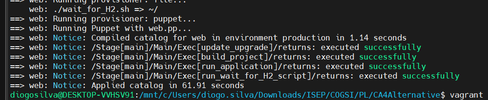

For WEB:
```bash
# Update and upgrade packages
exec { 'update_upgrade':
  command => '/usr/bin/apt-get update -y && /usr/bin/apt-get upgrade -y',
  path    => ['/usr/bin', '/usr/sbin'],
}

# Add GitHub to known_hosts
exec { 'add_github_known_host':
  command => '/usr/bin/ssh-keyscan -H github.com >> /home/vagrant/.ssh/known_hosts',
  path    => ['/usr/bin', '/usr/sbin'],
  user    => 'vagrant',
  creates => '/home/vagrant/.ssh/known_hosts',
  require => Exec['update_upgrade'],
}

# Install necessary packages
package { ['git', 'openjdk-17-jdk', 'maven', 'gradle']:
  ensure => installed,
  require => Exec['update_upgrade'],
}

# Clone the repository
exec { 'clone_repo':
  command => '/usr/bin/git clone git@github.com:1140422/cogsi2425-1140422-1240446-1211546.git /home/vagrant/cogsi2425-1140422-1240446-1211546',
  path    => ['/usr/bin', '/usr/sbin'],
  user    => 'vagrant',
  creates => '/home/vagrant/cogsi2425-1140422-1240446-1211546',
  require => Package['git'],
}

# Build the project with Gradle
exec { 'build_project':
  command => '/home/vagrant/cogsi2425-1140422-1240446-1211546/CA2/PART2/gradlew build',
  path    => ['/usr/bin', '/usr/sbin'],
  cwd     => '/home/vagrant/cogsi2425-1140422-1240446-1211546/CA2/PART2',
  user    => 'vagrant',
  require => Exec['clone_repo'],
}

# Run the application in the background
exec { 'run_application':
  command => '/home/vagrant/cogsi2425-1140422-1240446-1211546/CA2/PART2/gradlew runApp &',
  path    => ['/usr/bin', '/usr/sbin'],
  cwd     => '/home/vagrant/cogsi2425-1140422-1240446-1211546/CA2/PART2',
  user    => 'vagrant',
  require => Exec['build_project'],
}

# Ensure the script has execute permissions
file { '/home/vagrant/wait_for_H2.sh':
  mode    => '0755',  # Give the script execute permissions for the owner
  owner   => 'vagrant',
  group   => 'vagrant',
}

# Execute the script
exec { 'run_wait_for_H2_script':
  command => '/home/vagrant/wait_for_H2.sh &',
  user    => 'vagrant',  # Run as the 'vagrant' user
  require => File['/home/vagrant/wait_for_H2.sh'],  # Ensure permissions are set first
}
```
### Running The provisioner
* As we run the provisioner you can see the task being executed sucessfully

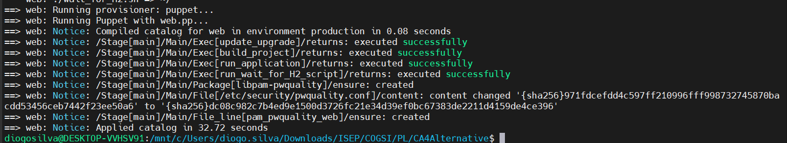


## Use PUPPET to configure PAM to enforce a complex password policy

* For PAM, we added this module in the Vagrant provisioner, which is required for Puppet to run certain commands, such as `file_line`.
```bash
 # This module provides a set of standard utility functions and resources commonly used in Puppet manifests for PAM
    puppet module install puppetlabs-stdlib
 ```

* We added the following lines to both the db.pp and web.pp files:
```bash 
# PAM
# Ensure the required package for PAM pwquality is installed
package { 'libpam-pwquality':
  ensure => installed,
}

# Configure the pwquality.conf file with password complexity requirements
file { '/etc/security/pwquality.conf':
  ensure  => file,
  content => @("END"),
    minlen = 12          # Minimum password length
    ucredit = -1         # Require at least one uppercase letter
    lcredit = -1         # Require at least one lowercase letter
    dcredit = -1         # Require at least one digit
    ocredit = -1         # Require at least one special character
    | END
  mode    => '0644',
  owner   => 'root',
  group   => 'root',
}

# Ensure the PAM configuration file is updated for enforcing the password policy
file_line { 'pam_pwquality_web':
  path  => '/etc/pam.d/common-password',  # Modify accordingly for your system
  line  => 'password requisite pam_pwquality.so retry=3 minlen=12 ucredit=-1 lcredit=-1 dcredit=-1 ocredit=-1',
  match => '^password\s+requisite\s+pam_pwquality.so',
}
```

* This code installs the libpam-pwquality package, sets password complexity rules in the pwquality.conf file, and modifies the PAM configuration to enforce these password policies.

## Use PUPPET to configure users, groups and their permissons
Now it's necessary to create a `developers` group and an user named `deuser` assigned to the group created. Permissions must be ensured to the group to its members only access the specific directories for each host.

To successfully achieve that we must add to `db.pp` and `app.pp` files the following code.

```bash
# Ensure 'developers' group exists
group { 'developers':
  ensure => 'present',
}

# Ensure 'devuser' exists and is a member of 'developers'
user { 'devuser':
  ensure     => 'present',
  gid        => 'developers',
  home       => '/home/devuser',
  managehome => true,
  shell      => '/bin/bash',
  require    => Group['developers'],
}

# Create directory for database files, owned by 'developers' group
file { '/opt/db_files':
  ensure  => 'directory',
  owner   => 'devuser',
  group   => 'developers',
  mode    => '0750',  # Access only for owner and group
  require => [Group['developers'], User['devuser']],
}
```

After creating the group and the user, and added him to that group, the directory permissions were set. The mode was set to 0750 on both hosts ensuring that only the owner and the group can access these directories.

## Use PUPPET to ensure the idempotence of our playbooks
For the last task of this assigment we must ensure that the Puppet scripts (playbooks) are idempotent and handle errors effectively. The following commands were added to `dp.pp` and `web.pp`.

Idempotency ensures that running the same script multiple times will not cause unintended changes or errors, and error handling ensures that any issues that occur during execution can be managed appropriately.

Puppet automatically tries to achieve idempotency by checking the system state before applying changes. For example, if a package is already installed, Puppet will not reinstall it.


- We use package resources to install packages, as Puppet will only install the package if it's not already installed.
```bash
package { ['openjdk-17-jdk', 'wget']:
  ensure => installed,
  require => Exec['update_upgrade'],
}
```
- We use file resources to manage files. If the file is already in the desired state, Puppet won’t alter it.
```bash
file { '/home/vagrant/.ssh':
  ensure  => directory,
  owner   => 'vagrant',
  group   => 'vagrant',
  mode    => '0700',
}
```
- When managing services, Puppet checks whether the service is already in the desired state before starting or stopping it.

Unlike Ansible, which provides `failed_when` and `ignore_errors` to control task success and error handling, Puppet achieves idempotence and error management through native resource parameters and conditional checks.<br> For instance, Puppet’s `onlyif` and `unless` parameters in the exec resource allow commands to run only under specific conditions, while `returns` can specify acceptable exit codes to avoid unnecessary failures.


### In a pratical way:
Since Puppet doesn't support `failed_when` like Ansible, we use the `returns` parameter in the `exec` resource to specify acceptable exit codes.<br>
This allows us to gracefully handle potential non-fatal errors and ensure idempotence. For example, in the following case, we allow both exit code `0` (success) and `1` (possible non-critical error like folder already exists or app already running).<br>  
Additionally, we use the `require` parameter to enforce the correct execution order of resources, ensuring that they are applied only when necessary, which further contributes to maintaining idempotence.


```bash
## DB.pp
# Download H2 database jar file using wget
exec { 'download_h2':
  command => 'wget -O /home/vagrant/h2.jar https://repo1.maven.org/maven2/com/h2database/h2/2.3.232/h2-2.3.232.jar',
  path    => ['/usr/bin', '/usr/local/bin'],
  creates => '/home/vagrant/h2.jar',           
  user    => 'vagrant',
  returns => [0, 1], #0 Sucess 1 Already has a file
}

# Start H2 database server
exec { 'start_h2_server':
  command => 'java -cp h2.jar org.h2.tools.Server -tcp -tcpAllowOthers -web -webAllowOthers -ifNotExists -tcpDaemon &',
  path    => ['/usr/bin', '/usr/local/bin', '/bin'],
  require => Exec['download_h2'],
  returns => [0, 1], #0 Sucess 1 Already started
}


# Install UFW
package { 'ufw':
  ensure => installed,
}

# Configure UFW firewall rules
exec { 'ufw_configure':
  command => "sudo ufw default deny incoming && \
              sudo ufw default allow outgoing && \
              sudo ufw allow OpenSSH && \
              sudo ufw allow ssh && \
              sudo ufw allow from 192.168.56.21 to any port 9092 && \
              sudo ufw allow from 192.168.56.21 to any port 8082 && \
              echo 'y' | ufw enable",
  #unless  => "sudo ufw status | grep -q 'Status: active'",
  path    => ['/usr/sbin', '/sbin', '/usr/bin', '/bin'],
  require => Package['ufw'],
  returns => [0, 1], #0 Sucess, 1 Possible error
}
```


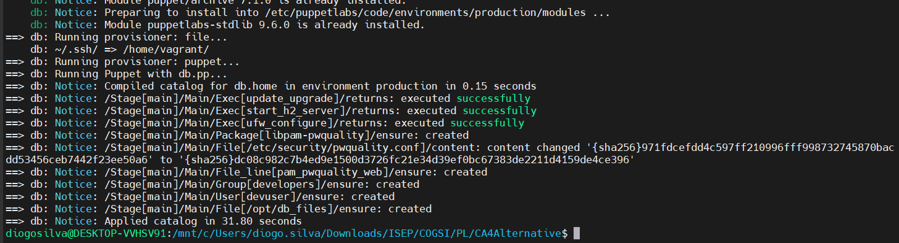


```bash
## Web.pp
# Run the application in the background
exec { 'run_application':
  command => '/home/vagrant/cogsi2425-1140422-1240446-1211546/CA2/PART2/gradlew runApp &',
  path    => ['/usr/bin', '/usr/sbin'],
  cwd     => '/home/vagrant/cogsi2425-1140422-1240446-1211546/CA2/PART2',
  user    => 'vagrant',
  require => Exec['build_project'],
  returns => [0, 1], #0 Sucess 1 Possible error
}

# Execute the script
exec { 'run_wait_for_H2_script':
  command => '/home/vagrant/wait_for_H2.sh &',
  user    => 'vagrant',  # Run as the 'vagrant' user
  require => File['/home/vagrant/wait_for_H2.sh'],  # Ensure permissions are set first
  returns => [0, 1], #0 Sucess 1 Possible error
}

# Clone the repository
exec { 'clone_repo':
  command => '/usr/bin/git clone git@github.com:1140422/cogsi2425-1140422-1240446-1211546.git /home/vagrant/cogsi2425-1140422-1240446-1211546',
  path    => ['/usr/bin', '/usr/sbin'],
  user    => 'vagrant',
  creates => '/home/vagrant/cogsi2425-1140422-1240446-1211546',
  require => Package['git'],
  returns => [0, 128], # 0 Means sucess 128 Means already has the folder
}
```


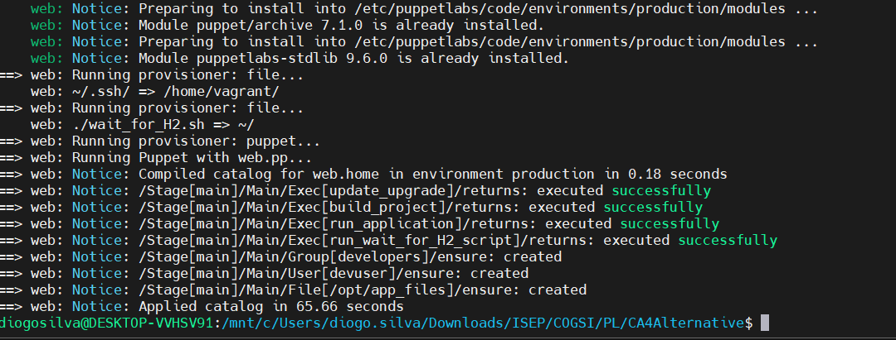
