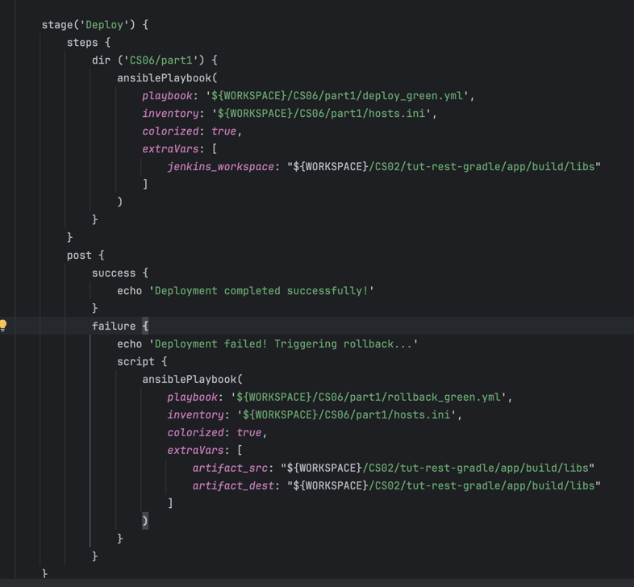

# CA06 - Jenkins with Ansible

Jenkins is an open-source automation server used to build, test, and deploy software. It supports continuous integration (CI) and continuous delivery (CD) workflows, enabling developers to automate repetitive tasks in software development pipelines. With its plugin ecosystem, Jenkins integrates with various tools and platforms, making it highly customizable for diverse projects.

## Part 1

The goal for this part is to create a Jenkins pipeline to build and deploy the gradle version of REST application to a local virtual machine (VM) using Vagrant and Ansible, as CS03.

First, it was installed Jenkins and Ansible on the local machine.

We've created a Vagrantfile, where we defined two virtual machines, a "blue" one and a "green" one. The main purpose of it is to use the blue-green deployment strategy, where we have two identical environments, and we switch between them to deploy new versions of the application.
We've created two machines, provisioned using ansible, where we've installed Java, Gradle, H2. Also was setted up the app and defined the startup of the Spring app as a systemd service:


To start these machines, as usual, we've used the command `vagrant up`.

The configuration was the same for both machines, the only difference was the port used by the app, 8080 for the blue machine and 8081 for the green machine.
The virtual machines were attributed with two static ips, so that when the ansible hosts need to be updated, the ip addresses don't change.

Then, we've created a Jenkinsfile, where the setup was to clone the repository, build the image, run the integration tests and archive the jar. Then, it was added a stage to ask if the app can be deployed to production, using the input directive.


Finally, if the user approves, we use an ansible script to deploy the app to the green machine:
If the deployment fails, a rollback is executed to the green machine.



Where the new Jar is copied to the specific folder of the green machine, and the systemd service is restarted.

To finish, we added a post-action to see if the app is running correctly and generate a tag with a **stable version**.


## Part 2

The goal for this part is to extend the CI/CD pipeline to containerize the REST application and deploy it using Docker and Ansible.

### **Pipeline Details**

The pipeline automates the process of building, testing, and deploying the application while ensuring consistency and efficiency through containerization.

### Steps

#### **Checkout**
The pipeline starts by cloning the source code from the `main` branch of the GitHub repository.

#### **Assemble**
The application is built using Gradle within the directory `CS02/tut-rest-gradle`. This step compiles the application and prepares it for testing.

#### **Test**
Integration tests are executed to validate the application:
- Results are captured using Jenkins' `junit` plugin, providing detailed test feedback.

#### **Archive**
The JAR file generated from the build process is archived as an artifact in Jenkins for later use.

#### **Deploy to Production?**
Before proceeding to production deployment, the pipeline prompts the user for confirmation. This ensures manual oversight for the deployment process.

#### **Build Docker Image**
The pipeline builds a Docker image for the application:
- A `Dockerfile` located in `CS06/part2` is used.
- The JAR file and configuration resources, such as `application.properties`, are passed as build arguments.

#### **Push Docker Image**
The Docker image is pushed to a registry (e.g., Docker Hub) using Jenkins credentials (`DOCKERHUB_CREDENTIALS_ID`), ensuring secure and consistent access.

#### **Deploy Unified Container**
The pipeline deploys the Docker container using an Ansible playbook:
- The playbook (`deploy.yml`) and inventory file (`hosts.ini`) are located in `CS06/part2`.
- The image name (`java-app:latest`) is passed as a variable to ensure the latest version is deployed.

````
stages {
        stage('Checkout') {
            steps {
                git branch: 'main', url: 'https://github.com/tonebarbosa/cogsi-1190404-1191106-1190699.git'
            }
        }


        stage('Assemble') {
            steps {
                dir ('CS02/tut-rest-gradle') {
                 sh './gradlew build'
                }
            }
        }

        stage('Test') {
            steps {
                dir ('CS02/tut-rest-gradle') {
                    sh './gradlew integrationTest'
                }
            }
            post {
                always {
                    dir ('CS02/tut-rest-gradle/app') {
                      junit '**/build/test-results/integrationTest/binary/output.bin'
                    }
                }
            }
        }

        stage('Archive') {
            steps {
                dir ('CS02/tut-rest-gradle') {
                    archiveArtifacts artifacts: '**/build/libs/*.jar', fingerprint: true
                }
            }
        }

        stage('Deploy to Production?') {
            steps {
                input 'Deploy to production?'
            }
        }

        stage('Build Docker Image') {
            steps {
                dir('CS06/part2') {
                    sh """
                    docker build -t java-app:latest \
                    --build-arg JAR_PATH=${WORKSPACE}/CS02/tut-rest-gradle/app/build/libs/app.jar \
                    --build-arg JAR_PATH_RESOURCES=${WORKSPACE}/CS02/tut-rest-gradle/app/build/resources/main/application.properties \
                    .
                    """
                }
            }
        }
        stage('Push Docker Image') {
            steps {
                script {
                    withDockerRegistry([credentialsId: DOCKERHUB_CREDENTIALS_ID, url: 'https://index.docker.io/v1/']) {
                        docker.image("java-app:latest").push()
                    }
                }
            }
        }
        stage('Deploy Unified Container') {
                    steps {
                        ansiblePlaybook(
                            playbook: '${WORKSPACE}/CS06/part2/deploy.yml',
                            inventory: '${WORKSPACE}/CS06/part2/hosts.ini',
                            colorized: true,
                            extraVars: [
                                docker_image: "java-app:latest"
                            ]
                        )
                    }
                }
    }
````

### **Post Actions**

#### **On Success**
- A Git tag with the format `stable-v<BUILD_NUMBER>` is created and pushed to the repository.
- This marks the current build as a stable version for future reference.

#### **On Failure**
- An error message is displayed, and the pipeline halts to prevent further actions.

````
post {
        success {
            echo "Pipeline completed successfully!"
            script {
                def tagName = "stable-v${env.BUILD_NUMBER}"

                sh """
                git tag -a ${tagName} -m "Stable build ${tagName}"
                git push origin ${tagName}
                """
                echo "Tagged build as ${tagName}"
            }
        }
        failure {
            echo "Pipeline failed."

        }
    }
````

### **Key Highlights**

1. **Containerization:**
   - The REST application is packaged into a Docker container, ensuring runtime consistency across environments.

2. **Registry Integration:**
   - The Docker image is pushed to a registry, enabling version control and accessibility for deployments.

3. **Ansible Automation:**
   - Deployment is automated using Ansible, which handles container management and ensures a smooth rollout to production.


## Alternative

### GitHub Actions

GitHub Actions is, as Jenkins, a CI/CD platform provided by GitHub that enables developers to automate their workflows directly within GitHub repositories. It integrates seamlessly with GitHub, allowing developers to create, test, and deploy applications using a simple YAML configuration file called .github/workflows stored in the repository. On our case, it is stored inside part2/alternative/workflows/part1.yml and part2.yml. This won't trigger a workflow, since it isn't on the folder.
Some advantages of GitHub actions is ease of use and built-in integration with the repository. Also, does not ask for additional infrastructure, as Jenkins, which requires a separate installation, setup, and maintenance, GitHub Actions is fully hosted by GitHub.
GitHub actions has some disadvantages, such as limited customization, dependency limitations and performance, due to GitHub's servers may be slower compared to self-hosted Jenkins agents.
On GitHub Actions, we have jobs with steps and on Jenkinsfile, we have stages  
